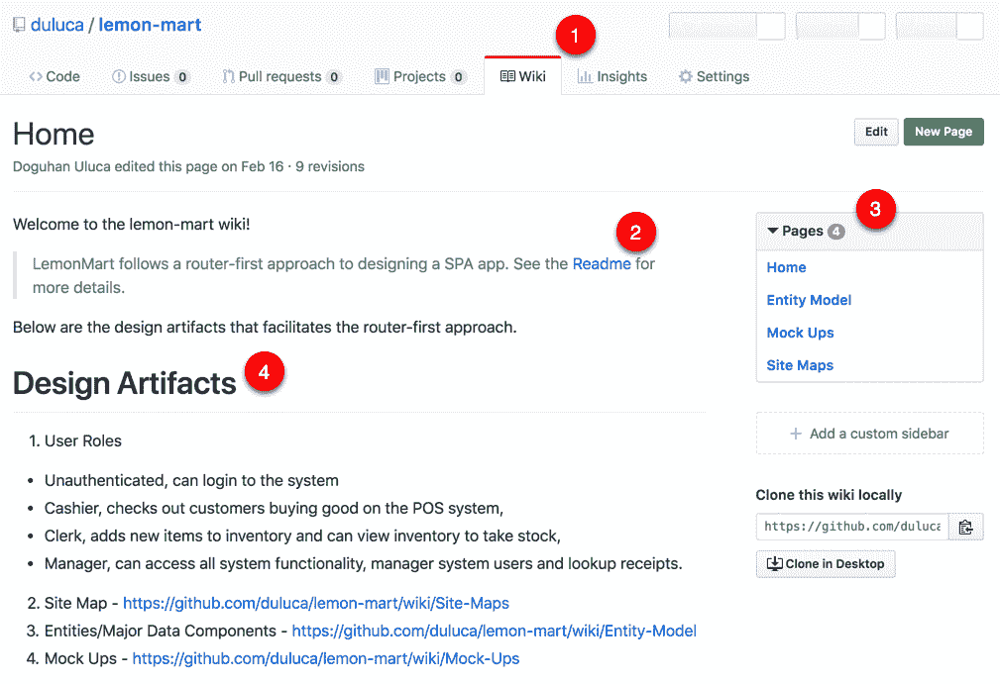
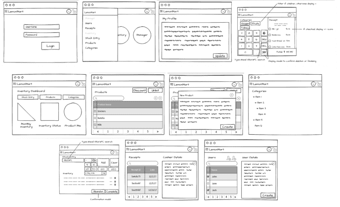
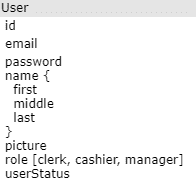
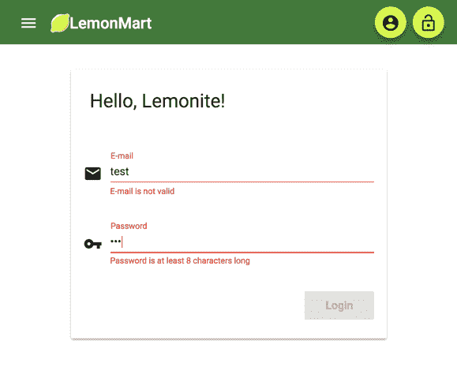
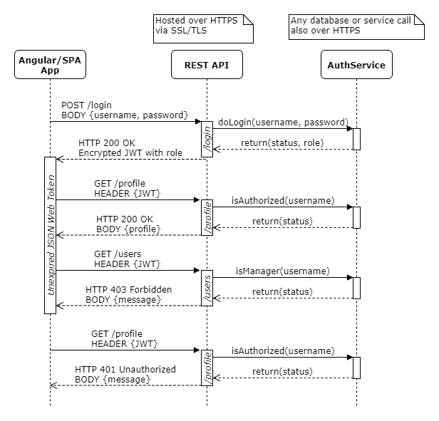
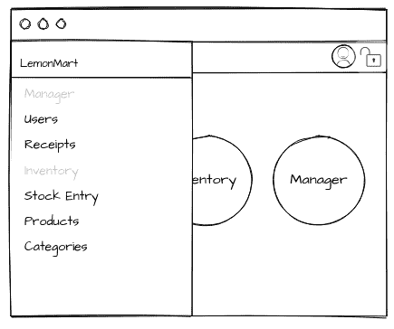
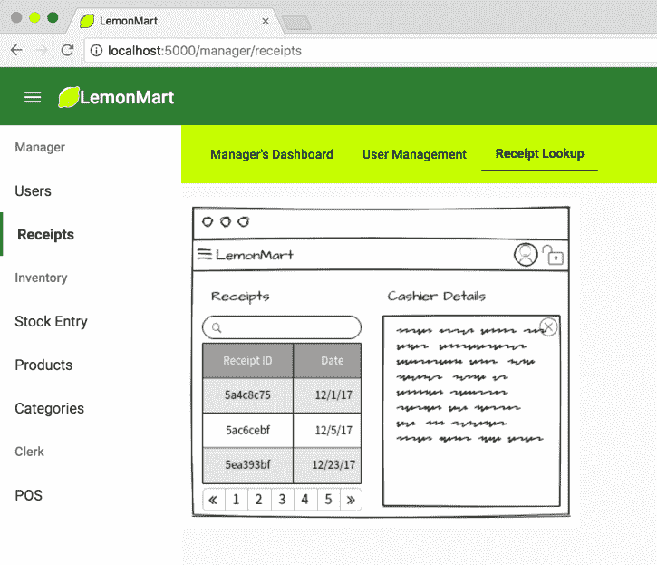
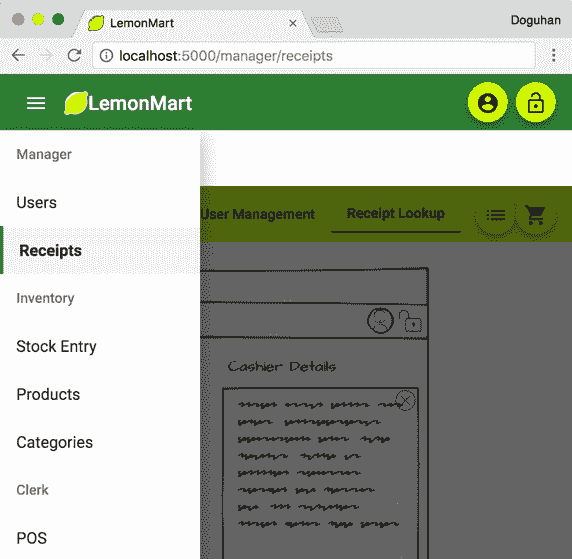
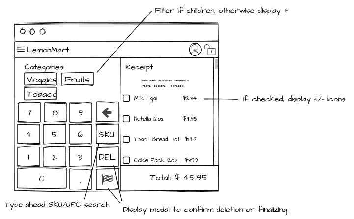

# 设计身份验证和授权

设计一个高质量的身份验证和授权系统，而不会让最终用户感到沮丧，这是一个难题。 身份验证是验证用户身份的行为，授权指定用户访问资源的特权。 这两个过程，简称为 auth，必须无缝地配合工作，以满足具有不同角色、需求和职能的用户的需求。 在今天的网络中，用户对通过浏览器遇到的任何身份验证系统都有很高的期望，因此这是应用程序中绝对要第一次完全正确的一个非常重要的部分。

用户应始终知道他们在应用程序中可以做什么和不能做什么。 如果存在错误、失败或错误，用户应清楚地了解为什么发生此类错误。 随着应用程序的增长，很容易忽略错误条件可能被触发的所有方式。 您的实现应易于扩展或维护，否则您的应用程序的这个基本骨架将需要大量维护。 在本章中，我们将解决创建出色的身份验证用户体验的各种挑战，并实现一个坚实的基线体验。

我们将继续采用路由优先的方式来设计单页应用程序，通过实现 LemonMart 的身份验证和授权体验。 在第十二章中，*创建一个基于路由的企业应用程序*，我们定义了用户角色，完成了所有主要路由的构建，并完成了对 LemonMart 的初步 walk-through 导航体验，因此我们已经准备好实现基于角色的路由和拉取该实现的细微差别。

在第十三章中，*持续集成和 API 设计*，我们讨论了围绕主要数据组件设计的想法，因此，您已经熟悉用户实体的外观，这将在实现基于令牌的登录体验中非常有用，包括在实体内缓存角色信息。

在深入研究身份验证之前，我们将讨论在开始实现各种有条件导航元素之前，完成应用程序的高级模拟 - ups 的重要性，这可能在设计阶段发生重大变化。

在本章中，您将学习以下主题：

+   高级用户体验设计的重要性

+   基于令牌的身份验证

+   有条件的导航

+   侧边导航栏

+   用于警报的可重用 UI 服务

+   缓存数据

+   JSON Web 令牌

+   Angular HTTP 拦截器

+   路由守卫

# 完成模拟 - ups

假象对确定应用程序中将需要的组件和用户控件的类型至关重要。 将在根级别定义用于跨组件使用的任何用户控件或组件，并通过各自的模块进行作用域定义。

我们已经确定了子模块并为它们设计了首次亮相页面，完成行走骨架。 现在我们已经定义了主要的数据组件，可以为应用程序的其余部分完成模型。 在高级别设计屏幕时，要牢记几点：

+   用户是否可以通过尽可能少的导航完成其角色所需的常见任务？

+   用户是否可以通过屏幕上可见的元素轻松访问应用程序的所有信息和功能？

+   用户是否可以轻松搜索他们需要的数据？

+   一旦用户找到感兴趣的记录，他们能够轻松地深入了解详细记录或查看相关记录吗？

+   弹出警告真的有必要吗？您知道用户不会阅读它，对吧？

请记住，设计任何用户体验都没有唯一正确的方式，这就是为什么在设计屏幕时，始终要考虑模块化和可重用性。

当生成各种设计文档，如模型或设计决策时，请注意将其发布在所有团队成员可访问的维基上：

1.  在 GitHub 上，切换到 Wiki 选项卡

1.  您可以在[Github.com/duluca/lemon-mart/wiki](https://github.com/duluca/lemon-mart/wiki)查看我的示例维基页面，如下所示：



GitHub.com LemonMart 维基

1.  在创建维基页面时，请确保在任何其他可用文档之间进行交叉链接，如 Readme

1.  请注意，GitHub 在页面下显示维基子页面。

1.  然而，额外的摘要很有用，比如设计文档部分，因为有些人可能会错过右侧的导航元素。

1.  在完成模型后，将其发布在维基上。

您可以在此处查看维基的摘要视图：



Lemon Mart 模型摘要视图

1.  可选地，将模型放在行走骨架应用程序中，以便测试人员可以更好地设想尚未开发的功能。

随着模型完成，我们现在可以继续 LemonMart 的实施，包括认证和授权工作流程。

# 设计认证和授权工作流程。

良好设计的身份验证工作流程是无状态的，因此没有会话过期的概念。用户可以自由地从任意设备和选项卡上同时或随时与您的无状态 REST API 进行交互。**JSON Web Token** (**JWT**) 实现了分布式基于声明的认证，可以通过数字签名或集成保护和/或使用 **消息认证码** (**MAC**) 进行加密。这意味着一旦用户的身份通过密码挑战等方式进行了认证，他们就会收到一个编码的声明票据或令牌，然后可以使用该令牌对系统进行未来请求，而无需重新验证用户的身份。服务器可以独立验证这一声明的有效性，并处理请求，无需事先知道其是否与该用户进行过交互。因此，我们不必存储关于用户的会话信息，这使得我们的解决方案是无状态且易于扩展的。每个令牌将在预定义的时间后过期，由于其分布式的特性，无法远程或单独吊销；但是，我们可以通过插入自定义账户和用户角色状态检查来增强实时安全性，以确保经过认证的用户有权访问服务器端资源。

JSON Web Tokens 实现了 IETF 行业标准 RFC7519，在 [`tools.ietf.org/html/rfc7519`](https://tools.ietf.org/html/rfc7519) 找到。

良好的授权工作流程能够基于用户的角色实现条件导航，以便用户自动转到最佳的着陆页面；他们不会显示适合其角色的路由或元素，如果他们错误地尝试访问未经授权的路径，系统将会阻止他们这样做。您必须记住，任何客户端角色导航仅仅只是一种便利，而不是为了安全。这意味着每次向服务器发出的调用都应该包含必要的头部信息，并且带有安全令牌，以便服务器可以对用户进行重新认证，独立验证他们的角色，然后才允许其检索受保护的数据。客户端认证是不可信的，这就是为什么密码重置屏幕必须使用服务器端呈现技术来构建，以便用户和服务器都能验证预期的用户正在与系统交互。

在以下部分中，我们将围绕用户数据实体设计一个完整功能的身份验证工作流程，如下：



用户实体

# 添加身份验证服务

我们将首先创建一个带有真实和虚假登录提供程序的身份验证服务：

1.  添加身份验证和授权服务：

```ts
$ npx ng g s auth -m app --flat false
```

1.  确保服务在 `app.module` 中提供：

```ts
src/app/app.module.ts
import { AuthService } from './auth/auth.service'
...  
providers: [AuthService],
```

为服务创建一个单独的文件夹将组织各种与身份验证和授权相关的组件，比如`enum`用于角色定义。此外，我们还可以在同一个文件夹中添加一个`authService`的假装，这对于编写单元测试至关重要。

1.  将用户角色定义为一个`enum`：

```ts
src/app/auth/role.enum.ts
export enum Role {
  None = 'none',
  Clerk = 'clerk',
  Cashier = 'cashier',
  Manager = 'manager',
}
```

# 实现一个基本的认证服务

现在，让我们构建一个本地认证服务，它将使我们能够展示一个强大的登录表单，缓存和基于认证状态和用户角色的条件导航概念：

1.  首先安装一个 JWT 解码库，以及用于伪造认证的 JWT 编码库：

```ts
$ npm install jwt-decode fake-jwt-sign
$ npm install -D @types/jwt-decode
```

1.  为`auth.service.ts`定义您的导入项：

```ts
src/app/auth/auth.service.ts
import { HttpClient } from '@angular/common/http'
import { Injectable } from '@angular/core'

import { sign } from 'fake-jwt-sign' // For fakeAuthProvider only
import * as decode from 'jwt-decode'

import { BehaviorSubject, Observable, of, throwError as observableThrowError } from 'rxjs'
import { catchError, map } from 'rxjs/operators'

import { environment } from '../../environments/environment'
import { Role } from './role.enum'
...
```

1.  实现一个`IAuthStatus`接口来存储解码后的用户信息，一个辅助接口以及默认的安全`defaultAuthStatus`。

```ts
src/app/auth/auth.service.ts
...
export interface IAuthStatus {
  isAuthenticated: boolean
  userRole: Role
  userId: string
}

interface IServerAuthResponse {
  accessToken: string
}

const defaultAuthStatus = { isAuthenticated: false, userRole: Role.None, userId: null }
...
```

`IAuthUser`是一个接口，代表了你可能从认证服务接收到的典型 JWT 的形状。它包含有关用户及其角色的最少信息，因此它可以附加到服务调用的`header`中，并且可以可选地缓存在`localStorage`中以记住用户的登录状态。在前面的实现中，我们假设了一个`Manager`的默认角色。

1.  定义`AuthService`类，其中有一个`BehaviorSubject`来锚定用户当前的`authStatus`，并在构造函数中配置一个可以处理`email`和`password`并返回`IServerAuthResponse`的`authProvider`。

```ts
src/app/auth/auth.service.ts ...
@Injectable({
  providedIn: 'root'
})
export class AuthService {
   private readonly authProvider: (
    email: string,
    password: string
  ) => Observable<IServerAuthResponse>

  authStatus = new BehaviorSubject<IAuthStatus>(defaultAuthStatus)

  constructor(private httpClient: HttpClient) {
     // Fake login function to simulate roles
    this.authProvider = this.fakeAuthProvider
    // Example of a real login call to server-side
    // this.authProvider = this.exampleAuthProvider
  }
  ...
```

请注意，`fakeAuthProvider`被配置为该服务的`authProvider`。一个真实的 auth provider 可能会像以下代码一样，其中用户的电子邮件和密码发送到一个 POST 端点，该端点验证他们的信息，创建并返回一个 JWT 供我们的应用程序消费：

```ts
example
private exampleAuthProvider(
  email: string,
  password: string
): Observable<IServerAuthResponse> {
  return this.httpClient.post<IServerAuthResponse>(`${environment.baseUrl}/v1/login`, {
    email: email,
    password: password,
  })
}
```

这相当简单，因为大部分工作是在服务器端完成的。这个调用也可以被发送给第三方。

请注意 URL 路径中的 API 版本`v1`是在服务中定义的，而不是作为`baseUrl`的一部分。这是因为每个 API 可以独立地更改版本。登录可能长时间保持`v1`，而其他 API 可能会升级为`v2`、`v3`等。

1.  实现一个`fakeAuthProvider`来模拟认证过程，包括动态创建假的 JWT。

```ts
src/app/auth/auth.service.ts
  ...
  private fakeAuthProvider(
    email: string,
    password: string
  ): Observable<IServerAuthResponse> {
    if (!email.toLowerCase().endsWith('@test.com')) {
      return observableThrowError('Failed to login! Email needs to end with @test.com.')
    }

    const authStatus = {
      isAuthenticated: true,
      userId: 'e4d1bc2ab25c',
      userRole: email.toLowerCase().includes('cashier')
        ? Role.Cashier
        : email.toLowerCase().includes('clerk')
          ? Role.Clerk
          : email.toLowerCase().includes('manager') ? Role.Manager : Role.None,
    } as IAuthStatus

    const authResponse = {
      accessToken: sign(authStatus, 'secret', {
        expiresIn: '1h',
        algorithm: 'none',
      }),
    } as IServerAuthResponse

    return of(authResponse)
  }
  ...
```

`fakeAuthProvider`在服务中实现了本来应该是服务器端方法的内容，因此您可以方便地在微调您的认证流程时进行代码实验。它使用临时的`fake-jwt-sign`库创建和签署一个 JWT，这样我们也可以演示如何处理一个符合规范的 JWT。

不要在您的 Angular 应用程序中使用`fake-jwt-sign`依赖项，因为它的目的是用于服务器端代码。

1.  在继续之前，实现一个`transformError`函数，用于处理在`common/common.ts`中的可观察流中混合的`HttpErrorResponse`和字符串错误：

```ts
src/app/common/common.ts
import { HttpErrorResponse } from '@angular/common/http'
import { throwError } from 'rxjs'

export function transformError(error: HttpErrorResponse | string) {
  let errorMessage = 'An unknown error has occurred'
  if (typeof error === 'string') {
    errorMessage = error
  } else if (error.error instanceof ErrorEvent) {
    errorMessage = `Error! ${error.error.message}`
  } else if (error.status) {
    errorMessage = `Request failed with ${error.status} ${error.statusText}`
  }
  return throwError(errorMessage)
}
```

1.  实现`login`函数，它将从下一节中显示的`LoginComponent`调用。

1.  添加 ``import { transformError } from '../common/common'``

1.  还要实现一个对应的`注销`功能，可以由顶部工具栏中的注销按钮调用，登录尝试失败，或者如果路由授权守卫在用户浏览应用程序时检测到未经授权的访问尝试，这是本章后续讨论的一个主题：

```ts
src/app/auth/auth.service.ts
  ...
  login(email: string, password: string): Observable<IAuthStatus> {
    this.logout()

    const loginResponse = this.authProvider(email, password).pipe(
      map(value => {
        return decode(value.accessToken) as IAuthStatus
      }),
      catchError(transformError)
    )

    loginResponse.subscribe(
      res => {
        this.authStatus.next(res)
      },
      err => {
        this.logout()
        return observableThrowError(err)
      }
    )

    return loginResponse
  }

  logout() {
    this.authStatus.next(defaultAuthStatus)
  }
}
```

`login`方法通过调用`logout`方法，`authProvider`以及在必要时抛出错误来封装了正确的操作顺序。

`login`方法遵循了 SOLID 设计中的开闭原则，它对外部提供不同的身份验证提供者开放以实现扩展，但对修改是封闭的，因为功能的差异被身份验证提供者封装起来。

在下一节中，我们将实现`LoginComponent`，以便用户可以输入他们的用户名和密码信息，并尝试登录。

# 实现登录组件

`login`组件利用我们刚刚创建的`authService`，并使用响应式表单实现验证错误。登录组件应该被设计成可以独立渲染，因为在路由事件中，如果我们发现用户没有得到适当的身份验证或授权，我们将把他们导航到这个组件。我们可以将此来源 URL 捕获为`redirectUrl`，以便用户成功登录后，我们可以将他们导航回去。

1.  让我们从实现`login`组件的路由开始：

```ts
src/app/app-routing.modules.ts
...
  { path: 'login', component: LoginComponent },
  { path: 'login/:redirectUrl', component: LoginComponent },
...
```

1.  现在实现组件本身：

```ts
src/app/login/login.component.ts
import { Component, OnInit } from '@angular/core'
import { FormBuilder, FormGroup, Validators, NgForm } from '@angular/forms'
import { AuthService } from '../auth/auth.service'
import { Role } from '../auth/role.enum'

@Component({
  selector: 'app-login',
  templateUrl: 'login.component.html',
  styles: [
    `
    .error {
        color: red
    }
    `,
    `
    div[fxLayout] {margin-top: 32px;}
    `,
  ],
})
export class LoginComponent implements OnInit {
  loginForm: FormGroup
  loginError = ''
  redirectUrl
  constructor(
    private formBuilder: FormBuilder,
    private authService: AuthService,
    private router: Router,
    private route: ActivatedRoute
  ) {
    route.paramMap.subscribe(params => (this.redirectUrl = params.get('redirectUrl')))
  }

  ngOnInit() {
    this.buildLoginForm()
  }

  buildLoginForm() {
    this.loginForm = this.formBuilder.group({
      email: ['', [Validators.required, Validators.email]],
      password: ['', [
        Validators.required,
        Validators.minLength(8),
        Validators.maxLength(50),
      ]],
    })
  }

  async login(submittedForm: FormGroup) {
    this.authService
      .login(submittedForm.value.email, submittedForm.value.password)
      .subscribe(authStatus => {
        if (authStatus.isAuthenticated) {
          this.router.navigate([this.redirectUrl || '/manager'])
        }
      }, error => (this.loginError = error))
  }
}
```

作为成功登录尝试的结果，我们利用路由器将经过身份验证的用户导航到他们的个人资料。在通过服务从服务器发送错误的情况下，我们将将该错误分配给`loginError`。

1.  这是一个登录表单的实现，用于捕获和验证用户的`电子邮件`和`密码`，如果有任何服务器错误，就显示它们：

```ts
src/app/login/login.component.html
<div fxLayout="row" fxLayoutAlign="center">
  <mat-card fxFlex="400px">
    <mat-card-header>
      <mat-card-title>
        <div class="mat-headline">Hello, Lemonite!</div>
      </mat-card-title>
    </mat-card-header>
    <mat-card-content>
      <form [formGroup]="loginForm" (ngSubmit)="login(loginForm)" fxLayout="column">
        <div fxLayout="row" fxLayoutAlign="start center" fxLayoutGap="10px">
          <mat-icon>email</mat-icon>
          <mat-form-field fxFlex>
            <input matInput placeholder="E-mail" aria-label="E-mail" formControlName="email">
            <mat-error *ngIf="loginForm.get('email').hasError('required')">
              E-mail is required
            </mat-error>
            <mat-error *ngIf="loginForm.get('email').hasError('email')">
              E-mail is not valid
            </mat-error>
          </mat-form-field>
        </div>
        <div fxLayout="row" fxLayoutAlign="start center" fxLayoutGap="10px">
          <mat-icon matPrefix>vpn_key</mat-icon>
          <mat-form-field fxFlex>
            <input matInput placeholder="Password" aria-label="Password" type="password" formControlName="password">
            <mat-hint>Minimum 8 characters</mat-hint>
            <mat-error *ngIf="loginForm.get('password').hasError('required')">
              Password is required
            </mat-error>
            <mat-error *ngIf="loginForm.get('password').hasError('minlength')">
              Password is at least 8 characters long
            </mat-error>
            <mat-error *ngIf="loginForm.get('password').hasError('maxlength')">
              Password cannot be longer than 50 characters
            </mat-error>
          </mat-form-field>
        </div>
        <div fxLayout="row" class="margin-top">
          <div *ngIf="loginError" class="mat-caption error">{{loginError}}</div>
          <div class="flex-spacer"></div>
          <button mat-raised-button type="submit" color="primary" [disabled]="loginForm.invalid">Login</button>
        </div>
      </form>
    </mat-card-content>
  </mat-card>
</div>
```

在电子邮件和密码符合客户端网站验证规则之前，登录按钮将被禁用。另外，`<mat-form-field>`一次只会显示一个`mat-error`，除非你为更多的错误创建了更多的空间，所以请确保将您的错误条件放在正确的顺序中。

完成`login`组件的实现后，现在可以更新主屏幕以有条件地显示或隐藏我们创建的新组件。

1.  更新`home.component`以在用户打开应用程序时显示登录：

```ts
src/app/home/home.component.ts

  template: `
    <div *ngIf="displayLogin">
      <app-login></app-login>
    </div>
    <div *ngIf="!displayLogin">
      <span class="mat-display-3">You get a lemon, you get a lemon, you get a lemon...</span>
    </div>
  `,

export class HomeComponent implements OnInit {
  displayLogin = true
  ...
```

不要忘记将上面的代码所需的依赖模块导入到您的 Angular 应用程序中。故意留给读者作为练习，以找到并导入丢失的模块。

你的应用程序应该看起来类似于这个屏幕截图：



LemonMart 带有登录

就实现和显示/隐藏侧边栏菜单、个人资料和注销图标而言，还有一些工作要做，考虑到用户的身份验证状态。

# 有条件的导航

有条件的导航对于创建一个没有挫败感的用户体验是必要的。通过选择性地显示用户可以访问的元素并隐藏他们无法访问的元素，我们可以让用户自信地在应用程序中导航。

让我们在用户登录应用程序后隐藏登录组件：

1.  在`home`组件中，在`home.component`中引入`authService`

1.  将`authStatus`设置为名为`displayLogin`的本地变量：

```ts
src/app/home/home.component
...
import { AuthService } from '../auth/auth.service'
...
export class HomeComponent implements OnInit {
  private _displayLogin = true
  constructor(private authService: AuthService) {}

  ngOnInit() {
    this.authService.authStatus.subscribe(
      authStatus => (this._displayLogin = !authStatus.isAuthenticated)
    )
  }

  get displayLogin() {
    return this._displayLogin
  }
}
```

属性获取器`displayLogin`在这里是必要的，否则您可能会收到一个 Error: ExpressionChangedAfterItHasBeenCheckedError: Expression has changed after it was checked 消息。这个错误是 Angular 组件生命周期和变更检测工作方式的副作用。这种行为在未来的 Angular 版本中可能会改变。

1.  在`app`组件中，订阅认证状态并将当前值存储在名为`displayAccountIcons`的本地变量中：

```ts
src/app/app.component.ts

import { Component, OnInit } from '@angular/core'
import { AuthService } from './auth/auth.service'
...
export class AppComponent implements OnInit {
  displayAccountIcons = false
  constructor(..., private authService: AuthService) { 
  ...
  ngOnInit() {
    this.authService.authStatus.subscribe(
      authStatus => (this.displayAccountIcons = authStatus.isAuthenticated)
    )
  }
  ...
}
```

1.  使用`*ngIf`隐藏所有针对已登录用户的按钮：

```ts
src/app/app.component.ts 
<button *ngIf="displayAccountIcons" ... >
```

现在，当用户注销时，您的工具栏应该看起来整洁，没有按钮，如下所示：


LemonMart 工具栏登录后

# 常见验证

在我们继续之前，我们需要为`loginForm`实现验证。随着我们在第十五章中实现更多的表单，*Angular 应用设计和示例*，你会意识到反复在模板或响应式表单中输入表单验证会变得繁琐快速。响应式表单的吸引之一是它由代码驱动，因此我们可以轻松地将验证提取到一个共享类中，进行单元测试，并重复使用它们：

1.  在`common`文件夹下创建一个`validations.ts`文件

1.  实现电子邮件和密码验证：

```ts
src/app/common/validations.ts
import { Validators } from '@angular/forms'

export const EmailValidation = [Validators.required, Validators.email]
export const PasswordValidation = [
  Validators.required,
  Validators.minLength(8),
  Validators.maxLength(50),
]
```

根据您的密码验证需求，您可以使用`Validations.pattern()`函数与`RegEx`模式来强制执行密码复杂性规则，或者利用 OWASP npm 包`owasp-password-strength-test`来启用密码短语，并设置更灵活的密码要求。

1.  使用新的验证更新`login`组件：

```ts
src/app/login/login.component.ts
import { EmailValidation, PasswordValidation } from '../common/validations'
  ...
     this.loginForm = this.formBuilder.group({
      email: ['', EmailValidation],
      password: ['', PasswordValidation],
    })
```

# UI 服务

当我们开始处理复杂的工作流程，例如认证工作流程时，有必要能够通过编程方式为用户显示一个弹出通知。在其他情况下，我们可能需要在执行破坏性操作之前询问确认，这时会需要一个更具侵入性的弹出式通知。

无论你使用什么组件库，都会很烦琐地重新编写相同的样板代码，只为了显示一个快速通知。一个 UI 服务可以整洁地封装一个默认实现，也可以根据需要进行定制：

1.  在`common`下创建一个新的`uiService`

1.  实现一个`showToast`函数：

```ts
src/app/common/ui.service.ts
import { Injectable, Component, Inject } from '@angular/core'
import {
  MatSnackBar,
  MatSnackBarConfig,
  MatDialog,
  MatDialogConfig,
} from '@angular/material'
import { Observable } from 'rxjs'

@Injectable()
export class UiService {
  constructor(private snackBar: MatSnackBar, private dialog: MatDialog) {}

  showToast(message: string, action = 'Close', config?: MatSnackBarConfig) {
    this.snackBar.open(
      message,
      action,
      config || {
        duration: 7000,
      }
    )
  }
...
}
```

对于`showDialog`函数，我们必须实现一个基本的对话框组件：

1.  在提供的`app.module`下的`common`文件夹中添加一个新的`simpleDialog`，包括内联模板和样式

```ts
app/common/simple-dialog/simple-dialog.component.ts
@Component({
  template: `
    <h2 mat-dialog-title>data.title</h2>
    <mat-dialog-content>
      <p>data.content</p>
    </mat-dialog-content>
    <mat-dialog-actions>
      <span class="flex-spacer"></span>
      <button mat-button mat-dialog-close *ngIf="data.cancelText">data.cancelText</button>
      <button mat-button mat-button-raised color="primary" [mat-dialog-close]="true"
        cdkFocusInitial>
        data.okText
      </button>
    </mat-dialog-actions>
  `,
})
export class SimpleDialogComponent {
  constructor(
    public dialogRef: MatDialogRef<SimpleDialogComponent, Boolean>,
    @Inject(MAT_DIALOG_DATA) public data: any
  ) {}
}
```

请注意，`SimpleDialogComponent`不应该像`selector: 'app-simple-dialog'`一样带有应用程序选择器，因为我们计划只在`UiService`中使用它。从您的组件中删除此属性。

1.  然后，实现一个`showDialog`函数来显示`SimpleDialogComponent`：

```ts
app/common/ui.service.ts
...
showDialog(
    title: string,
    content: string,
    okText = 'OK',
    cancelText?: string,
    customConfig?: MatDialogConfig
  ): Observable<Boolean> {
    const dialogRef = this.dialog.open(
      SimpleDialogComponent,
      customConfig || {
        width: '300px',
        data: { title: title, content: content, okText: okText, cancelText: cancelText },
      }
    )

    return dialogRef.afterClosed()
  }
}
```

`ShowDialog`返回一个`Observable<boolean>`，因此您可以根据用户的选择实现后续动作。点击确定将返回`true`，点击取消将返回`false`。

在`SimpleDialogComponent`中，使用`@Inject`，我们能够使用`showDialog`发送的所有变量来定制对话框的内容。

不要忘记更新`app.module.ts`和`material.module.ts`，以适应引入的各种依赖项。

1.  更新`login`组件，在登录后显示一个提示消息：

```ts
src/app/login/login.component.ts
import { UiService } from '../common/ui.service'
...
constructor(... ,
    private uiService: UiService)
...
  .subscribe(authStatus => {
        if (authStatus.isAuthenticated) {
          this.uiService.showToast(`Welcome! Role: ${authStatus.userRole}`)
          ...
```

用户登录后，将显示一个提示消息，如图所示：


材料吐司条

`snackBar`将占据整个屏幕的宽度，或者根据浏览器的大小占据一部分。

# 使用 cookie 和 localStorage 进行缓存

我们必须能够缓存已登录用户的认证状态。否则，每次刷新页面，用户都将不得不通过登录流程。我们需要更新`AuthService`以使其保持认证状态。

有三种主要的数据存储方式：

+   `cookie`

+   `localStorage`

+   `sessionStorage`

不应将 cookie 用于存储安全数据，因为它们可能会被坏人嗅探或窃取。此外，cookie 可以存储 4 KB 的数据并可以设置为过期。

`localStorage`和`sessionStorage`相似。它们是受保护且隔离的浏览器端存储，允许为应用程序存储更大量的数据。你无法为这些存储设置过期日期时间。当浏览器窗口关闭时，`sessionStorage`的值会被删除。这些值会在页面重新加载和恢复时保留。

JSON Web Tokens 是加密的，并包含用于到期的时间戳，从本质上讲，对抗了`cookie`和`localStorage`的弱点。任一选项都应该可以安全地与 JWT 一起使用。

让我们首先实现一个缓存服务，它可以将我们的身份验证信息缓存的方式抽象化，以供`AuthService`使用：

1.  首先创建一个封装缓存方法的抽象`cacheService`：

```ts
src/app/auth/cache.service.ts
export abstract class CacheService {
  protected getItem<T>(key: string): T {
    const data = localStorage.getItem(key)
    if (data && data !== 'undefined') {
      return JSON.parse(data)
    }
    return null
  }

  protected setItem(key: string, data: object | string) {
    if (typeof data === 'string') {
      localStorage.setItem(key, data)
    }
    localStorage.setItem(key, JSON.stringify(data))
  }

  protected removeItem(key: string) {
    localStorage.removeItem(key)
  }

  protected clear() {
    localStorage.clear()
  }
}

```

此缓存服务基类可用于为任何服务提供缓存功能。这与创建一个注入到另一个服务中的集中式缓存服务不同。通过避免集中式值存储，我们避免了各种服务之间的相互依赖。

1.  更新`AuthService`以扩展`CacheService`并实现对`authStatus`的缓存：

```ts
auth/auth.service
...
export class AuthService extends CacheService {
  authStatus = new BehaviorSubject<IAuthStatus>(
    this.getItem('authStatus') || defaultAuthStatus
  )

  constructor(private httpClient: HttpClient) {
    super()
    this.authStatus.subscribe(authStatus => this.setItem('authStatus', authStatus))
    ...
  }
  ...
}
```

此处展示的技术可用于持久化任何类型的数据，并有意利用 RxJS 事件来更新缓存。正如你可能注意到的，我们不需要更新登录函数来调用`setItem`，因为它已经调用了`this.authStatus.next`，我们只是连接到数据流。这有助于保持无状态和避免副作用，通过将函数之间解耦。

在初始化`BehaviorSubject`时，务必处理`undefined/null`情况，当从缓存中加载数据并仍提供默认实现时。

您可以在`setItem`和`getItem`函数中实现自定义缓存过期方案，或者利用第三方创建的服务。

如果您追求高安全性的应用程序，您可能选择仅缓存 JWT 以确保额外的安全层。在任何情况下，JWT 应该被单独缓存，因为令牌必须在每个请求的头部与服务器一起发送。重要的是要了解令牌身份验证的工作原理，以避免泄露妥协的秘密。在下一节中，我们将详细讨论 JWT 生命周期以提高您的理解。

# JSON Web Token 生命周期

JSON Web Tokens 搭配着无状态 REST API 架构，使用加密令牌机制，方便、分布式和高性能地对客户端发送的请求进行身份验证和授权。令牌身份验证方案有三个主要组成部分：

+   客户端捕获登录信息并隐藏不允许的操作以获得良好的用户体验

+   服务器端验证每个请求都经过了身份验证和拥有适当授权

+   身份验证服务，生成和验证加密令牌，独立验证来自数据存储的用户请求的身份验证和授权状态

安全系统假设主要组件之间发送/接收的数据是在传输过程中加密的。这意味着您的 REST API 必须使用正确配置的 SSL 证书托管，并通过 HTTPS 提供所有 API 调用，以便用户凭据永远不会在客户端和服务器之间暴露。同样，任何数据库或第三方服务调用都应该通过 HTTPS 进行。此外，任何存储密码的数据存储应该使用安全的单向哈希算法和良好的盐化实践。任何其他敏感用户信息应该使用安全的双向加密算法在静止状态下进行加密。遵循这种分层安全性方法至关重要，因为攻击者需要同时破坏所有实施的安全层来对您的业务造成实质性伤害。

下一个序列图突显了基于 JWT 的身份验证生命周期：



基于 JWT 的身份验证生命周期

最初，用户通过提供用户名和密码登录。一旦验证通过，用户的认证状态和角色将被加密为具有到期日期和时间的 JWT，并发送回浏览器。

你的 Angular（或任何其他 SPA）应用可以安全地将该令牌缓存到本地或会话存储中，这样用户就不需要在每个请求中强制登录，或者更糟糕的是，我们不会在浏览器中存储用户凭证。让我们更新认证服务，以便它能够缓存该令牌。

1.  更新服务以能够设置、获取、解码和清除令牌，如下所示：

```ts
src/app/auth/auth.service.ts
...
  private setToken(jwt: string) {
    this.setItem('jwt', jwt)
  }

  private getDecodedToken(): IAuthStatus {
    return decode(this.getItem('jwt'))
  }

  getToken(): string {
    return this.getItem('jwt') || ''
  }

  private clearToken() {
    this.removeItem('jwt')
  }
```

1.  在登录期间调用`setToken`，在登出期间调用`clearToken`，如下所示：

```ts
src/app/auth/auth.service.ts
...
  login(email: string, password: string): Observable<IAuthStatus> {
    this.logout()

    const loginResponse = this.authProvider(email, password).pipe(
      map(value => {
        this.setToken(value.accessToken)
        return decode(value.accessToken) as IAuthStatus
      }),
      catchError(transformError)
    )
  ...
  logout() {
    this.clearToken()
    this.authStatus.next(defaultAuthStatus)
  }
```

每个后续的请求都将在请求头中包含 JWT。您应该对每个 API 进行安全保护，以检查并验证接收到的令牌。例如，如果用户想要访问他们的个人资料，`AuthService`将验证令牌，以检查用户是否经过认证，但还需要进一步的数据库调用来检查用户是否有权查看数据。这样可以确保对用户的系统访问进行独立确认，并防止未过期令牌的滥用。

如果经过认证的用户调用 API，但他们没有适当的授权，例如，如果一个职员要获取所有用户的列表，那么`AuthService`将返回一个虚假状态，并且客户端将收到 403 Forbidden 的响应，这将显示为用户的错误消息。

用户可以使用过期的令牌发出请求；当此情况发生时，将向客户端发送 401 未授权的响应。作为良好的用户体验实践，我们应该自动提示用户重新登录，并允许他们在没有任何数据丢失的情况下恢复他们的工作流程。

总之，真正的安全性是通过健壮的服务器端实现实现的，任何客户端实现主要是为了实现良好的用户体验和良好的安全实践。

# HTTP 拦截器

实现一个 HTTP 拦截器，将 JWT 注入到发送给用户的每个请求的头部，并且通过要求用户登录来优雅地处理认证失败：

1.  在`auth`下创建`authHttpInterceptor`：

```ts
src/app/auth/auth-http-interceptor.ts
import {
  HttpEvent,
  HttpHandler,
  HttpInterceptor,
  HttpRequest,
} from '@angular/common/http'
import { Injectable } from '@angular/core'
import { Router } from '@angular/router'
import { Observable, throwError as observableThrowError } from 'rxjs'
import { catchError } from 'rxjs/operators'
import { AuthService } from './auth.service'

@Injectable()
export class AuthHttpInterceptor implements HttpInterceptor {
  constructor(private authService: AuthService, private router: Router) {}
  intercept(req: HttpRequest<any>, next: HttpHandler): Observable<HttpEvent<any>> {
    const jwt = this.authService.getToken()
    const authRequest = req.clone({ setHeaders: { authorization: `Bearer ${jwt}` } })
    return next.handle(authRequest).pipe(
      catchError((err, caught) => {
        if (err.status === 401) {
          this.router.navigate(['/user/login'], {
            queryParams: { redirectUrl: this.router.routerState.snapshot.url },
          })
        }

        return observableThrowError(err)
      })
    )
  }
}
```

请注意，`AuthService`被利用来检索令牌，而且在 401 错误之后，为登录组件设置`redirectUrl`。

1.  更新`app`模块以提供拦截器：

```ts
src/app/app.module.ts
 providers: [
    ...
    {
      provide: HTTP_INTERCEPTORS,
      useClass: AuthHttpInterceptor,
      multi: true,
    },
  ],
```

您可以在 Chrome Dev Tools | Network 选项卡中观察拦截器的实际操作，当应用程序获取`lemon.svg`文件时。


请求 lemon.svg 的请求头

# 侧边导航

启用以移动设备为优先的工作流程，并提供轻松的导航机制，以便快速跳转到所需的功能。使用认证服务，根据用户当前的角色，只显示他们可以访问的功能链接。我们将实现侧边导航的模拟如下：



侧边导航的模拟

让我们将侧向导航菜单的代码实现为一个单独的组件，以便更容易维护：

1.  在`app.module`中创建和声明一个`NavigationMenuComponent`

```ts
src/app/app.module.ts
@NgModule({
  declarations: [
    ...
    NavigationMenuComponent,
  ],
```

直到用户登录后才需要侧向导航。但是，为了能够从工具栏启动侧向导航菜单，我们需要能够从`app.component`触发它。由于此组件很简单，我们将会急切加载它。如果要惰性加载它，Angular 确实有一个动态组件加载器模式，但这具有高的实现开销，只有在可以节省数百千字节时才有意义。

`SideNav`将从工具栏触发，并且它带有一个`<mat-sidenav-container>`父容器，用于承载`SideNav`本身和应用程序的内容。因此，我们需要通过将`<router-outlet>`放置在`<mat-sidenav-content>`中来渲染所有应用程序内容。

1.  在 material.module 中导入`MatSidenavModule`和`MatListModule`

```ts
src/app/material.module.ts
@NgModule({
  imports: [
    ...
    MatSidenavModule,
    MatListModule,
  ],
  exports: [
    ...
    MatSidenavModule,
    MatListModule,
  ]
```

1.  定义一些样式，确保 Web 应用程序在桌面和移动场景上可以填充整个页面，并保持正确的滚动：

```ts
src/app/app.component.ts
styles: [
    `.app-container {
      display: flex;
      flex-direction: column;
      position: absolute;
      top: 0;
      bottom: 0;
      left: 0;
      right: 0;
    }
    .app-is-mobile .app-toolbar {
      position: fixed;
      z-index: 2;
    }
    .app-sidenav-container {
      flex: 1;
    }
    .app-is-mobile .app-sidenav-container {
      flex: 1 0 auto;
    },
    mat-sidenav {
      width: 200px;
    }
    `
  ],
```

1.  在`AppComponent`中导入`ObservableMedia`服务：

```ts
src/app/app.component.ts
constructor(
    ...
    public media: ObservableMedia
  ) {
  ...
}
```

1.  使用响应式`SideNav`更新模板，将在移动设备上覆盖内容或在桌面场景中将内容推开：

```ts
src/app/app.component.ts
...
template: `
  <div class="app-container">
    <mat-toolbar color="primary" fxLayoutGap="8px" class="app-toolbar"
      [class.app-is-mobile]="media.isActive('xs')">
      <button *ngIf="displayAccountIcons" mat-icon-button (click)="sidenav.toggle()">
        <mat-icon>menu</mat-icon>
      </button>
      <a mat-icon-button routerLink="/home">
        <mat-icon svgIcon="lemon"></mat-icon><span class="mat-h2">LemonMart</span>
      </a>
      <span class="flex-spacer"></span>
      <button *ngIf="displayAccountIcons" mat-mini-fab routerLink="/user/profile"
        matTooltip="Profile" aria-label="User Profile"><mat-icon>account_circle</mat-icon>
      </button>
      <button *ngIf="displayAccountIcons" mat-mini-fab routerLink="/user/logout"
        matTooltip="Logout" aria-label="Logout"><mat-icon>lock_open</mat-icon>
      </button>
    </mat-toolbar>
    <mat-sidenav-container class="app-sidenav-container"
                          [style.marginTop.px]="media.isActive('xs') ? 56 : 0">
      <mat-sidenav #sidenav [mode]="media.isActive('xs') ? 'over' : 'side'"
                  [fixedInViewport]="media.isActive('xs')" fixedTopGap="56">
        <app-navigation-menu></app-navigation-menu>
      </mat-sidenav>
      <mat-sidenav-content>
        <router-outlet class="app-container"></router-outlet>
      </mat-sidenav-content>
    </mat-sidenav-container>
  </div>
`,
```

前面的模板利用了之前注入的 Angular Flex 布局媒体可观察对象来实现响应式。

由于`SiveNav`内显示的链接长度可变并且受各种基于角色的业务规则约束，最好将其实现为一个单独的组件。

1.  为`displayAccountIcons`实现一个属性获取器，并使用`setTimeout`来避免诸如`ExpressionChangedAfterItHasBeenCheckedError`之类的错误。

```ts
src/app/app.component.ts export class AppComponent implements OnInit {
  _displayAccountIcons = false
  ...
  ngOnInit() {
    this.authService.authStatus.subscribe(authStatus => {
      setTimeout(() => {
        this._displayAccountIcons = authStatus.isAuthenticated
      }, 0)
    })
  }
```

```ts
  get displayAccountIcons() {
    return this._displayAccountIcons
  }
}
```

1.  在`NavigationMenuComponent`中实现导航链接：

```ts
src/app/navigation-menu/navigation-menu.component.ts
...
  styles: [
    `
    .active-link {
      font-weight: bold;
      border-left: 3px solid green;
    }
  `,
  ],
  template: `
    <mat-nav-list>
      <h3 matSubheader>Manager</h3>
      <a mat-list-item routerLinkActive="active-link" routerLink="/manager/users">Users</a>
      <a mat-list-item routerLinkActive="active-link" routerLink="/manager/receipts">Receipts</a>
      <h3 matSubheader>Inventory</h3>
      <a mat-list-item routerLinkActive="active-link" routerLink="/inventory/stockEntry">Stock Entry</a>
      <a mat-list-item routerLinkActive="active-link" routerLink="/inventory/products">Products</a>
      <a mat-list-item routerLinkActive="active-link" routerLink="/inventory/categories">Categories</a>
      <h3 matSubheader>Clerk</h3>
      <a mat-list-item routerLinkActive="active-link" routerLink="/pos">POS</a>
    </mat-nav-list>
  `,
...
```

`<mat-nav-list>`在布局目的上与`<mat-list>`功能上等效，所以您可以使用该组件的文档进行布局目的。在这里观察到的子标题为 Manager, Inventory 和 Clerk：



在桌面上显示收据查询的管理仪表板

`routerLinkActive="active-link"`突出显示所选的 Receipts 路由，如前面的截图所示。

此外，您可以在移动设备上看到外观和行为的差异如下：



在移动端显示收据查询的管理仪表板

# 登出

现在我们缓存了登录状态，需要实现一个退出体验：

1.  在`AuthService`中实现`logout`函数：

```ts
src/app/auth/auth.service.ts
...
  logout() {
    this.clearToken()
    this.authStatus.next(defaultAuthStatus)
  }
```

1.  实现`logout`组件：

```ts
src/app/user/logout/logout.component.ts
import { Component, OnInit } from '@angular/core'
import { Router } from '@angular/router'
import { AuthService } from '../../auth/auth.service'

@Component({
  selector: 'app-logout',
  template: `
    <p>
      Logging out...
    </p>
  `,
  styles: [],
})
export class LogoutComponent implements OnInit {
  constructor(private router: Router, private authService: AuthService) {}

  ngOnInit() {
    this.authService.logout()
    this.router.navigate(['/'])
  }
}
```

正如您所注意到的，登出后，用户会被导航回主页。

# 登录后基于角色的路由

这是您的应用程序最基本和最重要的部分。通过懒加载，我们已经确保只会加载最少量的资产以使用户能够登录。

用户登录后，应根据其用户角色路由到适当的登录屏幕，以便他们不需要猜测如何使用应用。例如，收银员只需访问 POS 以为顾客结账，因此他们可以自动路由到该屏幕。

你可以找到 POS 屏幕的模拟图示如下：



销售点屏幕模拟图

通过更新 `LoginComponent`，确保用户在登录后被路由到适当的页面：

1.  更新 `login` 逻辑以根据角色路由：

```ts
app/src/login/login.component.ts  

async login(submittedForm: FormGroup) {
    ...
    this.router.navigate([
      this.redirectUrl || this.homeRoutePerRole(authStatus.userRole)
    ])
    ...
  }

  homeRoutePerRole(role: Role) {
    switch (role) {
      case Role.Cashier:
        return '/pos' 
      case Role.Clerk:
        return '/inventory' 
      case Role.Manager:
        return '/manager' 
      default:
        return '/user/profile'
    }
  }
```

同样，店员和经理被路由到他们需要完成任务所需的功能的登录屏幕，正如前面所示。由于我们实现了默认的经理角色，相应的登录体验将自动启动。另一方面，用户意图和非意图尝试访问他们不应访问的路由。在下一节中，我们将了解可以帮助检查身份验证并在表单呈现之前加载必需数据的路由守卫。

# 路由守卫

路由守卫进一步实现逻辑的解耦和重用，并控制组件生命周期。

以下是您最有可能使用的四个主要守卫：

1.  `CanActivate` 和 `CanActivateChild`，用于检查路由的鉴权访问

1.  `CanDeactivate`，用于在离开路由之前询问权限

1.  `Resolve`，允许从路由参数预取数据

1.  `CanLoad`，允许在加载特性模块资产之前执行自定义逻辑

请参考以下部分，了解如何利用 `CanActivate` 和 `CanLoad`。`Resolve` 守卫将在 第十五章 中进行介绍，*Angular 应用设计与实例*。

# 鉴权守卫

鉴权守卫通过允许或阻止在加载模块或组件之前意外导航来实现良好的用户体验，并且在向服务器发出任何数据请求之前。

例如，当经理登录时，他们会自动路由到 `/manager/home` 路径。浏览器将缓存此 URL，并且店员意外地导航到相同的 URL 是完全可能的。Angular 不知道特定路由对用户是否可访问，如果没有 `AuthGuard`，它将高兴地渲染经理的主页并触发最终会失败的服务器请求。

无论前端实现的健壮性如何，您实施的每个 REST API 都应该在服务器端得到适当的安全保护。

让我们更新路由，以便在没有经过身份验证的用户的情况下无法激活 `ProfileComponent`，并且除非经理使用 `AuthGuard` 登录，否则不会加载 `ManagerModule`：

1.  实现一个 `AuthGuard` 服务：

```ts
src/app/auth/auth-guard.service.ts
import { Injectable } from '@angular/core'
import {
  CanActivate,
  Router,
  ActivatedRouteSnapshot,
  RouterStateSnapshot,
  CanLoad,
  CanActivateChild,
} from '@angular/router'
import { AuthService, IAuthStatus } from './auth.service'
import { Observable } from 'rxjs'
import { Route } from '@angular/compiler/src/core'
import { Role } from './role.enum'
import { UiService } from '../common/ui.service'

@Injectable({
  providedIn: 'root'
})
export class AuthGuard implements CanActivate, CanActivateChild, CanLoad {
  protected currentAuthStatus: IAuthStatus
  constructor(
    protected authService: AuthService,
    protected router: Router,
    private uiService: UiService
  ) {
    this.authService.authStatus.subscribe(
      authStatus => (this.currentAuthStatus = authStatus)
    )
  }

  canLoad(route: Route): boolean | Observable<boolean> | Promise<boolean> {
    return this.checkLogin()
  }

  canActivate(
    route: ActivatedRouteSnapshot,
    state: RouterStateSnapshot
  ): boolean | Observable<boolean> | Promise<boolean> {
    return this.checkLogin(route)
  }

  canActivateChild(
    childRoute: ActivatedRouteSnapshot,
    state: RouterStateSnapshot
  ): boolean | Observable<boolean> | Promise<boolean> {
    return this.checkLogin(childRoute)
  }

  protected checkLogin(route?: ActivatedRouteSnapshot) {
    let roleMatch = true
    let params: any
    if (route) {
      const expectedRole = route.data.expectedRole

      if (expectedRole) {
        roleMatch = this.currentAuthStatus.userRole === expectedRole
      }

      if (roleMatch) {
        params = { redirectUrl: route.pathFromRoot.map(r => r.url).join('/') }
      }
    }

    if (!this.currentAuthStatus.isAuthenticated || !roleMatch) {
      this.showAlert(this.currentAuthStatus.isAuthenticated, roleMatch)

      this.router.navigate(['login', params  || {}])
      return false
    }

    return true
  }

  private showAlert(isAuth: boolean, roleMatch: boolean) {
    if (!isAuth) {
      this.uiService.showToast('You must login to continue')
    }

    if (!roleMatch) {
      this.uiService.showToast('You do not have the permissions to view this resource')
    }
  }
}
```

1.  使用 `CanLoad` 守卫防止懒加载模块的加载，例如经理的模块：

```ts
src/app/app-routing.module.ts
...
  {
    path: 'manager',
    loadChildren: './manager/manager.module#ManagerModule',
    canLoad: [AuthGuard],
  },
...
```

在这种情况下，当加载 `ManagerModule` 时， `AuthGuard` 将在 `canLoad` 事件期间被激活，而 `checkLogin` 函数将验证用户的认证状态。如果守卫返回`false`，该模块将不会被加载。此时，我们没有元数据来检查用户的角色。

1.  使用 `CanActivate` 守卫来阻止个别组件的激活，如用户的`profile`：

```ts
user/user-routing.module.ts
...
{ path: 'profile', component: ProfileComponent, canActivate: [AuthGuard] },
...
```

在 `user-routing.module` 的情况下， `AuthGuard` 在 `canActivate` 事件期间被激活，而 `checkLogin` 函数控制着这个路由可以导航到哪里。由于用户正在查看自己的个人资料，这里不需要检查用户的角色。

1.  使用带有 `expectedRole` 属性的 `CanActivate` 或 `CanActivateChild` 来防止其他用户激活组件，如 `ManagerHomeComponent`：

```ts
mananger/manager-routing.module.ts
...
  {
    path: 'home',
    component: ManagerHomeComponent,
    canActivate: [AuthGuard],
    data: {
      expectedRole: Role.Manager,
    },
  },
 {
    path: 'users',
    component: UserManagementComponent,
    canActivate: [AuthGuard],
    data: {
      expectedRole: Role.Manager,
    },
  },
  {
    path: 'receipts',
    component: ReceiptLookupComponent,
    canActivate: [AuthGuard],
    data: {
      expectedRole: Role.Manager,
    },
  },
...
```

在`ManagerModule` 内部，我们可以验证用户是否有权访问特定路由。我们可以通过在路由定义中定义一些元数据，如 `expectedRole` 来做到这一点，该元数据将在 `canActivate` 事件中传递给 `checkLogin` 函数。如果用户已经认证但其角色不匹配`Role.Manager`，`AuthGuard` 将返回 false，导航将被阻止。

1.  确保`AuthService`和`AuthGuard`在`app.module` 和 `manager.module` 中都提供，因为它们在两个上下文中都被使用。

在继续之前，请确保执行`npm test` 和 `npm run e2e` 确保所有测试都通过。

# 认证服务伪装和共同测试提供程序

我们需要实现一个`AuthServiceFake` 以便我们的单元测试通过，并使用类似于 第十二章 中的 `commonTestingModules` 提到的模式，方便地在我们的规范文件中提供这个假对象。

为了确保我们的假对象将具有与实际`AuthService` 相同的公共函数和属性，让我们首先创建一个接口：

1.  在 `auth.service.ts` 中添加`IAuthService`

```ts
src/app/auth/auth.service.ts export interface IAuthService {
  authStatus: BehaviorSubject<IAuthStatus>
  login(email: string, password: string): Observable<IAuthStatus>
  logout()
  getToken(): string
}
```

1.  确保 `AuthService` 实现了接口

1.  导出 `defaultAuthStatus` 以供重复使用

```ts
src/app/auth/auth.service.ts

export const defaultAuthStatus = {
  isAuthenticated: false,
  userRole: Role.None,
  userId: null,
}export class AuthService extends CacheService implements IAuthService 
```

现在我们可以创建一个假对象，它实现了相同的接口，但提供的功能不依赖于任何外部验证系统。

1.  在`auth` 下创建一个名为 `auth.service.fake.ts` 的新文件：

```ts
src/app/auth/auth.service.fake.ts
import { Injectable } from '@angular/core'
import { BehaviorSubject, Observable, of } from 'rxjs'
import { IAuthService, IAuthStatus, defaultAuthStatus } from './auth.service'

@Injectable()
export class AuthServiceFake implements IAuthService {
  authStatus = new BehaviorSubject<IAuthStatus>(defaultAuthStatus)
  constructor() {}

  login(email: string, password: string): Observable<IAuthStatus> {
    return of(defaultAuthStatus)
  }

  logout() {}

  getToken(): string {
    return ''
  }
}
```

1.  使用 `commonTestingProviders` 更新 `common.testing.ts`：

```ts
src/app/common/common.testing.ts

export const commonTestingProviders: any[] = [
  { provide: AuthService, useClass: AuthServiceFake },
  UiService,
]
```

1.  观察 `app.component.spec.ts` 中对假对象的使用：

```ts
src/app/app.component.spec.ts ...
  TestBed.configureTestingModule({
    imports: commonTestingModules,
    providers: commonTestingProviders.concat([
      { provide: ObservableMedia, useClass: ObservableMediaFake },
      ...
```

我们之前创建的空的 `commonTestingProviders` 数组已经与特定于 `app.component` 的假对象进行了连接，所以我们的新的 `AuthServiceFake` 应该可以自动应用。

1.  使用如下所示更新 `AuthGuard` 的规范文件：

```ts
src/app/auth/auth-guard.service.spec.ts ...
   TestBed.configureTestingModule({
      imports: commonTestingModules,
      providers: commonTestingProviders.concat(AuthGuard)
    })
```

1.  继续将这种技术应用到所有依赖于`AuthService`和`UiService`的规范文件中

1.  一个显著的例外是在 `auth.service.spec.ts` 中，你*不*想使用假对象，因为`AuthService`是被测试的类，确保它被配置如下：

```ts
src/app/auth/auth.service.spec.ts
...
  TestBed.configureTestingModule({
    imports: [HttpClientTestingModule],
    providers: [AuthService, UiService],
  })
```

1.  另外，`SimpleDialogComponent` 的测试需要模拟一些外部依赖项，例如：

```ts
src/app/common/simple-dialog/simple-dialog.component.spec.ts
  ...
    providers: [{
      provide: MatDialogRef,
      useValue: {}
    }, {
      provide: MAT_DIALOG_DATA,
      useValue: {} // Add any data you wish to test if it is passed/used correctly
    }],
  ...
```

记住，不要在所有测试通过之前进入下一阶段！

# 摘要

现在你应该熟悉如何创建高质量的身份验证和授权体验了。我们开始时强调了完成和记录整个应用的高水平 UX 设计的重要性，这样我们才能适当地设计出一个很棒的有条件导航体验。我们创建了可重用的 UI 服务，以便我们可以方便地将警报注入到应用的流程控制逻辑中。

我们讨论了基于令牌的身份验证和 JWT，以便不泄露任何重要的用户信息。我们了解到缓存和 HTTP 拦截器是必要的，这样用户不必在每个请求中输入他们的登录信息。最后，我们讨论了路由守卫，以防止用户意外进入未经授权使用的屏幕，并重申了应用程序的真正安全性应该在服务器端实现的观点。

在下一章中，我们将详细介绍一系列 Angular 示例，以完成我们的业务线应用—LemonMart 的实现。
