# 在 AWS 上高可用的云基础架构

互联网是一个充满敌意的环境。有好的和坏的参与者。坏参与者可以试图攻击你的安全性，或者试图通过**分布式拒绝服务**（**DDoS**）攻击来使你的网站崩溃。如果你幸运的话，好的参与者会喜欢你的网站，并且不会停止使用它。他们会给你建议来改进你的网站，但也可能遇到 bug，并且他们可能会如此热情以至于你的网站因为高流量而变得非常缓慢。在互联网上进行真实世界的部署需要很多专业知识才能做到正确。作为一名全栈开发者，你只能了解关于硬件、软件和网络的一些微妙之处。幸运的是，随着云服务提供商的出现，许多这方面的专业知识已经被转化为软件配置，由提供商解决了繁琐的硬件和网络问题。

云服务提供商最好的功能之一是云可扩展性，指的是你的服务器可以自动扩展以响应意外的高流量，并在流量恢复到正常水平时缩减成本。**亚马逊云服务**（**AWS**）不仅仅实现了基本的云可扩展性，并且引入了高可用性和容错概念，允许在本地和全球进行弹性的部署。我选择介绍 AWS，是因为它的功能远远超出了我在本书中所涉及到的范围。通过 Route 53，你可以获得免费的 DDoS 保护；通过 API Gateway，你可以创建 API 密钥；通过 AWS Lambda，你可以处理成千上万的交易，每个月只需几美元；通过 CloudFront，你可以在世界各大城市的秘密边缘位置缓存你的内容。此外，蓝绿部署可以让你实现软件无停机部署。

总的来说，你将在本章学习到的工具和技术适用于任何云提供商，并且已经成为任何全栈开发者的关键知识。我们将讨论以下主题：

+   创建和保护 AWS 账户

+   右尺寸的基础设施

+   简单的负载测试以优化实例

+   配置和部署到 AWS ECS Fargate

+   脚本化的蓝绿部署

+   计费

# 右尺寸的基础设施

优化你的基础设施的目的是保护公司的收入，同时最大程度地减少操作基础设施的成本。你的目标应该是确保用户不会遇到高延迟，即性能不佳，或者更糟的是未完成或丢失的请求，同时使你的创业项目能够持续发展。

网页应用程序性能的三大支柱如下：

1.  CPU 利用率

1.  内存使用

1.  网络带宽

我故意将磁盘访问排除在关键考虑指标之外，因为只有在应用服务器或数据存储上执行的特定工作负载才会受到影响。只要应用资源由 **内容交付网络**（**CDN**）交付，磁盘访问很少会对提供 Web 应用程序的性能产生影响。也就是说，仍然要留意任何意外的磁盘访问，比如频繁创建临时和日志文件。例如，Docker 可能会产生可以轻松填满驱动器的大量日志。

在理想情况下，CPU、内存和网络带宽使用应该均匀地在可用容量的 60-80% 之间利用。如果由于磁盘 I/O、慢的第三方服务或低效的代码等各种其他因素导致性能问题，很可能其中一种指标会接近或达到最大容量，而另外两种指标则处于空转或严重未被利用。这是一个机会，可以使用更多的 CPU、内存或带宽来弥补性能问题，并且均匀利用可用资源。

将目标定在 60-80% 的利用率的原因是为了留出一些时间来为新实例（服务器或容器）进行配置并准备好为用户提供服务。在超出预定阈值后，当正在配置新实例时，您可以继续为日益增多的用户提供服务，从而最小化未满足的请求。

在本书中，我反对过度设计或完美解决方案。在当今复杂的 IT 环境中，几乎不可能预测您会在哪里遇到性能瓶颈。您的工程师可能很容易地花费 10 万美元以上的工程小时数，而解决问题的解决方案可能是几百美元的新硬件，无论是网络交换机、固态硬盘、CPU 还是更多内存。

如果您的 CPU 太忙，您可能需要向您的代码中引入更多的记账逻辑，比如索引、哈希表或字典，您可以将其缓存在内存中，以加速您逻辑的后续步骤或中间步骤。例如，如果您不断运行数组查找操作来定位记录的特定属性，您可以对该记录进行操作，将记录的 ID 和/或属性保存在内存中的哈希表中将能将您的运行成本从 *O(n)* 减少到 *O(1)*。

按照前面的例子，您可能会发现使用哈希表消耗了太多内存。在这种情况下，您可能希望更积极地将缓存转移到速度较慢但更充足的数据存储中，利用您的备用网络带宽，比如 Redis 实例。

如果您的网络利用率过高，您可能需要调查使用具有过期链接的 CDN、客户端缓存、限制请求速率、针对滥用其配额的客户设置 API 访问限制，或优化您的实例，让其网络容量相比 CPU 或内存容量不成比例更多。

# 优化实例

在早些时候的示例中，我演示了使用我的 `duluca/minimal-node-web-server` Docker 镜像来托管我们 Angular 应用程序。尽管 Node.js 是一个非常轻量级的服务器，但它简单地不能对只用作 Web 服务器进行优化。此外，Node.js 具有单线程执行环境，这使其成为为许多并发用户同时提供静态内容的贫乏选择。

您可以通过执行 `docker stats` 观察 Docker 镜像使用的资源：

```ts
$ docker stats
CONTAINER ID  CPU %  MEM USAGE / LIMIT    MEM %  NET I/O         BLOCK I/O  PIDS
27d431e289c9  0.00%  1.797MiB / 1.952GiB  0.09%  13.7kB / 285kB  0B / 0B       2
```

这里是 Node 和基于 NGINX 的服务器在空闲时利用的系统资源的比较结果：

| **服务器** | **              镜像大小** | **             内存使用** |
| --- | --- | --- |
| `duluca/minimal-nginx-web-server` | 16.8 MB | 1.8 MB |
| `duluca/minimal-node-web-server` | 71.8 MB | 37.0 MB |

然而，空闲状态值只能讲述故事的一部分。为了更好地理解，我们必须进行一项简单的负载测试，以查看内存和 CPU 在负载下的利用情况。

# 简单的负载测试

为了更好地了解我们服务器的性能特征，让我们为它们添加一些负载和压力：

1.  使用 `docker run` 启动您的容器：

```ts
$ docker run --name <imageName> -d -p 8080:<internal_port> <imageRepo>
```

如果您使用 `npm 脚本为 Docker`，执行以下命令来启动您的容器：

```ts
$ npm run docker:debug
```

1.  执行以下 bash 脚本以启动负载测试：

```ts
$ curl -L http://bit.ly/load-test-bash [](http://bit.ly/load-test-bash) | bash -s 100 "http://localhost:8080"
```

此脚本将向服务器发送 `100requests/second` 的请求，直到您终止它。

1.  执行 `docker stats` 以观察性能特征。

这里是 CPU 和内存利用的高层次观察：

| **CPU 利用率统计** | **        低** | **         中** | **          高** | **   最大内存** |
| --- | --- | --- | --- | --- |
| `duluca/minimal-nginx-web-server` | 2% |                    15% |                       60% |                   2.4 MB |
| `duluca/minimal-node-web-server` | 20% |                    45% |                     130% |                    75 MB |

正如您所见，两个服务器提供完全相同的内容，但性能存在显著差异。请注意，基于每秒请求的这种测试适用于比较分析，并不一定反映实际使用情况。

很明显，我们的 NGINX 服务器将为我们带来最高的性价比。有了最佳解决方案，让我们在 AWS 上部署应用程序。

# 部署到 AWS ECS Fargate

AWS **弹性容器服务**（**ECS**）Fargate 是在云中部署容器的一种经济高效且易于配置的方式。

ECS 由四个主要部分组成：

1.  容器仓库，**弹性容器注册表**（**ECR**），您可以在其中发布您的 Docker 镜像

1.  服务、任务和任务定义，您可以在其中为容器定义运行时参数和端口映射，服务作为任务运行

1.  群集，EC2 实例的集合，可以在其中调配和扩展任务

1.  Fargate 是一种托管的集群服务，它对 EC2 实例、负载均衡器和安全组问题进行了抽象。

在发表时，Fargate 仅在 AWS `us-east-1`区域可用。

我们的目标是创建高可用的蓝绿部署，意味着我们的应用程序至少在服务器故障或部署期间有一个实例在运行。

# 配置 ECS Fargate

你可以在 AWS 服务菜单下访问 ECS 函数，选择弹性容器服务链接。

如果这是你第一次登录，你必须通过一个教程，在这里你将被要求创建一个样本应用。我建议你完成教程后删除你的样本应用。为了删除服务，你需要更新你的服务任务的数量为 0。此外，删除默认集群以避免任何意外费用。

# 创建一个 Fargate 集群

让我们从配置 Fargate 集群开始，当配置其他 AWS 服务时，它将充当一个锚点。我们的集群最终将运行一个集群服务，在随后的章节中逐步构建。

在发布时，AWS Fargate 只在 AWS 美国东部地区可用，支持更多地区和即将推出对 Amazon Elastic Container Service for Kubernetes（Amazon EKS）的支持。Kubernetes 是一个广泛使用的开源替代品，相对于 AWS ECS 具有更丰富的容器编排能力，支持本地、云和混合部署。

让我们创建集群：

1.  导航到弹性容器服务

1.  点击 Clusters | Create Cluster

1.  选择仅具有网络...由 AWS Fargate 提供支持的模板

1.  点击下一步，你会看到创建集群的步骤，如图所示：

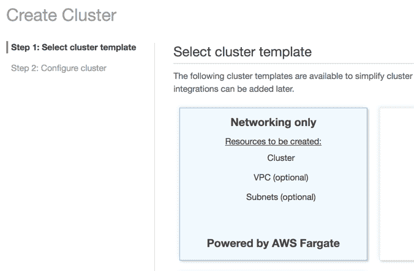

AWS ECS 创建集群

1.  输入集群名称为 `fargate-cluster`

1.  创建一个 VPC，将你的资源与其他 AWS 资源隔离开来

1.  点击创建集群完成设置

你将看到你的操作摘要，如下所示：

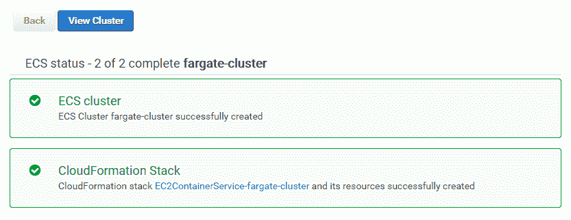

AWS ECS Fargate 集群

现在，你已经在自己的**虚拟私有云**（**VPC**）中创建了一个集群，你可以在弹性容器服务 | 集群下查看它。

# 创建容器库

接下来，我们需要设置一个存储库，在这里我们可以发布我们在本地或 CI 环境中构建的容器映像：

1.  导航到弹性容器服务

1.  点击 Repositories | 创建存储库

1.  将存储库名称输入为 `lemon-mart`

1.  复制屏幕上生成的存储库 URI

1.  将 URI 粘贴在你的应用程序的`package.json`中，作为新的`imageRepo`变量：

```ts
package.json ...
"config": {
  “imageRepo”: “000000000000.dkr.ecr.us-east-1.amazonaws.com/lemon-mart”,
  ...
}
```

1.  点击创建存储库

1.  点击下一步，然后点击完成设置

在摘要屏幕中，你将得到进一步关于如何在 Docker 中使用你的存储库的指导。在本章的后面，我们将介绍如何使用脚本为我们处理这个问题。

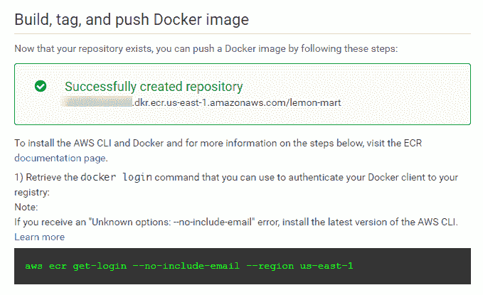

AWS ECS 仓库

你可以在弹性容器服务 | 存储库下查看你的新存储库。我们将在接下来的`npm 脚本 for AWS`部分介绍如何发布你的映像。

# 创建任务定义

在我们的仓库中定义了一个容器目标后，我们可以定义一个任务定义，其中包含运行我们的容器所需的元数据，例如端口映射、保留 CPU 和内存分配：

1.  转到 Elastic Container Service

1.  点击 Task Definitions | 创建新任务定义

1.  选择 Fargate 启动类型兼容性

1.  将任务定义名称设置为`lemon-mart-task`

1.  选择任务角色`none`（稍后可以添加一个以启用访问其他 AWS 服务）

1.  输入任务大小`0.5 GB`

1.  输入任务 CPU`0.25 CPU`

1.  点击添加容器：

    1.  将容器名称设置为`lemon-mart`

    1.  对于 Image，粘贴之前的镜像仓库 URI，但在其后追加`:latest`标签，以便始终拉取仓库中的最新镜像，例如`000000000000.dkr.ecr.us-east-1.amazonaws.com/lemon-mart:latest`

    1.  为 NGINX 设置软限制为`128 MB`，为 Node.js 设置为`256 MB`

    1.  在端口映射下，为 NGINX 指定容器端口为`80`，为 Node.js 指定为`3000`。

1.  接受剩下的默认值

1.  点击添加；这是在创建任务定义之前您的任务定义将看起来像的样子：

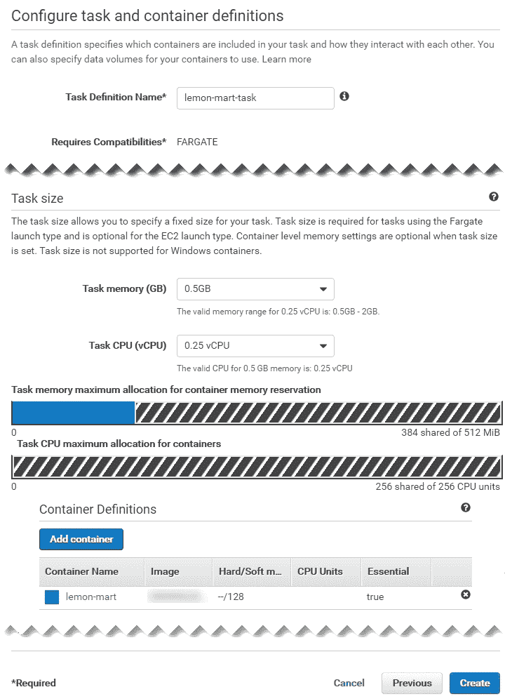

AWS ECS 任务定义

1.  点击创建以完成设置

在 Elastic Container Service | Task Definitions 下查看您的新任务定义。

请注意，默认设置将启用 AWS CloudWatch 日志记录，这是您可以在后期访问容器实例的控制台日志的一种方式。在此示例中，将创建名为`/ecs/lemon-mart-task`的 CloudWatch 日志组。

在 Cloud Watch | Logs 下查看您的新日志组。

如果您正在添加需要持久数据的容器，则任务定义允许您定义卷并将文件夹挂载到您的 Docker 容器中。我已发布了一篇关于在您的 ECS 容器中配置 AWS **弹性文件系统** (**EFS**)的指南，网址为[bit.ly/mount-aws-efs-ecs-container](http://bit.ly/mount-aws-efs-ecs-container)。

# 创建弹性负载均衡器

在高可用部署中，我们将希望在两个不同的**可用区**（**AZs**）上运行两个容器实例，如我们刚刚创建的任务定义所定义的那样。对于这种动态扩展和收缩，我们需要配置一个**应用负载均衡器**（**ALB**）来处理请求路由和排空：

1.  在另一个选项卡上，导航至 EC2 | 负载均衡器 | 创建负载均衡器

1.  创建一个应用负载均衡器

1.  输入名称`lemon-mart-alb`：

为了支持监听器下的 SSL 流量，你可以在端口`443`上添加一个新的 HTTPS 监听器。通过 AWS 服务和向导，可以方便地设置 SSL。在 ALB 配置过程中，AWS 提供了链接到这些向导以创建你的证书。然而，这是一个复杂的过程，取决于你现有的域名托管和 SSL 证书设置。在本书中，我将跳过与 SSL 相关的配置。你可以在我发布的指南[bit.ly/setupAWSECSCluster](http://bit.ly/setupAWSECSCluster)中找到 SSL 相关的步骤。

1.  在可用区中，选择为您的 fargate-cluster 创建的 VPC

1.  选择所有列出的可用区

1.  展开标签，添加一个键/值对以便识别 ALB，比如``"App": " LemonMart"``

1.  点击下一步

1.  选择默认的 ELB 安全策略

1.  点击下一步

1.  创建一个新的集群特定安全组，`lemon-mart-sg`，仅允许端口`80`入站或`443`（如果使用 HTTPS）。

在下一节中创建集群服务时，请确保此处创建的安全组是在服务创建期间选择的那个。否则，您的 ALB 将无法连接到您的实例。

1.  点击下一步

1.  将新的目标组命名为`lemon-mart-target-group`

1.  将协议类型从`instance`更改为`ip`

1.  在健康检查下，保持默认路由`/`，如果在 HTTP 上提供网站

健康检查对于扩展和部署操作至关重要。这是 AWS 用来检查实例是否已成功创建的机制。

如果部署 API 和/或将所有 HTTP 调用重定向到 HTTPS，请确保你的应用定义了一个不重定向到 HTTPS 的自定义路由。在 HTTP 服务器 GET `/healthCheck` 返回简单的`I'm healthy`消息，并验证这不会重定向到 HTTPS。否则，你将通过许多痛苦和痛苦来试图弄清楚问题所在，因为所有的健康检查都失败了，而部署却莫名其妙地失败了。`duluca/minimal-node-web-server`提供 HTTPS 重定向功能，以及开箱即用的仅 HTTP `/healthCheck`端点。使用`duluca/minimal-nginx-web-server`，你将需要提供自己的配置。

1.  点击下一步

1.  *不*注册任何目标或 IP 范围。如果这是由 ECS Fargate 魔法般地为您管理的，如果您自己这样做，您将为半破碎的基础设施提供。

1.  点击下一步:审核;您的 ALB 设置应该与所示的类似：

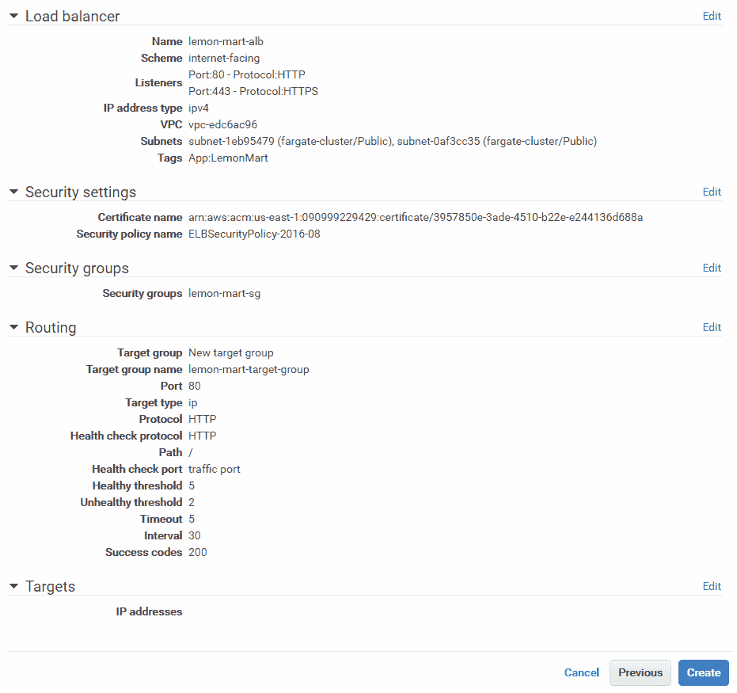

AWS 应用负载均衡器设置

1.  点击创建完成设置

在下一节中创建集群服务时，您将使用 lemon-mart-alb。

# 创建集群服务

现在，我们将通过使用任务定义和我们创建的 ALB 在我们的集群中创建一个服务，将它们整合起来：

1.  转到弹性容器服务

1.  点击集群 | fargate-cluster

1.  在服务选项卡下，点击创建

1.  选择启动类型`Fargate`

1.  选择您之前创建的任务定义

请注意，任务定义是有版本的，比如 `lemon-mart-task:1`。如果要对任务定义进行更改，AWS 将创建 `lemon-mart-task:2`。您需要使用此新版本更新服务，以使更改生效。

1.  输入服务名称 `lemon-mart-service`

1.  任务数量 `2`

1.  最小可用百分比 `50`

1.  最大百分比 `200`

1.  点击下一步

为了确保在部署过程中保持高可用性，将最小健康百分比设置为 100。Fargate 的定价是按秒计费的，因此在部署应用程序时，您将额外支付额外的实例费用，而旧实例正在被取消。

1.  在配置网络下，选择与之前集群相同的 VPC

1.  选择所有现有的子网；应至少有两个以保证高可用性

1.  选择在上一部分中创建的安全组—`lemon-mart-sg`

1.  将负载均衡器类型选择为应用负载均衡器

1.  选择 lemon-mart-alb 选项

1.  通过点击“添加到负载均衡器”按钮，为 ALB（应用负载均衡器）添加容器端口，例如 `80` 或 `3000`

1.  选择您已经定义的监听端口

1.  选择您之前定义的目标组

1.  取消勾选“启用服务发现集成”

1.  点击下一步

1.  如果您希望实例在达到一定限制时能够自动扩展和缩减，则设置自动缩放

我建议在服务的初始设置过程中跳过自动扩展的设置，以便更容易排除任何潜在的配置问题。您可以随后再回来进行设置。自动任务缩放策略依赖于警报，如 CPU 利用率。

1.  点击下一步，并审查您所做的更改，如图所示：

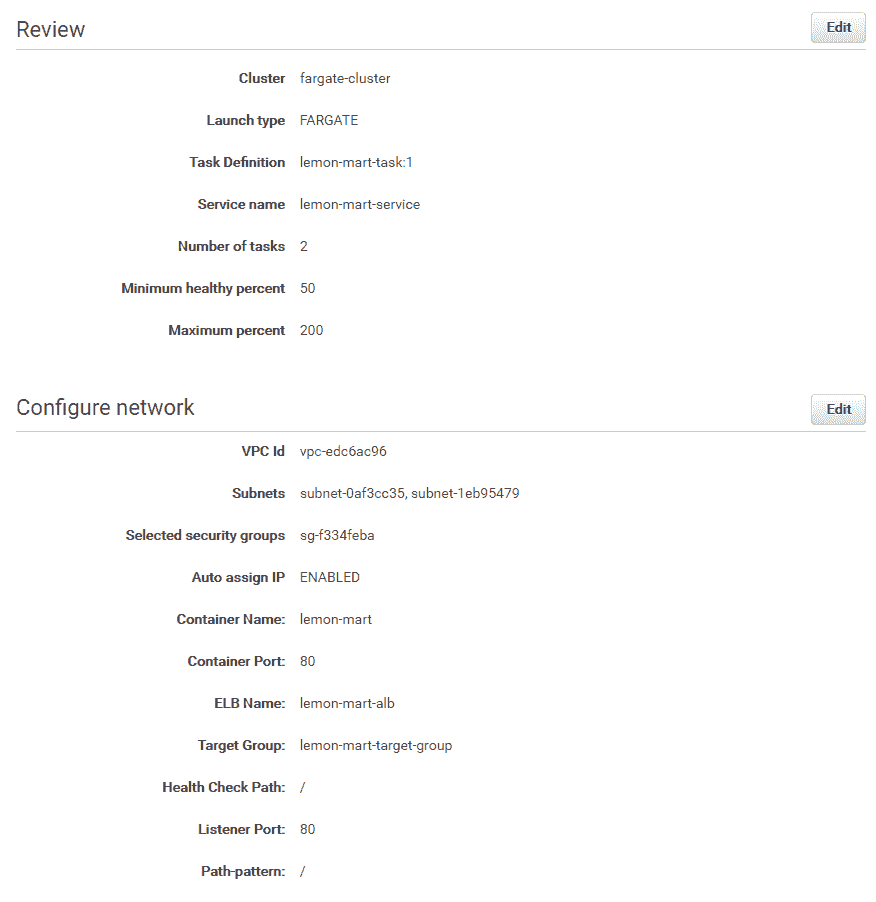

AWS Fargate 集群服务设置

1.  最后，点击“保存”完成设置

观察您在 Elastic Container Service | Clusters | fargate-cluster | lemon-mart-service 下的新服务。在将图像发布到容器存储库之前，您的 AWS 服务将无法启动实例，因为健康检查将持续失败。发布图像后，您将希望确保服务的事件标签中没有错误。

AWS 是一个复杂的系统，通过 Fargate，您可以避免很多复杂性。然而，如果您有兴趣使用自己的 Ec2 实例建立自己的 ECS 集群，您可以通过 1-3 年的保留实例获得重大折扣。我有一份完整的设置指南，可在 [bit.ly/setupAWSECSCluster](http://bit.ly/setupAWSECSCluster) 上找到。

我们手动执行了许多步骤来创建我们的集群。AWS CloudFormation 可以通过提供可定制的配置模板或从头开始编写模板来解决这个问题。如果您希望认真对待 AWS，这种代码即基础设施的设置绝对是上策。

对于生产部署，请确保您的配置由 CloudFormation 模板定义，这样就可以轻松地重新配置，而不是在部署相关的意外失误发生时。

# 配置 DNS

如果您使用 AWS Route 53 来管理您的域名，那么很容易将域名或子域名分配给 ALB：

1.  转到 Route 53 | 托管区域

1.  选择您的域名，例如`thejavascriptpromise.com`

1.  点击创建记录集

1.  将名称输入为`lemonmart`

1.  将别名设置为`是`

1.  从负载均衡器列表中选择 lemon-mart-alb

1.  点击创建以完成设置

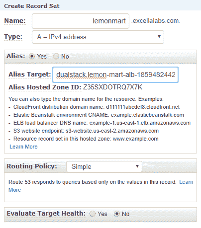

Route 53 - 创建记录集

现在，您的站点将通过您刚刚定义的子域名可达，例如`http://lemonmart.thejavascriptpromise.com`。

如果不使用 Route 53，不必惊慌。在您的域名提供商的网站上，编辑`Zone`文件以创建`A`记录到 ELB 的 DNS 地址，完成后即可。

# 获取 DNS 名称

为了获得负载均衡器的 DNS 地址，请执行以下步骤：

1.  转到 EC2 | 负载均衡器

1.  选择 lemon-mart-alb

1.  在描述标签中记录 DNS 名称；考虑以下示例：

```ts
DNS name:
lemon-mart-alb-1871778644.us-east-1.elb.amazonaws.com (A Record)
```

# 准备 Angular 应用

本节假设您已经根据第十章*，为生产发布准备 Angular 应用*的详细说明设置了 Docker 和`npm Scripts for Docker`。您可以在[bit.ly/npmScriptsForDocker](http://bit.ly/npmScriptsForDocker)获取这些脚本的最新版本。

实现优化的`Dockerfile`：

```ts
Dockerfile 
FROM duluca/minimal-nginx-web-server:1.13.8-alpine
COPY dist /var/www
CMD 'nginx'
```

请注意，如果您正在使用`npm Scripts for Docker`，请将内部图像端口从`3000`更新到`80`，如下所示：

```ts
"docker:runHelper": "cross-conf-env docker run -e NODE_ENV=local --name $npm_package_config_imageName -d -p $npm_package_config_imagePort:80 $npm_package_config_imageRepo",
```

# 添加 npm Scripts for AWS

就像`npm Scripts for Docker`一样，我开发了一组脚本，称为`npm Scripts for AWS`，适用于 Windows 10 和 macOS。这些脚本将使您能够以出色、无停机时间、蓝绿色方式上传和发布您的 Docker 镜像。您可以在[bit.ly/npmScriptsForAWS](http://bit.ly/npmScriptsForAWS)获取这些脚本的最新版本：

1.  确保您的项目已经设置了[bit.ly/npmScriptsForDocker](http://bit.ly/npmScriptsForDocker)

1.  创建`.env`文件并设置`AWS_ACCESS_KEY_ID`和`AWS_SECRET_ACCESS_KEY`：

```ts
.env
AWS_ACCESS_KEY_ID=your_own_key_id
AWS_SECRET_ACCESS_KEY=your_own_secret_key
```

1.  确保您的`.env`文件在您的`.gitignore`文件中，以保护您的秘密信息

1.  安装或升级到最新的 AWS CLI：

    +   在 macOS 上 `brew install awscli`

    +   在 Windows 上`choco install awscli`

1.  使用您的凭证登录 AWS CLI：

    1.  运行`aws configure`

    1.  您将需要从配置 IAM 账户时获得的访问密钥 ID 和访问密钥 Commands 的各位。

    1.  设置默认区域名称，如`us-east-1`

1.  更新`package.json`，添加新的`config`属性，其中包含以下配置属性：

```ts
package.json
  ...
  "config": {
    ...
    "awsRegion": "us-east-1",
    "awsEcsCluster": "fargate-cluster",
    "awsService": "lemon-mart-service"
  },
 ...
```

确保您从配置`npm Scripts for Docker`时更新了`package.json`，以便`imageRepo`属性具有您新的 ECS 存储库的地址。

1.  向`package.json`添加 AWS `scripts`，示例如下：

```ts
package.json
...
"scripts": {
  ...
  "aws:login": "run-p -cs aws:login:win aws:login:mac",
  "aws:login:win": "cross-conf-env aws ecr get-login --no-include-email --region $npm_package_config_awsRegion > dockerLogin.cmd && call dockerLogin.cmd && del dockerLogin.cmd",
 "aws:login:mac": "eval $(aws ecr get-login --no-include-email --region $npm_package_config_awsRegion)"
}
```

`npm run aws:login` 调用特定于平台的命令,自动执行从 AWS CLI 工具获取 Docker 登录命令的多步操作,如下所示:

```ts
example
$ aws ecr get-login --no-include-email --region us-east-1
docker login -u AWS -p eyJwYXl...3ODk1fQ== https://073020584345.dkr.ecr.us-east-1.amazonaws.com
```

你首先需要执行 `aws ecr get-login`,然后复制粘贴得到的 `docker login` 命令并执行它,以便你的本地 Docker 实例指向 AWS ECR:

```ts
package.json
...
"scripts": {
  ...
  "aws:deploy": "cross-conf-env docker run --env-file ./.env duluca/ecs-deploy-fargate -c $npm_package_config_awsEcsCluster -n $npm_package_config_awsService -i $npm_package_config_imageRepo:latest -r $npm_package_config_awsRegion --timeout 1000"
  }
...
```

`npm run aws:deploy` 拉取一个 Docker 容器,该容器本身执行蓝绿部署,使用你通过 `aws ecr` 命令提供的参数。这是如何运作的细节超出了本书的范围。要查看更多使用本地 `aws ecr` 命令的示例,请参考 `aws-samples` 存储库 [github.com/aws-samples/ecs-blue-green-deployment](https://github.com/aws-samples/ecs-blue-green-deployment)。

请注意, `duluca/ecs-deploy-fargate` 蓝绿部署脚本是原始 `silintl/ecs-deploy` 镜像的一个分支,经过修改以支持使用 PR `https://github.com/silinternational/ecs-deploy/pull/129` 的 AWS ECS Fargate。一旦 `silintl/ecs-deploy` 合并了这个变更,我建议你使用 `silintl/ecs-deploy` 进行蓝绿部署:

```ts
package.json
...
"scripts": {
  ...
  "aws:release": "run-s -cs aws:login docker:publish aws:deploy"
}
...
```

最后, `npm run aws:release` 只需按正确的顺序运行 `aws:login`、`docker:publish` 和 `aws:deploy` 命令。

# 发布

你的项目已配置为部署在 AWS 上。你主要需要使用我们创建的两个命令来构建和发布镜像:

1.  执行 `docker:debug` 来测试、构建、标记、运行、跟踪并在浏览器中启动你的应用程序来测试镜像:

```ts
$ npm run docker:debug
```

1.  执行 `aws:release` 配置 Docker 登录 AWS,发布最新的镜像构建,并将其发布到 ECS:

```ts
 $ npm run aws:release
```

1.  验证你的任务在服务级别正在运行: 

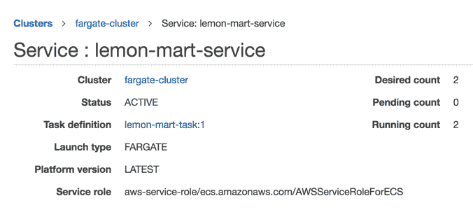

AWS ECS 服务

确保运行计数和期望计数相同。

1.  验证你的实例在任务级别正在运行:

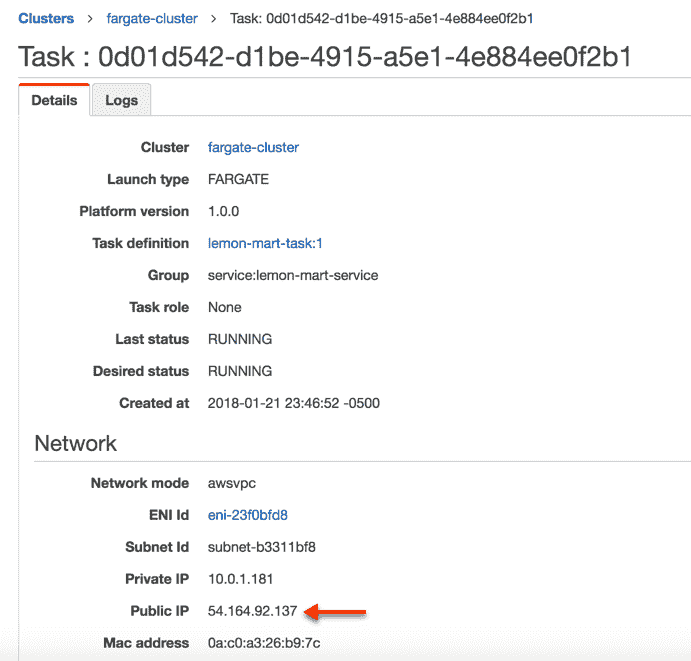

AWS ECS 任务实例

记下公网 IP 地址并导航到它; 例如 `http://54.164.92.137`，你应该能看到你的应用程序或正在运行的 LemonMart。

1.  验证负载均衡器在 DNS 级别的设置是否正确。

1.  导航到 ALB DNS 地址,例如 `http://lemon-mart-alb-1871778644.us-east-1.elb.amazonaws.com`,确认应用程序呈现如下:

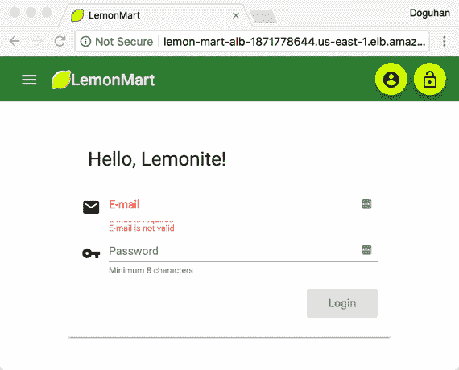

LemonMart 运行在 AWS Fargate 上

瞧!你的网站应该已经启动并运行了。

在后续版本发布中,你将能够观察到蓝绿部署的进行,如下所示:

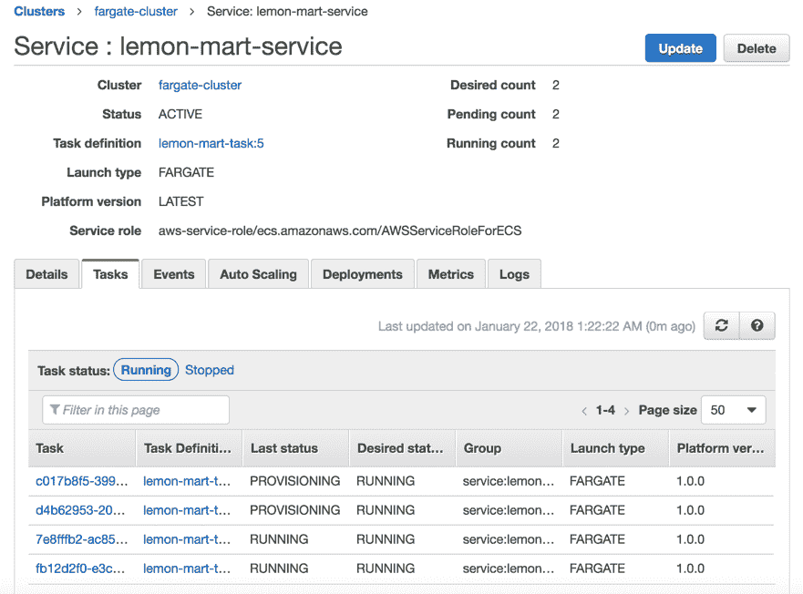

AWS 服务在蓝绿部署期间

有两个任务正在运行,另外两个新任务正在预配置。在新任务得到验证的同时,运行数量会上升到四个任务。在新任务得到验证并从旧任务中排出连接后,运行数量将恢复为两个。

你可以通过配置 CircleCI 与你的 AWS 凭据，使用已安装了`awscli`工具的容器，并运行`npm Scripts for AWS`来自动化你的部署。使用这种技术，你可以实现对暂存环境的持续部署或对生产环境的持续交付。

# 摘要

在本章中，你了解了正确保护你的 AWS 账户的微妙之处和各种安全考虑。我们讨论了调整基础架构的概念。你以隔离的方式进行了简单的负载测试，以找出两个 Web 服务器之间性能的相对差异。拥有了一个经过优化的 Web 服务器，你配置了 AWS ECS Fargate 集群，实现了高可用的云基础架构。通过使用 AWS 的 npm 脚本，你学会了如何编写可重复和可靠的无停机蓝绿部署。最后，你了解了在 AWS 和其他云提供商（如 Heroku、Zeit Now 和 Digital Ocean）上运行基础架构的基本成本。
