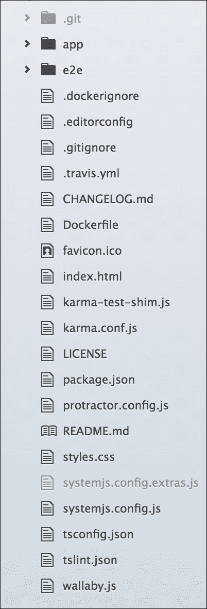
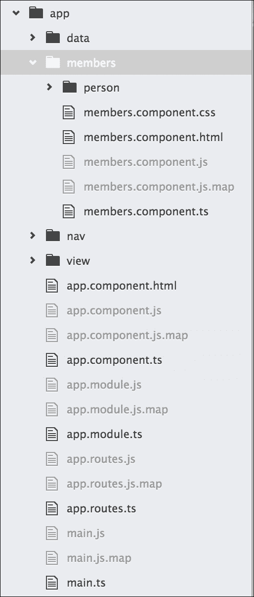
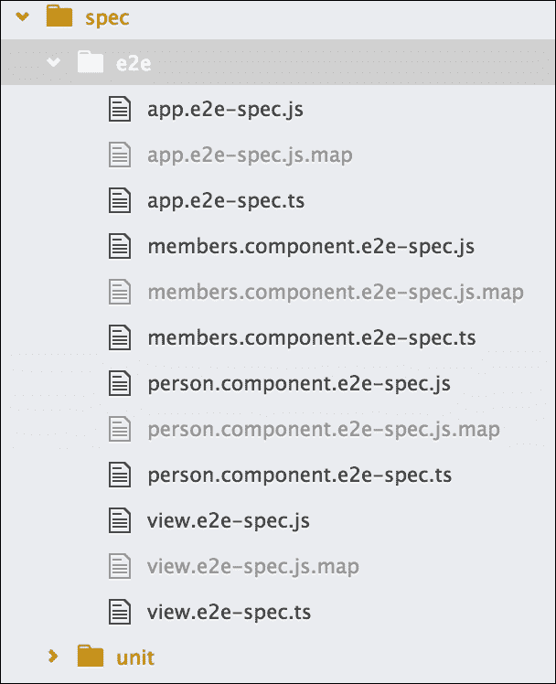
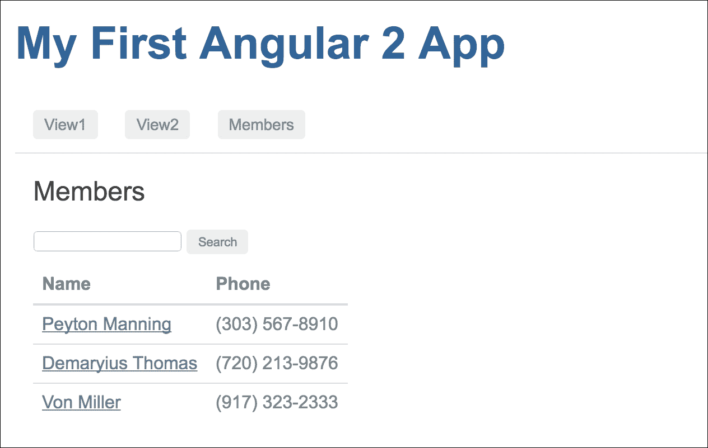
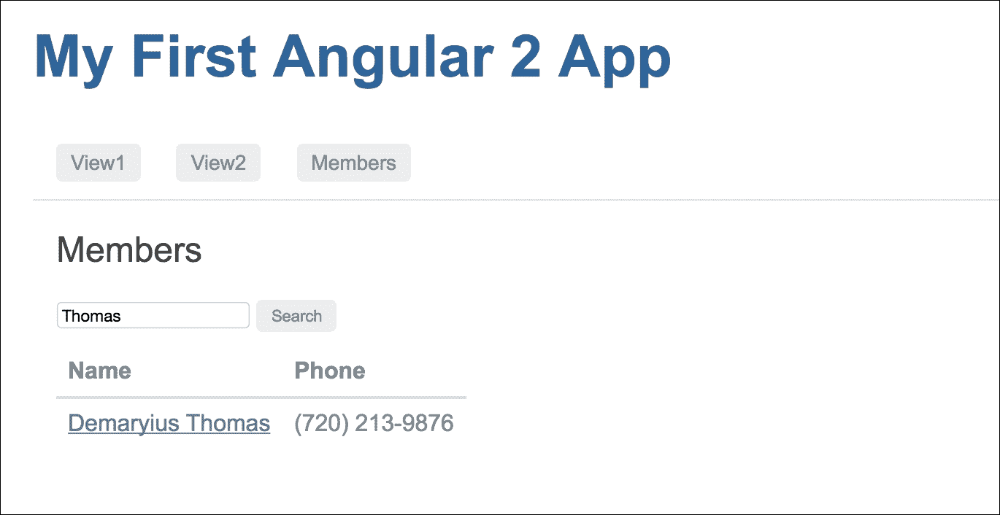
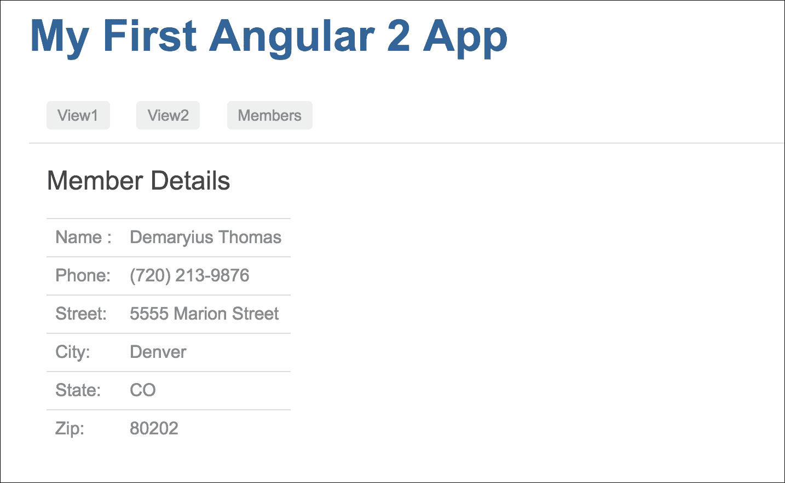
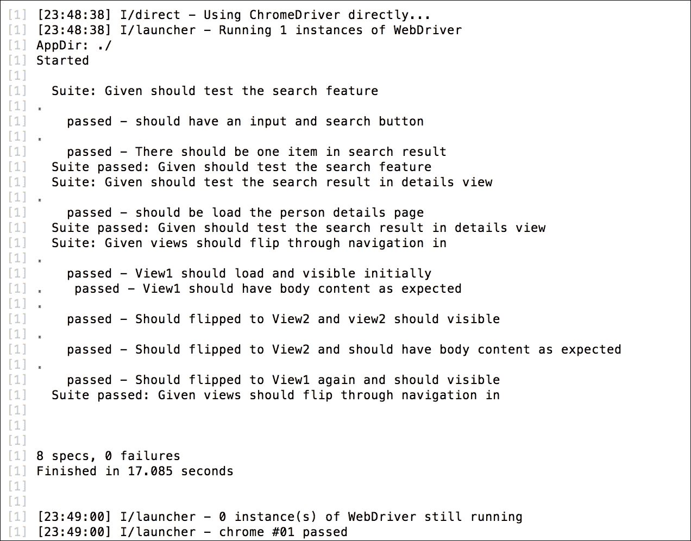

# 第七章。翻转

在这一点上，我们应该对使用 TDD 进行 Angular 应用程序的初始实现感到自信。此外，我们应该熟悉使用先测试的方法。先测试的方法在学习阶段非常好，但有时当我们遇到很多错误时会耗费时间。对于简单和已知的行为，可能不适合采用先测试的方法。

我们已经看到了先测试的方法是如何工作的，所以我们可以通过检查任何功能来跳过这些步骤，而不创建这些组件。除此之外，我们可以更进一步，让我们更有信心更快地编写我们的组件。我们可以准备好我们的组件，然后编写端到端的测试规范来测试预期的行为。如果端到端测试失败，我们可以在 Protractor 调试器中触发错误。

在本章中，我们将继续扩展我们对 Angular 应用 TDD（但不是先测试的方法）的知识。我们不会在这里讨论基本的 Angular 组件生态系统的细节；相反，我们将更进一步，包括更多的 Angular 特性。我们将通过以下主题进一步扩展我们的知识：

+   Angular 路由

+   导航到路由

+   与路由参数数据通信

+   使用 CSS 和 HTML 元素的 Protractor 定位器的位置引用

# TDD 的基础知识

在本章中，我们将演示如何将 TDD 应用于搜索应用程序的路由和导航。在进行实例演练之前，我们需要了解本章中将使用的一些技术、配置和函数，包括以下内容：

+   Protractor 定位器

+   无头浏览器测试

在回顾了这些概念之后，我们可以继续进行实例演练。

## Protractor 定位器

Protractor 定位器是每个人都应该花一些时间学习的关键组件。在之前的 Protractor 章节中，我们了解了一些常用的定位器，并提供了工作示例。我们将在这里提供一些 Protractor `Locator`的示例。

Protractor 定位器允许我们在 HTML 页面中查找元素。在本章中，我们将看到 CSS、HTML 和 Angular 特定的定位器的实际应用。定位器被传递给`element`函数。`element`函数将在页面上查找并返回元素。通用的定位器语法如下：

```ts
element(by.<LOCATOR>); 

```

在上述代码中，`<LOCATOR>`是一个占位符。以下部分描述了其中的一些定位器。

### CSS 定位器

CSS 用于向 HTML 页面添加布局、颜色、格式和样式。从端到端测试的角度来看，元素的外观和样式可能是规范的一部分。例如，考虑以下 HTML 片段：

```ts
<div class="anyClass" id="anyId"></div> 
// ... 
var e1 = element(by.css('.anyClass')); 
var e2 = element(by.css('#anyId')); 
var e3 = element(by.css('div')); 
var e4 = $('div'); 

```

所有这四个选择都将选择 `div` 元素。

### 按钮和链接定位器

除了能够选择和解释某物的外观方式之外，能够在页面内找到按钮和链接也很重要。这将使测试能够轻松地与网站进行交互。以下是一些示例：

+   `buttonText` 定位器：

```ts
        <button>anyButton</button> 
        // ... 
        var b1 = element(by.buttonText('anyButton')); 

```

+   `linkText` 定位器：

```ts
        <a href="#">anyLink</a> 
        // ... 
        var a1 = element(by.linkText('anyLink')); 

```

### URL 位置引用

在测试 Angular 路由时，我们需要能够测试我们测试的 URL。通过在 URL 和位置周围添加测试，我们必须确保应用程序能够使用特定路由。这很重要，因为路由为我们的应用程序提供了一个接口。以下是如何在 Protractor 测试中获取 URL 引用的方法：

```ts
var location = browser.getLocationAbsUrl(); 

```

现在我们已经看到了如何使用不同的定位器，是时候将知识付诸实践了。

# 准备一个 Angular 项目

重要的是要有一个快速设置项目的过程和方法。您花在思考目录结构和所需工具的时间越少，您就可以花更多时间开发！

因此，在之前的章节中，我们看了如何获取 Angular 的简单现有项目，开发为 `quickstart` 项目 ([`github.com/angular/quickstart`](https://github.com/angular/quickstart))。

然而，有些人使用 `angular2-seed` ([`github.com/mgechev/angular2-seed`](https://github.com/angular/angular-seed)) 项目，Yeoman，或者创建一个自定义模板。虽然这些技术很有用并且有其优点，但在开始学习 Angular 时，了解如何从零开始构建应用是至关重要的。通过自己构建目录结构和安装工具，我们将更好地理解 Angular。

您将能够根据您特定的应用程序和需求做出布局决策，而不是将它们适应其他模块。随着您的成长和成为更好的 Angular 开发人员，这一步可能不再需要，并且会成为您的第二天性。

## 加载现有项目

首先，我们将从 Angular 的 `quickstart` 项目 [`github.com/angular/quickstart`](https://github.com/angular/quickstart) 克隆项目，将其重命名为 `angular-flip-flop`，我们的项目文件夹结构如下：



在前几章中，我们讨论了如何设置项目，理解了涉及的不同组件，并走过了整个过程。我们将跳过这些细节，并假设您可以回忆起如何执行必要的安装。

## 准备项目

这个`quickstart`项目在项目的首页（`index.html`）中没有包含基本的`href`。我们需要这样做才能完美地进行路由，因此让我们在`index.html`的`<head>`部分添加一行（`base href`）：

```ts
<base href="/"> 

```

在这里，我们的引导组件在应用程序组件中，HTML 模板在组件本身中。在继续之前，我们应该将模板分离到一个新文件中。

为此，我们将更新我们的应用程序组件（`app/app.component.ts`），如下所示：

```ts
import { Component } from '@angular/core'; 

@Component({ 
  moduleId: module.id, 
  selector: 'my-app', 
  templateUrl: 'app.component.html' 
}) 
export class AppComponent { 

}; 

```

让我们在`app/app.component.html`中创建我们单独的模板文件。代码将如下所示：

```ts
<h1>My First Angular 2 App</h1> 

```

## 运行项目

让我们继续进行，并准备使用以下命令运行：

```ts
**$ cd angular-flip-flop**
**$ npm install // To install the required node modules.** 
**$ npm run // To build and run the project in http server.** 

```

要确认安装并运行项目，应用程序将自动在 Web 浏览器中运行。

在运行项目后，预期的输出如下：


## 重构项目

让我们稍微改变项目结构，不过不多。默认情况下，它在相同位置包括了单元测试和组件文件，并将 e2e 测试文件分离到`app/`文件夹之外的`e2e/`文件夹中。

然而，我们将保持所有测试在相同的位置，也就是在`app`之外；我们将把所有测试保存在`spec/e2e`和`spec/unit`中。

目标是将测试规范与组件分开。这样，我们可以将我们的单元测试文件保存在`spec/unit`文件夹之外。

因此，我们当前的文件夹结构将如下所示：


### 注意

只要我们已经改变了单元测试和 e2e 测试的路径，我们就必须在 Karma 配置和 Protractor 配置文件中更改路径。

# 为 Karma 设置无头浏览器测试

在之前的章节中，我们使用默认配置运行 Karma。默认的 Chrome 配置在每次测试时都会启动 Chrome。针对应用程序将在其中运行的实际代码和浏览器进行测试是一个强大的工具。然而，在启动时，浏览器可能并不总是知道你希望它如何行为。从单元测试的角度来看，你可能不希望浏览器在窗口中启动。原因可能是测试可能需要很长时间运行，或者你并不总是安装了浏览器。

幸运的是，Karma 配备了轻松配置 PhantomJS 的能力，一个无界面浏览器。无界面浏览器在后台运行，不会在 UI 中显示网页。PhantomJS 无界面浏览器是一个非常好用的测试工具。它甚至可以设置为对你的测试进行截图！在 PhantomJS 网站上阅读更多关于如何做到这一点以及使用的 WebKit 的信息，网址是[`phantomjs.org/`](http://phantomjs.org/)。以下设置配置将展示如何在 Karma 中设置 PhantomJS 进行无界面浏览器测试。

## 预配置

当 Karma 被安装时，它会自动包含 PhantomJS 浏览器插件。有关更多信息，请参考插件位于[`github.com/karma-runner/karma-phantomjs-launcher`](https://github.com/karma-runner/karma-phantomjs-launcher)。不应该需要任何更多的安装或配置。

然而，如果你的设置显示缺少`karma-phantomjs-launcher`，你可以很容易地使用`npm`进行安装，就像这样：

```ts
**$ npm install karma-phantomjs-launcher --save -dev**

```

## 配置

PhantomJS 被配置在 Karma 配置的`browsers`部分。打开`karma.conf.js`文件，并使用以下细节进行更新：

```ts
browsers: ['PhantomJS'], 

```

同样在`plugins`选项中进行：

```ts
plugins: [ 
        ......... 
        require('karma-phantomjs-launcher'), 
    ], 

```

现在项目已经初始化并配置了无界面浏览器测试，你可以通过以下教程看到它的运行情况。

# Angular 路由和导航的教程

这个教程将利用 Angular 路由。路由是 Angular 的一个非常有用的特性，在 Angular 1.x 之前也是如此，但更加强大。它们允许我们使用不同的组件来控制应用程序的某些方面。

这个教程将在不同的组件之间切换，以展示如何使用 TDD 来构建路由。以下是规格说明。将有一个导航菜单，其中有两个菜单项，**View1**和**View2**：

+   在导航菜单中，点击标签**View1**

+   内容区域（路由器出口）将加载/翻转**View1**内容

以下是第二部分：

+   在导航菜单中，单击标签**View2**

+   内容区域（路由器出口）将加载/翻转**View2**内容

基本上，这将是一个在两个视图之间进行翻转的应用程序。

## 设置 Angular 路由

路由器是 Angular 中的可选服务，因此它不包含在 Angular 核心中。如果我们需要使用路由器，我们将需要在应用程序中安装 Angular `router`服务。

只要我们从`quickstart`克隆了我们的项目，我们应该没问题，因为它最近已将 Angular 路由器添加到其依赖项中，但我们应该检查并确认。如果在`package.json`中的依赖项中没有`@angular/router`，我们可以使用`npm`安装 Angular 路由器，如下所示：

```ts
**$ npm install @angular/router --save**

```

### 定义方向

路由指定了位置并期望结果。从 Angular 的角度来看，路由必须首先指定，然后与某些组件关联。

要在我们的应用程序中实现路由器，我们需要在应用程序模块中导入路由器模块，其中它将在应用程序中注册路由器。之后，我们将需要配置所有路由并将该配置传递给应用程序模块。

### 路由器模块

要在应用程序中实现路由器，我们需要在应用程序模块中导入`RouterModule`，位于`app/app.module.ts`，如下所示：

```ts
import {RouterModule} from "@angular/router"; 

```

这将只是在应用程序系统中使`router`模块可用，但我们必须有一个路由器配置来定义整个应用程序中所有可能的路由器，然后通过应用程序模块将该配置导入应用程序生态系统。

### 配置路由

路由器在配置之前是无用的，为了配置它，我们首先需要导入`router`组件。配置主要包含一个数组列表，其中路由路径和相关组件作为键值对存在。我们可以将配置数组添加到应用程序模块中，或者我们可以创建一个单独的配置文件并将应用模块包含在其中。我们将选择第二个选项，以便路由配置与应用模块分离。

让我们在应用程序根目录中创建路由器配置文件`app/app.routes.ts`。在那里，首先，我们需要从 Angular 服务中导入 Angular `Routes`，如下所示：

```ts
import {Routes} from '@angular/router';

```

从路由器配置文件中，我们需要导出配置数组，如下所示：

```ts
export const rootRouterConfig: Routes = [ 
 // List of routes will come here 
]; 

```

### 应用程序中的路由

我们已经将`router`模块导入到了位于`app/app.module.ts`的应用程序模块中。

然后，我们需要将路由配置文件（`rootRouterConfig`）导入到这个应用程序模块文件中，如下所示：

```ts
import {rootRouterConfig} from "./app.routes";

```

在应用程序模块中，我们知道`NgModule`导入了可选模块到应用程序生态系统中，类似地，为了在应用程序中包含路由，`RouterModule`有一个名为`RouterModule.forRoot(RouterConfig)`的函数，接受`routerConfiguration`来实现整个应用程序中的路由。

应用程序模块（`app/app.module.ts`）将导入`RouterModule`如下：

```ts
@NgModule({ 
  declarations: [AppComponent, ........], 
  imports     : [........., RouterModule.forRoot(rootRouterConfig)], 
  bootstrap   : [AppComponent] 
}) 
export class AppModule { 
} 

```

### 配置中的路由

现在，让我们向位于`app/app.routes.ts`的`Routes`配置数组中添加一些路由。路由配置数组包含一些对象作为键值对，每个对象中大多有两到三个元素。

数组对象中的第一个元素包含“路径”，第二个元素包含与该“路径”对应的要加载的“组件”。

让我们向配置数组中添加两个路由，如下所示：

```ts
export const rootRouterConfig: Routes = [ 
  { 
    path: 'view1',  
    component: View1Component 
  }, 
  { 
    path: 'view2',  
    component: View2Component 
  } 
]; 

```

在这里，定义了两个路由，`view1`和`view2`，并分配了两个组件以加载该路由。

在某些情况下，我们可能需要从一个路由重定向到另一个路由。例如，对于应用程序的根路径（''），我们可能计划重定向到`view1`路由。为此，我们必须在对象中设置`redirectTo`元素，并将一些路由名称分配为其值。我们还需要添加一个额外的元素作为`pathMatch`，并将其值设置为`full`，以便在重定向到其他路由之前匹配完整路径。

代码如下所示：

```ts
export const rootRouterConfig: Routes = [ 
  { 
    path: '',  
    redirectTo: 'view1',  
    pathMatch: 'full' 
  }, 
  .............. 
]; 

```

因此，是的，我们的初始路由配置已经准备就绪。现在，完整的配置将如下所示：

```ts
import {Routes} from '@angular/router'; 
import {View1Component} from './view/view1.component'; 
import {View2Component} from './view/view2.component'; 

export const rootRouterConfig: Routes = [ 
  { 
    path: '',  
    redirectTo: 'view1',  
    pathMatch: 'full' 
  }, 
  { 
    path: 'view1',  
    component: View1Component 
  }, 
  { 
    path: 'view2',  
    component: View2Component 
  } 
]; 

```

我在这里应该提到，我们必须导入`view1`和`view2`组件，因为我们在路由配置中使用了它们。

要详细了解 Angular 路由，请参考[`angular.io/docs/ts/latest/guide/router.html`](https://angular.io/docs/ts/latest/guide/router.html)。

## 实践路由

到目前为止，我们已经安装和导入了路由模块，配置了路由，并在应用程序生态系统中包含了一些内容。我们仍然需要做一些相关的任务，比如创建路由出口，创建导航，以及创建路由中定义的组件，以便亲身体验路由。

### 定义路由出口

只要路由在`appComponent`中配置，我们就需要一个占位符来加载路由导航的组件，Angular 将其定义为路由出口。

`RouterOutlet`是一个占位符，Angular 根据应用程序的路由动态填充它。

对于我们的应用程序，我们将在`appComponent`模板中放置`router-outlet`，位于(`/app/app.component.html`)，就像这样：

```ts
<router-outlet></router-outlet> 

```

### 准备导航

在路由配置中，我们为我们的应用程序设置了两个路径，`/view1`和`/view2`。现在，让我们创建具有两个路由路径的导航菜单，以便进行简单的导航。为此，我们可以创建一个单独的简单组件，以便为整个应用程序组件隔离导航。

在`/app/nav/navbar.component.ts`中为`NavbarComponent`创建一个新的组件文件，如下所示：

```ts
import {Component} from '@angular/core'; 

@Component({ 
  selector: 'app-navbar', 
  templateUrl: 'navbar.component.html', 
  styleUrls: ['navbar.component.css'] 
}) 
export class NavbarComponent {} 

```

此外，在`/app/nav/navbar.component.html`中为导航组件创建一个模板，如下所示：

```ts
<main> 
  <nav> 
    <a [routerLink]="['/view1']">View1</a> 
    <a [routerLink]="['/view2']">View2</a> 
    <a [routerLink]="['/members']">Members</a>      
  </nav> 
</main> 

```

### 注意

现在不要担心导航中的`members`链接；我会在后面的部分告诉你它是什么。

让我们为导航组件创建基本的 CSS 样式，以便更好地查看`/app/nav/navbar.component.css`，如下所示：

```ts
:host { 
  border-color: #e1e1e1; 
  border-style: solid; 
  border-width: 0 0 1px; 
  display: block; 
  height: 48px; 
  padding: 0 16px; 
} 

nav a { 
  color: #8f8f8f; 
  font-size: 14px; 
  font-weight: 500; 
  margin-right: 20px; 
  text-decoration: none; 
  vertical-align: middle; 
} 

nav a.router-link-active { 
  color: #106cc8; 
} 

```

我们有一个导航组件。现在我们需要将其绑定到我们的应用组件，也就是我们的应用程序登陆页面。

为了这样做，我们必须将以下内容附加到位于`/app/app.component.html`的`appComponent`模板中：

```ts
<h1>My First Angular 2 App</h1> 
<app-navbar></app-navbar> 
<router-outlet></router-outlet> 

```

### 准备组件

对于每个定义的路由，我们需要创建一个单独的组件，因为每个路由都将与一个组件相关联。

在这里，我们有两个定义的路由，我们需要创建两个单独的组件来处理路由导航。根据我们的需求，我们将创建`View1Component`和`View2Component`。

在`/app/view/view1.component.ts`中为`View 1`组件创建一个新的组件文件，如下所示：

```ts
import {Component} from '@angular/core'; 

@Component({ 
  selector: 'app-view1', 
  template: '<div id="view1">I am view one component</div>' 
}) 
export class View1Component { } 

```

为`View 2`组件创建另一个组件文件(`/app/view/view2.component.ts`)：

```ts
import {Component} from '@angular/core'; 

@Component({ 
  selector: 'app-view2', 
  template: '<div id="view2">I am view two component</div>' 
}) 
export class View2Component { } 

```

我们已经准备好了我们的路由和相关组件（`导航`，`View1`和`View2`）。希望一切都按预期工作，我们可以在浏览器中看到应用程序的输出。

在查看浏览器中的预期输出之前，让我们通过端到端测试来测试预期结果。现在我们知道了预期的行为，我们将根据我们的期望编写端到端测试规范。一旦我们准备好了端到端测试规范，我们将看到它如何满足我们的期望。

## 组装翻转/翻转测试

在 3A 中的第一个*A*，*assemble*之后，这些步骤将向我们展示如何组装测试：

1.  从 Protractor 基本模板开始，如下所示：

```ts
        describe('Given views should flip through navigation         
        interaction', () => { 
          beforeEach( () => { 
            // ..... 
        }); 

        it('Should fliped to the next view', () => { 
           // ....  
        }); 
        }); 

```

1.  使用以下代码导航到应用程序的根目录：

```ts
        browser.get('view1'); 

```

1.  `beforeEach`方法需要确认正确的组件视图正在显示。这可以通过使用 CSS 定位器来查找`view1`的`div`标签来完成。期望将如下所示：

```ts
        var view1 = element(by.css('#view1')); 
        expect(view1.isPresent()).toBeTruthy(); 

```

1.  然后，添加一个期望，即`view2`不可见：

```ts
        var view2 = element(by.css('#view2')); 
        expect(view2.isPresent()).toBeFalsy(); 

```

1.  然后通过获取`view1`组件的整个文本来进一步确认：

```ts
        var view1 = element(by.css('#view1')); 
        expect(view1.getText()).toEqual('I am view one component'); 

```

### 翻转到下一个视图

前面的测试需要确认，当在导航中点击`view2`链接时，`view2`组件的内容将会加载。为了测试这一点，我们可以使用`by.linkText`定位器。它将如下所示：

```ts
var view2Link = element(by.linkText('View2')); 
view2Link.click(); 

```

`beforeEach`函数现在已经完成，看起来像这样：

```ts
var view1 = element(by.css('#view1')); 
var view2 = element(by.css('#view2')); 
beforeEach(() => { 
    browser.get('view1'); 
    expect(view1.isPresent()).toBeTruthy(); 
    var view2Link = element(by.linkText('View2')); 
    view2Link.click(); 
}) 

```

接下来，我们将添加断言。

### 断言翻转

断言将再次使用 Protractor 的 CSS 定位器，如下所示，来查找`view2`是否可用：

```ts
it('Should fliped to View2 and view2 should visible', () => { 
  expect(view2.isPresent()).toBeTruthy(); 
}); 

```

我们还需要确认`view1`不再可用。添加`view1`不应存在的期望，如下所示：

```ts
it('Should fliped to View2 and view1 should not visible', () => { 
  expect(view1.isPresent()).toBeFalsy(); 
}); 

```

另外，为了确保，我们可以检查`view2`的内容是否已加载，如下所示：

```ts
it('Should fliped to View2 and should have body content as expected',  () => { 
    expect(view2.getText()).toEqual('I am view two component'); 
}); 

```

由于我们即将进行的测试将从导航中点击`view2`链接切换到`view1`组件，让我们通过点击导航中的`view1`链接返回到`view1`组件，希望事情能如预期般工作：

```ts
it('Should flipped to View1 again and should visible', () => { 
    var view1Link = element(by.linkText('View1')); 
    view1Link.click(); 
    expect(view1.isPresent()).toBeTruthy(); 
    expect(view2.isPresent()).toBeFalsy(); 
  }); 

```

测试现在已经组装完成。

## 运行翻转/反转测试

我们的测试规范已经准备好，现在是运行测试并查看结果的时候了。

首先，我们将通过以下命令保持项目在 HTTP 服务器上运行：

```ts
**$ npm start**

```

然后，我们必须运行 Protractor。确保运行应用程序和 Protractor 配置文件的端口号；为了确保，更新配置中运行服务器端口。要运行 Protractor，请使用以下命令：

```ts
**$ npm run e2e**

```

结果应该如下所示：

```ts
Suite: Given views should flip through navigation in 
    passed - View1 should have body content as expected 
    passed - Should flipped to View2 and view2 should visible 
    passed - Should flipped to View2 and should have body content
    as expected 
    passed - Should flipped to View1 again and should visible 
        Suite passed: Given views should flip through navigation in 

```

根据我们的期望，Protractor 测试已经通过。现在我们可以查看浏览器，检查事情是否与端到端测试结果一样。

## 在浏览器中打开应用程序

只要我们已经运行了用于端到端测试的`npm start`命令，我们的应用程序就可以在本地主机的特定端口`3000`上运行。默认情况下，它将在浏览器中打开。

预期输出如下截图所示：


# 以 TDD 方式进行搜索

这个演练将向我们展示如何构建一个简单的搜索应用程序。它有两个组件：第一个讨论了搜索查询组件，第二个使用路由来显示搜索结果的详细信息。

## 搜索查询的演练

正在构建的应用程序是一个搜索应用程序。第一步是设置带有搜索结果的搜索区域。想象一下，我正在进行搜索。在这种情况下，将发生以下操作：

+   输入搜索查询

+   结果将显示在搜索框底部

这部分应用程序与我们在第六章中看到的测试、布局和方法非常相似，*第一步*。应用程序将需要使用输入，响应点击，并确认结果数据。由于测试和代码使用与之前示例相同的功能，因此不值得提供完整的搜索功能演练。相反，以下小节将展示所需的代码并附带一些解释。

## 搜索查询测试

以下代码代表了搜索查询功能的测试：

```ts
describe('Given should test the search feature', () => { 
    let searchBox, searchButton, searchResult; 

    beforeEach(() => { 

    //ASSEMBLE  
    browser.get(''); 
    element(by.linkText('Search')).click(); 
    searchResult = element.all(by.css('#searchList tbody tr')); 
    expect(searchResult.count()).toBe(3); 

    //ACT 
    searchButton = element(by.css('form button')); 
    searchBox = element(by.css('form input')); 
    searchBox.sendKeys('Thomas'); 
    searchButton.click(); 
    }); 

    //Assert 
    it('There should be one item in search result', () => { 
    searchResult = element.all(by.css('#searchList tbody tr')); 
    expect(searchResult.count()).toBe(1); 
    }); 
}); 

```

我们应该注意到与之前的测试有相似之处。功能被编写成模仿用户在搜索框中输入的行为。测试找到输入字段，输入一个值，然后选择写着**搜索**的按钮。断言确认结果包含一个单一值。

## 搜索应用程序

为了执行搜索操作，我们需要创建一个搜索组件，其中包含一个输入字段来接受用户输入（搜索查询）和一个按钮来执行用户操作并触发点击事件。此外，它可能有一个占位符来包含搜索结果。

只要我们的应用程序已经包含了路由器，我们就可以为特定路由放置搜索组件。

请注意，我们将我们的搜索组件称为`MembersComponent`，因为我们在搜索组件中使用了一些成员数据。路由也将根据这个进行配置。

因此，在我们现有的`app.routes.ts`文件中，我们将添加以下搜索路由：

```ts
export const rootRouterConfig: Routes = [ 
  { 
    path: '/members', 
    component: MembersComponent 
  } 
................... 
]; 

```

## 搜索组件

搜索组件（`MembersComponent`）将是这里搜索功能的主要类。它将执行搜索并返回搜索结果。

在搜索组件的初始加载期间，它将没有任何搜索查询，因此我们已经设置了行为以返回所有数据。然后，在搜索触发后，它将根据搜索查询返回数据。

搜索组件将放置在`app/members/members.compoennt.ts`中。在代码中，首先，我们将不得不导入所需的 Angular 服务，如下所示：

```ts
import { Component, OnInit } from '@angular/core'; 
import { Http, Response } from '@angular/http'; 
import { Router } from '@angular/router'; 

```

我们将使用`Http`服务进行 AJAX 调用，默认情况下，在 Angular 中，`Http`服务返回一个可观察对象。但是，处理承诺比处理可观察对象更容易。因此，我们将把这个可观察对象转换为一个承诺。Angular 建议使用`rxjs`模块，该模块具有`toPromise`方法，用于将可观察对象转换为承诺。因此，我们将导入`rxjs`模块，如下所示：

```ts
import 'rxjs/add/operator/toPromise'; 

```

Angular 引入了`ngOnInit()`方法，在初始化组件时执行，类似于任何类中的构造方法，但对于运行测试规范很有帮助。为此，我们从 Angular 核心中导入了`OnInit`接口，`Component`类将实现`OnInit`接口以获取`ngOnInit`方法。

除此之外，`Component`类应注入所需的模块，例如`Http`和`Router`，如下所示：

```ts
export class MembersComponent implements OnInit { 
    constructor(private http:Http, private router:Router) { 
  } 
} 

```

如前所述，我们将使用`ngOnInit()`方法，并从中初始化搜索机制，如下所示：

```ts
export class MembersComponent implements OnInit { 
 ngOnInit() { 
    this.search(); 
  } 

```

在这里，我们将在成员列表上应用“搜索”功能，为此，我们在`app/data/people.json`中有一些虚拟数据。我们将从这里检索数据并对数据执行搜索操作。让我们看看如何：

+   `getData()`方法将从 API 检索数据并返回一个承诺。

```ts
        getData() { 
            return this.http.get('app/data/people.json') 
            .toPromise() 
            .then(response => response.json()); 
        } 

```

+   `searchQuery()`方法将解析返回的承诺，并根据搜索查询创建一个数据数组。如果没有提供搜索查询，它将返回完整的数据集作为数组：

```ts
        searchQuery(q:string) { 
            if (!q || q === '*') { 
              q = ''; 
            } else { 
              q = q.toLowerCase(); 
            } 
            return this.getData() 
              .then(data => { 
              let results:Array<Person> = []; 
              data.map(item => { 
                if (JSON.stringify(item).toLowerCase().includes(q)) { 
                  results.push(item); 
                } 
              }); 
              return results; 
            }); 
        } 

```

+   `search()`方法将为模板准备数据集，以便在前端绑定：

```ts
        search(): void { 
          this.searchQuery(this.query) 
          .then(results => this.memberList = results); 
        } 

```

我们还有一个可选的方法，用于导航到成员详细信息组件。我们称之为`person`组件。在这里，`viewDetails()`方法将传递成员 ID，`router.navigate()`方法将应用程序导航到带有 ID 参数的`person`组件，如下所示：

```ts
viewDetails(id:number) { 
    this.router.navigate(['/person', id]); 
  } 

```

`MembersComponent`的完整代码如下：

```ts
import { Component, OnInit } from '@angular/core'; 
import { Http, Response } from '@angular/http'; 
import { Router } from '@angular/router'; 
import 'rxjs/add/operator/toPromise'; 
import { Person } from './person/person.component'; 

@Component({ 
  selector: 'app-member', 
  moduleId: module.id, 
  templateUrl: 'members.component.html', 
  styleUrls: ['members.component.css'] 
}) 
export class MembersComponent implements OnInit { 
  memberList: Array<Person> = []; 
  query: string; 

  constructor(private http:Http, private router:Router) { 
  } 

  ngOnInit() { 
    this.search(); 
  } 

  viewDetails(id:number) { 
    this.router.navigate(['/person', id]); 
  } 

  getData() { 
    return this.http.get('app/data/people.json') 
      .toPromise() 
      .then(response => response.json()); 
  } 

  search(): void { 
    this.searchQuery(this.query) 
    .then(results => this.memberList = results); 
  } 

  searchQuery(q:string) { 
    if (!q || q === '*') { 
      q = ''; 
    } else { 
      q = q.toLowerCase(); 
    } 
    return this.getData() 
      .then(data => { 
      let results:Array<Person> = []; 
      data.map(item => { 
        if (JSON.stringify(item).toLowerCase().includes(q)) { 
          results.push(item); 
        } 
      }); 
      return results; 
    }); 
  } 
} 

```

`search`组件模板包含搜索表单和搜索结果列表（当有结果要显示时）。

模板如下所示：

```ts
<h2>Members</h2> 

<form> 
  <input type="search" [(ngModel)]="query" name="query" (keyup.enter)="search()"> 
  <button type="button" (click)="search()">Search</button> 
</form> 

<table *ngIf="memberList" id="searchList"> 
  <thead> 
  <tr> 
    <th>Name</th> 
    <th>Phone</th> 
  </tr> 
  </thead> 
  <tbody> 
  <tr *ngFor="let member of memberList; let i=index"> 
    <td><a href="javascript:void(0)" (click)="viewDetails(member.id)">{{member.name}}</a></td> 
    <td>{{member.phone}}</td> 
  </tr> 
  </tbody> 
</table> 

```

前面的 Angular 组件与前几章中已经展示的内容类似。

我们正在使用`people.json`文件中的虚拟数据集，其中包含有关带地址的人的信息。我们希望将信息分为两部分，一部分是摘要信息，另一部分是地址详细信息。由于我们将使用这个数据集，因此很容易为这个数据集创建一个对象模型。

摘要数据集将被定义为`Person`对象，地址详细信息将被定义为`Address`。让我们在`app/members/person/person.component.ts`中创建一个人员对象，并将两个对象模型放在同一个文件中。

`Person`和`Address`两个对象模型类如下：

```ts
export class Person { 
  id:number; 
  name:string; 
  phone:string; 
  address:Address; 

  constructor(obj?:any) { 
    this.id = obj && Number(obj.id) || null; 
    this.name = obj && obj.name || null; 
    this.phone = obj && obj.phone || null; 
    this.address = obj && obj.address || null; 
  } 
} 

export class Address { 
  street:string; 
  city:string; 
  state:string; 
  zip:string; 

  constructor(obj?:any) { 
    this.street = obj && obj.street || null; 
    this.city = obj && obj.city || null; 
    this.state = obj && obj.state || null; 
    this.zip = obj && obj.zip || null; 
  } 
} 

```

## 显示搜索结果！

现在，**搜索**按钮已经设置了所需的功能，结果应该只包含基于搜索查询的数据，而不是所有数据。让我们看一下用户规范。

给定一组搜索结果：

+   我们将根据搜索查询得到成员列表

+   我们将点击任何成员的名字并导航到详细组件以获取详细信息

按照自上而下的方法，第一步将是 Protractor 测试，然后是使应用程序完全功能的必要步骤。

### 测试搜索结果

根据规范，我们需要利用现有的搜索结果。我们可以在现有的搜索查询测试中添加内容，而不是从头开始创建一个测试。从搜索查询测试中嵌入一个基本测试，如下所示：

```ts
describe('Given should test the search result in details view', () => { 
  beforeEach(() => { 
  }); 

  it('should be load the person details page', () => { 
  }); 
}); 

```

下一步是构建测试。

### 组装搜索结果测试

在这种情况下，搜索结果已经可以从搜索查询测试中获得。我们不必为测试添加任何其他设置步骤。

### 选择搜索结果

正在测试的对象是结果。测试是结果被选择后，应用程序必须执行某些操作。编写这个测试的步骤如下：

1.  选择`resultItem`。由于我们将使用路由来表示详细信息，我们将创建一个指向详细页面的链接并点击该链接。以下是创建链接的方法：

选择`resultItem`内的链接。这使用当前选择的元素，然后找到符合条件的任何子元素。代码如下：

```ts
        let resultItem = element(by.linkText('Demaryius Thomas')); 

```

1.  现在，要选择链接，请添加以下代码：

```ts
        resultItem.click(); 

```

### 确认搜索结果

现在搜索项已被选中，我们需要验证结果详情页面是否可见。在这一点上，最简单的解决方案是确保详情视图是可见的。这可以通过使用 Protractor 的 CSS 定位器来查找搜索详情视图来实现。以下是用于确认搜索结果的代码：

```ts
it('Should be load the person details page', () => { 
    var resultDetail = element(by.css('#personDetails')) 
    expect(resultDetail.isDisplayed()).toBeTruthy(); 
}) 

```

以下是完整的测试：

```ts
describe('Given should test the search result in details view', () => { 

  beforeEach(() => { 
    browser.get('members'); 
    let searchButton = element(by.css('form button')); 
    let searchBox = element(by.css('form input')); 
    searchBox.sendKeys('Thomas'); 
    searchButton.click(); 
    let resultItem = element(by.linkText('Demaryius Thomas')); 
    resultItem.click(); 
  }); 

  it('should be load the person details page', () => { 
    var resultDetail = element(by.css('#personDetails')) 
    expect(resultDetail.isDisplayed()).toBeTruthy(); 
  }); 

}); 

```

现在测试已经设置好，我们可以继续到生命周期的下一个阶段并运行它。

## 搜索结果组件

搜索结果组件（我们命名为 `Person`）将路由以接受来自 `params` 路由的 person ID，并将根据该 ID 搜索数据。

搜索结果组件将放置在 `app/members/person/person.component.ts` 中。在代码中，首先我们将需要导入所需的 Angular 服务，如下所示：

```ts
import { Component, OnInit } from '@angular/core'; 
import { Http, Response } from '@angular/http'; 
import { Router, ActivatedRoute, Params } from '@angular/router'; 

```

我们已经在 `members` 组件中看到了一些这些 Angular 服务。在这里，我们将主要讨论 `ActivatedRoute`，因为它是新的。这是一个用于与当前/激活路由交互的 Angular 路由模块：当我们需要访问当前路由中的 `params` 时，我们将通过它来访问它们。

正如我们讨论过的，我们在初始化组件时将需要 `ActivatedRoute`；因此，我们在 `ngOnInit()` 方法中调用了 `ActivatedRoute`。它将为我们提供当前路由参数，并且我们将使用它来从演示成员数据集中检索特定的 `Person`，如下所示：

```ts
export class PersonComponent implements OnInit { 
  person: Person; 
  constructor(private http:Http, private route: ActivatedRoute, 
  private router: Router) { 
  } 

  ngOnInit() { 
    this.route.params.forEach((params: Params) => { 
       let id = +params['id']; 
       this.getPerson(id).then(person => { 
         this.person = person; 
       }); 
     }); 
  } 

```

我们在 `app/data/people.json` 中有一些虚拟数据。这是 `members` 组件中使用的相同数据。我们将根据所选的 ID 检索数据，就像这样：

```ts
getData() { 
    return this.http.get('app/data/people.json') 
      .toPromise() 
      .then(response => response.json()); 
  } 

```

`getData()` 方法将从 API 中检索数据并返回一个 promise：

```ts
getPerson(id:number) { 
    return this.getData().then(data => data.find(member => 
    member.id === id)); 
  } 

```

`getPerson()` 方法将解析返回的 promise，并根据所选的 ID 返回 `Person` 对象。

关于 `PersonComponent` 的完整代码如下：

```ts
import { Component, OnInit } from '@angular/core'; 
import { Http, Response } from '@angular/http'; 
import { Router, ActivatedRoute, Params } from '@angular/router'; 
import 'rxjs/add/operator/toPromise'; 

@Component({ 
  selector: 'app-person', 
  moduleId: module.id, 
  templateUrl: 'person.component.html', 
  styleUrls: ['../members.component.css'] 
}) 
export class PersonComponent implements OnInit { 
  person: Person; 
  constructor(private http:Http, private route: ActivatedRoute, private router: Router) { 
  } 

  ngOnInit() { 
    this.route.params.forEach((params: Params) => { 
       let id = +params['id']; 
       this.getPerson(id).then(person => { 
         this.person = person; 
       }); 
     }); 
  } 

  getPerson(id:number) { 
    return this.getData().then(data => data.find(member => member.id === id)); 
  } 

  getData() { 
    return this.http.get('app/data/people.json') 
      .toPromise() 
      .then(response => response.json()); 
  } 
} 

```

`search` 组件模板包含搜索表单和搜索结果列表（当有结果要显示时）。

模板如下所示：

```ts
<h2>Member Details</h2> 

<table *ngIf="person" id="personDetails"> 
  <tbody> 
  <tr> 
    <td>Name :</td> 
    <td>{{person.name}}</td> 
  </tr> 
    <tr> 
      <td>Phone: </td> 
      <td>{{person.phone}}</td> 
    </tr> 
    <tr> 
      <td>Street: </td> 
      <td>{{person.address.street}}</td> 
    </tr> 
    <tr> 
      <td>City: </td> 
      <td>{{person.address.city}}</td> 
    </tr> 
    <tr> 
      <td>State: </td> 
      <td>{{person.address.state}}</td> 
    </tr> 
    <tr> 
      <td>Zip: </td> 
      <td>{{person.address.zip}}</td> 
  </tr> 
  </tbody> 
</table> 

```

## 路由中的搜索结果

我们有搜索结果/`Person` 组件，但我们忘记在路由配置中包含它。没有它，我们将会有一个异常，因为在没有在路由中包含它的情况下，无法从 `members` 列表导航到 `Person` 组件。

因此，在我们现有的 `app.routes.ts` 文件中，我们将添加以下搜索路由：

```ts
export const rootRouterConfig: Routes = [ 
  { 
    path: '/person/:id', 
    component: PersonComponent 
  } 
................... 
]; 

```

# 运行搜索轮

我们的应用程序已经准备好进行重构、路由配置、e2e 测试以及它们的子组件。我们将查看当前文件结构和项目的输出。

## 应用结构

我们的应用程序有两个主要的文件夹，一个是`app`目录，另一个是`spec/test`目录。

让我们看看我们`app`目录的当前结构：



这是`test`目录：



## 让我们运行

我们的搜索功能已经准备就绪。如果我们运行`npm start`，我们的应用程序将在默认端口`3000`上在浏览器中运行。让我们导航到**成员**以获取搜索功能的输出。搜索功能的 URL 是`http://localhost:3000/members`。

当我们登陆**成员**页面时，实际上会加载所有数据，因为搜索输入为空，这意味着没有搜索查询。输出应该如下所示：



现在让我们用一个搜索查询来检查**成员**页面。如果我们将查询输入为`Thomas`并进行搜索，它将给我们只有一行数据，如下所示：



我们在数据列表中有一行。现在是时候看数据的详细信息了。点击**Thomas**后，我们将看到关于 Thomas 的详细信息，包括地址，如下所示：



万岁！完整的应用程序如预期般在浏览器中运行。

## 现在 e2e 怎么样！

项目在浏览器中运行，我们已经为每个组件进行了 e2e 测试。让我们看看当我们一起运行整个应用程序的 e2e 测试时，e2e 测试的反应如何。

让我们运行`npm run e2e`；输出如下所示：



# 自测问题

Q1\. 在导航后使用哪个自定义占位符来加载组件？

```ts
<router-output> </router-output> 

<router-outlet> </router-outlet> 

<router-link> </router-link> 

```

Q2\. 给定以下的 Angular 组件，你将如何选择`element`并模拟点击？

```ts
<a href="#">Some Link</a> 
$('a').click();. 
element(by.css('li)).click();. 
element(by.linkText('Some Link')).click();. 

```

Q3\. 在 Angular 中使用路由时，你需要安装`@angular/router`。

+   正确

+   错误

# 总结

本章向我们展示了如何使用 TDD 来构建一个 Angular 应用程序。到目前为止，这种方法侧重于从用户角度进行规范，并使用自顶向下的 TDD 方法。这种技术帮助我们测试并完成了可用的小组件。

随着应用程序的增长，它们的复杂性也在增加。在下一章中，我们将探讨自下而上的方法，并看看何时使用这种技术而不是自上而下的方法。

本章向我们展示了如何使用 TDD 来开发具有路由导航的基于组件的应用程序。路由允许我们很好地分离我们的组件和视图。我们研究了几种 Protractor 定位器的用法，从 CSS 到重复器，链接文本和内部定位器。除了使用 Protractor，我们还学习了如何配置 Karma 与无头浏览器，并看到它的实际应用。
