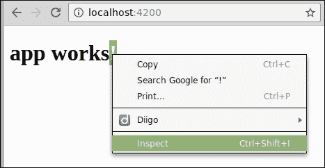
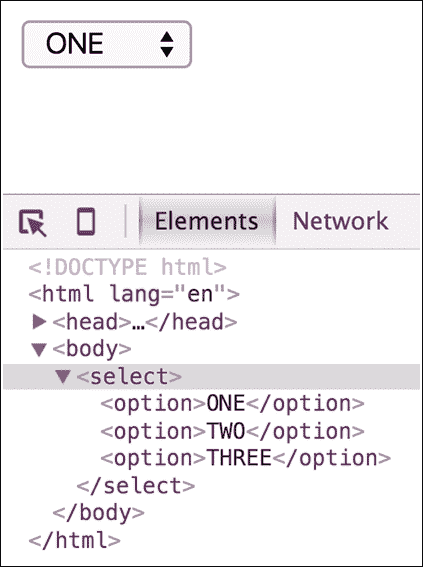
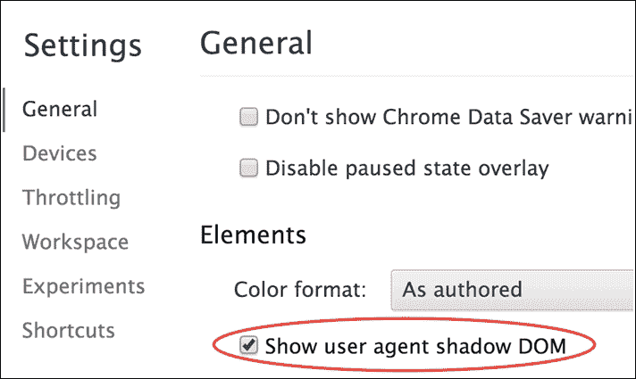

# 第四章。构建基本组件

在其核心，Angular 2 组件是一个负责向视图公开数据并实现用户交互逻辑的类。Angular 2 组件可以与 Angular 1 的控制器、作用域和视图进行比较。

Angular 2 如何知道如何处理我们的类作为组件？我们需要向类附加元数据，告诉 Angular 如何处理它。

元数据一词描述了我们添加到代码中的附加信息。这些信息在运行时由 Angular 2 使用。

在本章中，我们将涵盖以下主题：

+   Angular 2 组件的解剖

+   组件选择器

+   组件模板

+   组件样式

+   视图封装（影子 DOM）

+   数据绑定

+   Angular 2 组件的解剖

在第二章, *使用 angular-cli 设置 Angular 2 开发环境*，设置开发环境时，我们使用`angular-cli`工具从头开始生成了一个 Angular 2 项目，并将其提供给浏览器。如果您还没有这样做，请参考第二章, *使用 angular-cli 设置 Angular 2 开发环境*，并按照步骤进行操作。

完成后，是时候在我们喜爱的 IDE 中打开项目（也在第二章, *使用 angular-cli 设置 Angular 2 开发环境*中描述），检查代码。它应该类似于以下截图：


当我们使用`angular-cli`生成项目时，会为我们创建一个带有我们应用程序名称的组件（我们提供给`ng new`命令）。我们可以在`src/app`目录下找到它，如下所示：


找到名为`app.component.ts`的文件，并在编辑视图中打开它（编辑视图可能因 IDE 而异）。

让我们逐行探索组件代码，这是`app.component.ts`的代码

```ts
[app.component.ts]
import { Component } from '@angular/core';

@Component({
  selector: 'app-root',
  templateUrl: './app.component.html',
  styleUrls: ['./app.component.css']
})
export class AppComponent {
  title = 'app works!';
}
```

在第一行，我们从 Angular 核心模块导入`Component`装饰器

+   然后，我们通过在装饰器名称后面分配`@`符号来声明`Component`装饰器。因为装饰器只是一个函数（参考第三章，“TypeScript 入门”中的解释），我们需要像调用任何其他函数一样使用括号来调用它。

+   `Component`装饰器接受一个对象作为参数，该对象定义了组件的元数据。我们稍后会探讨它。

+   在装饰器之后，我们声明组件类，它应该包含我们的组件逻辑，并且当前声明了名为`title`的字符串。

+   类需要被导出，这样它才能在代码的其他地方使用。

正如我们所看到的，Angular 2 组件必须由两个不同的部分构建：一个简单的类和一个装饰器。

在我们深入研究这段代码之前，让我们打开浏览器，探索已经呈现到浏览器的元素。

为此，将浏览器指向`http://localhost:4200/`（我正在使用 Google Chrome），右键单击标题，然后从弹出菜单中选择**检查**：



这将打开 Chrome DevTool，我们将在其中探索 DOM：


我们在元数据中定义的`selector`成为了具有相同名称的元素，我们在组件类中定义的`title`作为`<h1>`标签呈现在其中。

`<app-root>`是如何找到 DOM 的？`<h1>`标签是从哪里来的？

# 引导应用程序

在处理组件和 DOM 之间的链接之前，让我们介绍模块的概念以及如何使用它来引导应用程序。

在项目根目录的`src`目录下，找到并打开`main.ts`文件：


这个文件是我们 Angular 应用程序的起点。它负责实例化应用程序的主模块和其中的根组件。为此，我们从`platform-browser-dynamic`模块中导入`platformBrowserDynamic`方法，该方法是 Angular 的一部分。这个方法返回一个对象来启动应用程序。这个对象的`bootstrapModule`方法负责通过渲染组件树的根组件来启动 Angular。它需要传递主模块作为参数，所以我们导入我们的模块类`AppModule`并将其传递给`bootstrap`：

以下代码来自`main.ts`文件：

```ts
import './polyfills.ts';
import { platformBrowserDynamic } from '@angular/platform-browser-dynamic';
import { enableProdMode } from '@angular/core';
import { environment } from './environments/environment';
import { AppModule } from './app/';

if (environment.production) {
  enableProdMode();
}

platformBrowserDynamic().bootstrapModule(AppModule);
```

其余的代码对使用根模块引导 Angular 没有任何影响。`enableProdMode`方法是 Angular 核心中的一个方法，它在生产模式下运行应用程序。环境只是一个常量，它保存一个布尔值，指示我们是否在生产环境中运行。

模块是将一组组件、指令、服务和管道聚合到一个单一实体中的便捷方式，可以进入其他模块。每个 Angular 应用程序都包含一个根模块，在我们的情况下是`AppModule`。它包含应用程序的根组件。

模块只是一个用`@NgModule`装饰的类，它接受一个对象作为参数，该对象定义了模块的元数据。

请注意，我们使用了动态引导的方法，利用了即时编译器。这会在内存中和浏览器中动态编译组件。另一种称为**预编译**（**AoT**）的替代方法在 Angular 2 中也是可能的。在这种情况下，无需将 Angular 编译器发送到浏览器，性能提升可能是显著的。

在这种情况下，在预编译应用程序之后，您需要在`main.ts`文件中使用`platform-browser-dynamic`模块的`platformBrowserDynamic`方法：

```ts
import './polyfills.ts';
import { platformBrowser } from '@angular/platform-browser';
import { enableProdMode } from '@angular/core';
import { environment } from './environments/environment';
import { AppModuleNgFactory } from './app/app.module.ng.factory';

if (environment.production) {
  enableProdMode();

}

platformBrowser().bootstrapModuleFactory(AppModuleNgFactory);
```

# 组件选择器

正如我们在本章的第一个示例中所看到的，我们在组件装饰器中定义的**选择器**成为一个呈现到 DOM 中的元素。在我们探索选择器选项之前，让我们了解一下 Angular 如何呈现这个组件。

正如我们在第一章中讨论的*Angular 2 组件架构*，Angular 2 应用程序可以被描述为一个组件树。就像任何其他树结构一样，只有一个根节点。目前在我们的项目中，我们只有一个组件，它被用作树节点。

有了这些信息，让我们看看 Angular 如何实例化我们的根组件并将其呈现出来：

在项目根目录的`src/app`目录下，找到并打开`app.module.ts`文件。这个文件包含了应用程序的根模块的定义：

```ts
[app.module.ts]
import { BrowserModule } from '@angular/platform-browser';
import { NgModule } from '@angular/core';
import { FormsModule } from '@angular/forms';
import { HttpModule } from '@angular/http';
import { AppComponent } from './app.component';

@NgModule({
  declarations: [
    AppComponent
  ],

  imports: [
    BrowserModule,
    FormsModule,
    HttpModule
  ],

  providers: [],
  bootstrap: [AppComponent]
})
export class AppModule { }
```

`app.module.ts` 负责实例化组件类。当这发生时，Angular 会在`index.html`文件中搜索我们在组件装饰器中定义的选择器。我们需要放置在`index.html`中的唯一组件是在`app.module.ts`中的根模块的`bootstrap`属性中定义的根组件。

请注意，此组件需要在`declarations`属性中指定，列出模块中所有可用的组件。

打开`index.html`，它位于`main.ts`旁边，检查代码：

```ts
[index.html]
<html>
  <head>
    <!-- other code related to the page head -->
  </head>
  <body>
    <app-root>Loading...</app-root>
  </body>
</html>
```

我们看到的第一件事是，在我们的`html`文件中，我们将选择器用作元素。这是 Angular 的默认行为。

您在`index.html`中找到的其他代码与`angular-cli`使用的构建系统相关，这超出了本书的范围。

你需要知道的是，当这个 HTML 加载到服务器时，Angular 会加载所有必需的依赖项，你需要运行`main.ts`中的代码来启动框架。

## 选择器选项

当我们构建组件时，我们正在创建新的 HTML 元素。这就是为什么默认情况下我们的选择器名称在 HTML 中用作元素的原因。但是，我们还有其他选项可以用于构建组件。让我们来探索一下：

+   按 CSS 类名选择：

```ts
@Component({
  selector: '.app-root'
})
```

在标记中使用：

```ts
<div class="app-root">Loading...</div>
```

+   按属性名选择：

```ts
@Component({
  selector: '[app-root]'
})
```

在标记中使用：

```ts
<div app-root>Loading...</div>
```

+   按属性名和值选择：

```ts
@Component({
  selector: 'div[app=components]'
})
```

在标记中使用：

```ts
<div app="components">Loading...</div>
```

+   仅在元素不匹配选择器时选择：

```ts
@Component({
  selector: 'div:not(.widget)'
})
```

在标记中使用：

```ts
<div class="app">Loading...</div>
```

+   如果其中一个选择器匹配，则选择：

```ts
@Component({
  selector: 'app-root, .app, [ng=app]'
})
```

在标记中使用：

```ts
<app-root>Loading...</app-root>
<div class="app">Loading...</div>
<div ng="app">Loading...</div>
```

大多数情况下，保留默认值——即组件选择器——正是我们在构建常见组件时想要的。在后面的章节中，我们还将看到其他用法。

现在，我们将保留选择器为默认值。

# 组件模板

模板是 Angular 2 中组件的核心。没有模板，就没有东西可以渲染到 DOM 中。有两种方法可以将模板附加到组件上：

+   提供外部`html`文件的 URL

+   内联定义模板

由`angular-cli`创建的`app-root`包含外部模板。它是用`templateUrl`属性定义的：

```ts
[app.component.ts]
@Component({
  selector: 'app-root',
  templateUrl: './app.component.html'
})
```

我们可以在`app.component.ts`旁边找到模板，它是一个与`app.component.html`同名的 HTML 文件。让我们打开它来检查代码：

```ts
[app.component.html]
<h1>
  {{title}}
</h1>
```

现在我们知道`<h1>`是从哪里来的。你可以猜到，双大括号会从组件类中渲染标题。

如果我们想要内联声明我们的模板，我们应该使用模板属性。幸运的是，在 ES6 中，我们有一种简单创建多行字符串的方法。这个功能称为**模板字符串**，并且用反引号（```ts) character. In the following example, we demonstrate how to declare an inline template:

```

[app.component.ts]

@Component({

selector: 'app-root',

template: `

<h1>

{{title}}

</h1>

`

})

```ts

Keeping the template inline is comfortable as we can see both the template and the component class in the same file.

## Embedding styles in component template

We will probably want to use some CSS in our component's template. Like templates, we have two options—specifying our CSS classes inline or supplying a URL for external style sheets. Currently, our component uses one external CSS file, by declaring a path in the `styleUrls` array.

As the property name suggests, we can supply more than one URL to pull the CSS from. The styles defined on those CSS files are now available for use within our template. First let's take a look at the current component declaration:

```

[app.component.ts]

@Component({

selector: 'app-root',

template: `

<h1>

{{title}}

</h1>

`,

styleUrls: ['./app.component.css']

})

```ts

Alternatively, we can define styles inline, just like the template, by using the **styles** property instead. **styles** is an array of strings where we can write our CSS rules. The following example demonstrates how to style the `<h1>` tag using inline styles:

```

[app.component.ts]

@Component({

selector: 'app-root',

template: `

<h1>

{{title}}

</h1>

`,

styles: [`

h1 { color: darkblue }

`]

})

```ts

Let's explore the element in Chrome DevTool. Right-click on the `title` and choose inspect from the pop up menu. The Chrome DevTool will launch:


Looking at the element through the DevTool, we expose some facts about component styling:

*   The style that we defined is transformed into an inline style tag on the `head` section on top of the `html` document
*   The style definition is changed and now includes a property next to it, which makes it specific and almost impossible to override

Angular protects the component styling from overriding by generating a unique property and attaches it to the original CSS selector that we defined. This behavior tries to mimic the way that the shadow DOM works. So, before we can move forward, we need to understand what the shadow DOM is.

# The shadow DOM

When we are creating a component in Angular 2, a shadow DOM is created and our template gets loaded into it (not by default). What is a shadow DOM? Shadow DOM refers to a subtree of DOM elements that renders as part of the document, but not into the main document DOM tree.

Let's see a well-known example of a shadow DOM, an HTML `select`, in action. Create a plain HTML file in your favorite text editor and create a `select` element in its body:

```

<!doctype html>

<html lang="en">

<head>

<meta charset="UTF-8">

<title>Document</title>

</head>

<body>

<select>

<option>ONE</option>

<option>TWO</option>

<option>THREE</option>

</select>

</body>

</html>

```ts

Next, open it up in Chrome and right-click on the element, then choose **Inspect Element** from the pop-up menu:


The Chrome DevTool will pop up, and we can inspect the `select` element in the **Elements** tab:



If you have ever tried to customize the appearance of a native `html select` element with CSS, you know that you need to hack and develop a workaround to make it work. The `select` element has styling structure, and even a built-in behavior, but we can't see it. It's encapsulated inside the element.

If you are not familiar with the term encapsulation here is a quick definition taken from Wikipedia:

**Encapsulation** is an Object Oriented Programming concept that binds together the data and functions that manipulate the data, and that keeps both safe from outside interference and misuse.

So, where does the select appearance come from? Chrome DevTool has a feature that can rival the shadow DOM of this element. To enable this, go to the Settings menu of Chrome DevTool:


Scroll down and find the **Elements** section. Check the checkbox **Show user agent shadow DOM**:



Now, let's inspect the `select` element again:


Now we clearly see that the `select` element hides a secret DOM tree. Under the `select` element, a new root is created (the `#shadow-root`) and a content element renders right under it. The hidden content tag has an attribute called `select`, which defines some internal behavior. This is same for the option tag. If you would like to explore one more popular HTML element that creates a shadow DOM, you can repeat those steps using `<input type='file' />`.

This powerful ability to create a native element, which encapsulates its own styling, behavior, and even data, is also possible with Angular 2.

# Encapsulation modes

By default, as we have seen, our component won't encapsulate its structure and styling. This means that CSS classes from outside of the component can override and affect the embedded CSS styles that we defined, and the HTML structure of the component is accessible as well.

Angular will generate a unique property for our `selector` to protect our styling, but this can be overridden with a CSS `!important` statement.

To change this, we need to define an encapsulation mode. Angular 2 provides us three options to choose from:

*   **Emulated** (the default): Angular will add a special attribute to the class `selector` to avoid affecting other styles outside of the components.
*   **Native**: This is the native encapsulation mechanism of the renderer that will be applied. In our case, it's the browser. Angular will create a shadow DOM for this component, which means that external CSS can't affect our component.
*   **None**: No encapsulation will be applied.

To define encapsulation options, we need to import the `ViewEncapsulation` from Angular core and use one of the options to define the component encapsulation property. The following example demonstrates how to set the component encapsulation model to `None`:

```

[app.component.ts]

@Component({

selector: 'app-root',

encapsulation: ViewEncapsulation.None,

template: `

<h1>

{{title}}

</h1>

`,

styles: [`

h1 { color: darkblue }

`]

})

```ts

Most of the time, leaving the default emulate mode is fine. In the future chapters, we will encounter some situations where setting the mode to `None` is crucial.

# Data bindings

To fully understand the component code that was generated for us by angular-cli, we need to talk about data bindings. In other words, the way that we were able to render the **title** declared on the component class to component template.

First, let's take a look at the entire component code:

```

[app.component.ts]

import { Component, ViewEncapsulation } from '@angular/core';

@Component({

selector: 'app-root',

封装：ViewEncapsulation.None，

template: `

<h1>

{{title}}

</h1>

`,

styles: [`

h1 { color: darkblue }

`]

})

export class AppComponent {

title = 'app works!';

}

```

很容易在模板中发现双大括号。这是 Angular 模板语法的一部分，负责从组件类进行单向数据绑定。在这种情况下，我们将 title 属性（字符串）绑定到`<h1>`标签之间呈现。

在本书的后面，我们将探索更多的绑定选项。

# 总结

在 Angular 2 中，组件是一个带有装饰器的类，该装饰器为其添加重要的元数据。组件装饰器定义了我们如何使用它以及它可以做什么。当调用装饰器时，选择器和模板是最低要求的字段（如果其中一个缺少，Angular 将抛出错误）。

如果我们将视图封装定义为本地，Angular 将为我们的组件创建一个影子 DOM，这样可以保护嵌入样式不受页面上外部 CSS 的影响。

在下一章中，我们将继续开发我们的组件并使其动态化。
