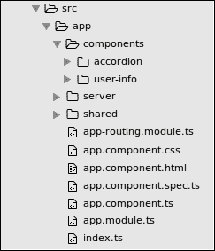
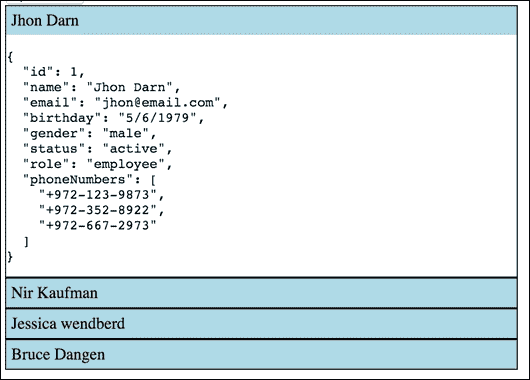
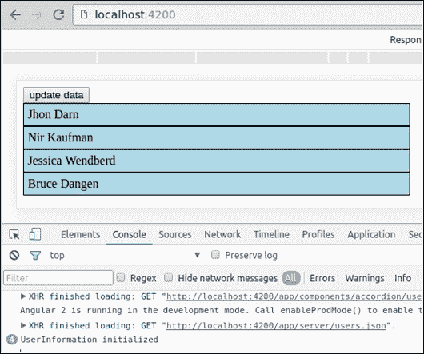
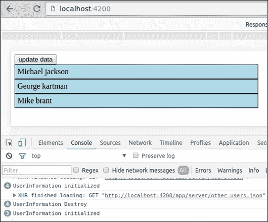
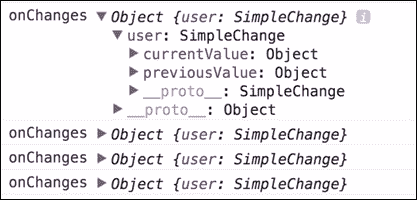

# 第七章。将一切放在一起

是时候把我们学到的关于组件的一切付诸实践了。在本章中，我们将构建有用的组件。我们还将学习关于 Angular 2 变化检测和组件生命周期的知识。

以下是我们将要涵盖的主题：

+   重置开发环境

+   构建一个简单的手风琴组件

+   扩展手风琴组件树

+   扩展钩子到组件生命周期事件

# 准备我们的开发环境

现在是时候使用`angular-cli`创建一个新项目了，就像第二章中描述的那样，*使用 angular-cli 设置 Angular 2 开发环境*。我们将创建一个名为`components`的新目录，用于包含本章中将要实现的所有组件。

在实现相应组件时，我们将在本章中创建另外两个子目录，`accordion`和`user-info`：



在开始构建新组件之前的最后一件事是清理我们的根组件。打开`index.ts`并进行如下清理：

```ts
[app.component.ts]
import { Component } from '@angular/core';

@Component({
  selector: 'app-root',
  template: '<h1>Angular2 Components</h1>'
}) 
export class AppComponent {}
```

打开浏览器，确保组件已经渲染而没有任何错误：


现在我们准备开始开发我们的新组件了。

# 手风琴组件

我们将要构建的第一个组件将是一个`accordion`组件。手风琴由两个组件组成：手风琴包装器和手风琴标签。让我们先开始实现`accordion`标签。

在 components 目录中，创建一个名为`accordion`的新目录。在其中，创建`accordion-tab.ts`文件，并粘贴以下代码：

```ts
[accordion-tab.ts]
import { Component } from '@angular/core';

@Component({
  selector: 'accordion-tab',
  styles: [`
    .accordion-tab {
      width: 500px;
      border: 1px solid black;
      border-collapse: collapse;
    }
    .accordion-heading {
      padding: 5px;
      background-color: lightblue;
      cursor: pointer;
    }
 `],
  template: `
    <div class="accordion-tab">
      <div class="accordion-heading">Accordion Title</div>
      <div>
        <ng-content></ng-content>
      </div>
    </div>
  `
})
export class AccordionTab {}
```

组件装饰器很简单。我们添加了一些 CSS 和一个包含`<ng-content>`标签的模板，用于手风琴标签内容的插入点。

为了测试它，让我们渲染`accordion-tab`文件。打开`app.component.ts`并更新代码：

```ts
[app.component.ts]
import { Component } from '@angular/core';
import { AccordionTab } from './components/accordion/accordion-tab';

@Component({
  selector: 'app-root',
  template:`
    <div>
      <accordion-tab>Accordion Content</accordion-tab>
      <accordion-tab></accordion-tab>
      <accordion-tab></accordion-tab>
    </div>
  `
})
export class AppComponent {}
```

不要忘记将`AccordionTab`类添加到根模块的 declarations 属性中。这个操作对于本章中实现的所有自定义组件都是必需的。打开`app.module.ts`文件并进行如下更新：

```ts
[app.module.ts]
import { BrowserModule } from '@angular/platform-browser';
import { NgModule } from '@angular/core';
import { FormsModule } from '@angular/forms';
import { HttpModule } from '@angular/http';
import { AppComponent } from './app.component';
import { AccordionTab } from './components/accordion/accordion-tab';

@NgModule({
  declarations: [
    AppComponent,
    AccordionTab
  ],
  imports: [
    BrowserModule,
    FormsModule,
    HttpModule
  ],
  providers: [],
  bootstrap: [AppComponent]
})
export class AppModule { }
```

现在，让我们打开浏览器，确保组件按预期渲染：


接下来，让我们实现`accordion-tab`的切换动作。打开`accordion-tab.ts`并更新模板和`Component`类：

```ts
[accordion-tab.ts]
import { Component } from '@angular/core';

@Component({
  selector: 'accordion-tab',
  styles: [`
    .accordion-tab {
      width: 500px;
      border: 1px solid black;
      border-collapse: collapse;
    }
    .accordion-heading {
      padding: 5px;
      background-color: lightblue;
      cursor: pointer;
    }
  `],
  template: `
    <div class="accordion-tab">
      <div class="accordion-heading"
       (click)="toggleContent()">Accordion Title</div>
      <div class="accordion-body">
        <ng-content *ngIf="extended"></ng-content>
      </div>
    </div>
  `
})
export class AccordionTab {
  extended: boolean = false;
  toggleContent() {
    this.extended = !this.extended
  }
}
```

我们将一个方法绑定到标题的点击事件，这个方法切换一个布尔值，触发`ngIf`指令。我们在前两章中已经讨论过这个。为了测试我们的组件，让我们在其他标签中放一些虚拟内容。打开`app.component.ts`并按照以下方式更新模板：

```ts
[app.component.ts]
import { Component } from '@angular/core';
import { AccordionTab } from './accordion/accordion-tab.ts';

@Component({
  selector: 'app-root',
  template:`
    <div>
      <accordion-tab>Accordion Content</accordion-tab>
      <accordion-tab>Accordion Content</accordion-tab>
      <accordion-tab>Accordion Content</accordion-tab>
    </div>
  `
}) 
export class AppComponent {}
```

现在，我们可以打开浏览器测试我们的组件。当我们点击标签标题时，相应的内容会切换。但是标签应该一起工作。只有一个标签可以展开。为了实现这一点，我们可以用一个实现这个逻辑的组件包装`accordion-tab`组件。

在我们这样做之前，我们需要确保从服务器获取的`users`数组中的每个对象（在我们的情况下是`users.json`）都有一个唯一的`id`。打开`users.json`并确保它类似于以下内容：

```ts
[users.json]
[
  {
    "id": 1,
    "name": "Jhon Darn",
    "email": "jhon@email.com",
    "birthday": "5/6/1979",
    "gender": "male",
    "status": "active",
    "role": "employee",
    "phoneNumbers": [
      "+972-123-9873",
      "+972-352-8922",
      "+972-667-2973"
    ]
  },
  (...)
```

现在，在`accordion`文件夹内创建一个名为`accordion.ts`的新文件，让我们先制定基本实现：

```ts
[accordion.ts]
import { Component } from '@angular/core';
import { Http } from '@angular/http';
import 'rxjs/add/operator/map';
import { AccordionTab } from './accordion-tab';

@Component({
  selector: 'accordion',
  template: `
    <div>
      <accordion-tab *ngFor="let user of users"
                   (click)="toggle(user)"
                   [extended]="isActive(user)"
                   [title]="user.name">
                 <pre>{{ user | json }}</pre>
      </accordion-tab>
    </div>
  `
})
export class Accordion {  users;
  activeUserId = 0;

  constructor(http: Http) {
    http.get('/app/server/users.json')
        .map(result => result.json())
        .subscribe(result => this.users = result);
  }

  isActive(user) {
    return user.id === this.activeUserId;
  }

  toggle(user) {
    this.isActive(user) ?
        this.activeUserId = 0 : this.activeUserId = user.id;
  }
}
```

我们使用 HTTP 服务从静态 JSON 中获取用户数据，并遍历`users`数组——重复手风琴标签组件。在每个`accordion-tab`组件上，我们绑定一个方法到点击事件，并将动态数据绑定到属性上。我们还使用`json`管道在手风琴标签内填充一些内容。

选择活动标签的逻辑在`Component`类中非常容易实现。

接下来，我们需要重构`accordion-tab`并定义它的输入和输出接口：

```ts
[accordion-tab.ts]
import {
    Component, Input, Output
} from '@angular/core';

@Component({
  selector: 'accordion-tab',
  styles: [`
    .accordion-tab {
      width: 500px;
      border: 1px solid black;
      border-collapse: collapse;
    }
    .accordion-heading {
      padding: 5px;
      background-color: lightblue;
      cursor: pointer;
    }
  `],
  template:`
    <div class="accordion-tab">
      <div class="accordion-heading"
       (click)="toggleContent()">{{title}}</div>
      <div class="accordion-body">
        <content *ngIf="extended"></content>
      </div>
    </div>
  `
})
export class AccordionTab {
  @Input() extended;
  @Input() title;

  toggleContent() {
    this.extended = !this.extended
  }
}
```

简单的手风琴现在已经准备好了。我们几乎使用了我们学到的所有知识来制作这个小部件。请注意，我们不需要写很多代码。Angular 的内置指令和绑定系统为我们做了大部分的工作。要在浏览器中测试它，打开`app.component.ts`并渲染`<accordion>`组件：

```ts
[app.component.ts]
import { Component } from '@angular/core';
import { Accordion } from './components/accordion/accordion';

@Component({
  selector: 'app-root',
  template: `<accordion></accordion>`
}) 
export class AppComponent {}
```

打开浏览器并检查结果。每次点击手风琴标签时，只有一个标签会展开：



在我们继续之前，让手风琴只在点击它的`标题`和整个`标签`时展开。为此，我们将在点击标题时发出自定义事件，然后从父组件（即手风琴）绑定到这个事件：

```ts
[accordion-tab.ts]
import {
    Component, Input, Output, EventEmitter
} from '@angular/core';

@Component({
  selector: 'accordion-tab',
  styles: [`
    .accordion-tab {
      width: 500px;
      border: 1px solid black;
      border-collapse: collapse;
    }
    .accordion-heading {
      padding: 5px;
      background-color: lightblue;
      cursor: pointer;
    }
 `],
  template: `
    <div class="accordion-tab">
     <div class="accordion-heading" 
          (click)="toggleContent()">{{title}}</div>
     <div>
      <ng-content *ngIf="extended"></ng-content>
     </div>
    </div>
  `
}) 
export class AccordionTab {
  @Input() extended : boolean;
  @Input() title : string;
  @Output() toggle = new EventEmitter<any>();
  toggleContent() {
    this.toggle.emit(null)
  }
}
```

这就是`accordion-tab`组件。让我们转到`accordion`组件并绑定到这个事件：

```ts
[accordion.ts]
import { Component, Inject } from '@angular/core';
import { Http } from '@angular/http';
import 'rxjs/add/operator/map';
import { AccordionTab } from './accordion-tab';
@Component({
  selector: 'accordion',
  template: `
    <div>
      <accordion-tab *ngFor="let user of users"
                    (toggle)="toggle(user)"
                    [extended]="isActive(user)"
                    [title]="user.name">
        <pre>{{ user | json }}</pre>
      </accordion-tab>
    </div>
  `
})
export class Accordion {  
  users;
  activeUserId = 0;

  constructor(http: Http) {
    http.get('/app/server/users.json')
        .map(result => result.json())
        .subscribe(result => this.users = result);
  }
  isActive(user) {
    return user.id === this.activeUserId;
  }
  toggle(user) {
    this.isActive(user) ?
        this.activeUserId = 0 : this.activeUserId = user.id;
  }
}
```

现在我们可以渲染手风琴组件并查看结果。在`app.component.ts`中包括以下内容：

```ts
[app.component.ts]
import { Component } from '@angular/core';
import { Accordion } from './components/accordion/accordion';

@Component({
  selector: 'app-root',
  template:`<accordion></accordion>`
}) 
export class AppComponent {}
```

打开浏览器并检查结果。手风琴按预期工作。

## 扩展手风琴组件树

让我们向手风琴树中添加另一个组件。不要将原始 JSON 呈现为选项卡内容，而是重用我们在第四章和第五章中构建的用户信息组件。为此，只需在`components`目录中创建一个`user-info`子目录，并将相应的 TypeScript 文件复制到该目录中。我们需要重构的唯一文件是`accordion.ts`：

```ts
[accordion.ts] 
import { Component, Inject, ViewEncapsulation } from '@angular/core';
import { Http } from '@angular/http';
import 'rxjs/add/operator/map';
import { AccordionTab } from './accordion-tab';
import { UserInformation } from '../user-info/user-info';

@Component({
  selector: 'accordion',
  template: `
    <div>
      <accordion-tab *ngFor="let user of users"
                    (toggle)="toggle(user)"
                    [extended]="isActive(user)"
                    [title]="user.name">
        <user-info [user]="user"></user-info>
      </accordion-tab>
    </div>
  `
})
export class Accordion {  
  users;
  activeUserId = 0;
  constructor(http: Http) {
    http.get('app/server/users.json')
        .map(result => result.json())
        .subscribe(result => this.users = result);
  }
  isActive(user) {
    return user.id === this.activeUserId;
  }
  toggle(user) {
    this.isActive(user) ?
        this.activeUserId = 0 : this.activeUserId = user.id;
  }
}
```

我们所需要做的就是导入用户信息组件，在组件元数据中声明它，并在我们的模板中使用它，将`user`变量绑定到组件期望的`User`属性。

# 组件生命周期

组件实例有一个我们可以连接到的生命周期。目前，我们的迷你应用程序包含四个组件：`App`、`accordion`、`accordion-tab`和`user-info`，但一个典型的 Angular 应用程序将包含数十个组件树，Angular 将在应用程序的生命周期内创建、更新和销毁这些组件。

为了演示目的，我们将模拟一个返回其他数据的服务器调用。为此，在`server`目录中创建一个名为`other-users.json`的文件，并将以下代码粘贴到其中：

```ts
[other-users.json]
[
  {
    "id": 5,
    "name": "Michael jackson",
    "email": "jackson@email.com",
    "birthday": "22/3/1974",
    "gender": "male",
    "status": "onhold",
    "role": "manager",
    "phoneNumbers": [
      "+972-123-9873"
    ]
  },
  (...)
]
```

在手风琴组件模板上，我们将添加一个按钮，该按钮将获取新数据，并在`Component`类上实现`fetchData`方法：

```ts
[accordion.ts]
import { Component, Inject } from '@angular/core';
import { Http } from '@angular/http';
import 'rxjs/add/operator/map';
import { AccordionTab } from './accordion-tab';
import { UserInformation } from '../user-info/user-info';

@Component({
  selector: 'accordion',
  template: `
    <div>
     <button (click)="fetchData('other-users.json')">update data</button>
     <accordion-tab *ngFor="let user of users"
                    (toggle)="toggle(user)"
                    [extended]="isActive(user)"
                    [title]="user.name">
        <user-info [user]="user"></user-info>
      </accordion-tab>
    </div>
  `
})
export class Accordion {  
  users;
  activeUserId = 0;

  constructor(private http: Http) {
    this.fetchData('users.json');
  }
  isActive(user) {
    return user.id === this.activeUserId;
  }

  fetchData(subPath) {
    this.http.get(`/app/server/${subPath}`)
        .map(result => result.json())
        .subscribe(result => this.users = result);
  }

  toggle(user) {
    this.isActive(user) ?
        this.activeUserId = 0 : this.activeUserId = user.id;
  }
}
```

现在，每次点击按钮时，用户数据都会更新，手风琴会重新渲染。打开浏览器，点击按钮，观察手风琴数据的变化。

# 生命周期事件接口

为了在每个组件生命周期事件上运行我们自己的逻辑，我们需要实现与我们想要做出反应的事件相对应的所需方法。这些事件中的每一个都被发布为一个 TypeScript 接口，我们可以在我们的组件类中实现它。使用 TypeScript 接口是可选的，不会以任何方式影响我们的应用程序。您可以从 TypeScript 网站上的文档中了解有关 TypeScript 接口的信息[`www.typescriptlang.org/docs/handbook/interfaces.html`](http://www.typescriptlang.org/docs/handbook/interfaces.html)。我们不会在我们的代码示例中使用这个。

## OnInit and OnDestroy

最简单、最直接、最易于理解的生命周期事件钩子是`onInit`和`onDestroy`。

`ngOnInit`方法在组件数据绑定属性首次检查后被调用，`ngOnDestroy`将在组件实例被 Angular 销毁之前被调用。在我们的组件层次结构中，我们将在`user-info`类上实现这两种方法：

```ts
[user-info.ts]
import {
  Component, Input,
  OnInit, OnDestroy
} from '@angular/core';

@Component({

  selector: 'user-info',
  styleUrls: ['./user-info.css'],
  templateUrl: './user-info.html'
})
export class UserInformation implements OnInit, OnDestroy {  
  @Input() 
  user;

  fontSize = '20px';
  editMode = false;
  randomNumber;

  ngOnInit(){
    console.log('UserInformation initialized');
  }

  ngOnDestroy(){
    console.log('UserInformation Destroy');
  }

  toggleEditMode() {
    this.editMode = !this.editMode;
  }

  onSubmit(data) {
    Object.assign(this.user, data);
    this.editMode = false;
  }
}
```

现在，打开浏览器，确保控制台可见。您应该看到四个日志，指示每个用户组件已被初始化：



现在，点击按钮从服务器拉取新数据。您应该看到每个已被销毁的用户信息组件的四个日志，并为新数据创建的新组件的三个日志：



`OnInit`方法是在组件初始化后（数据绑定属性已解析）和一个子组件初始化之前运行代码的好地方。`OnDestroy`是在组件从 DOM 中移除之前进行清理或持久化代码的好地方。

## OnChanges

`OnChanges`有一个名为`ngOnChanges`的方法，它将在检查所有数据绑定属性后被调用。Angular 传递一个包含以更改的属性命名的键和一个`SimpleChange`对象实例的`change`对象。`SimpleChange`对象包含先前的值和当前的值。让我们在我们的`user-info`组件中实现这个方法：

```ts
[user-info.ts]
import {
  Component, Input,
  OnInit, OnDestroy, OnChanges
} from '@angular/core';

@Component({
  selector: 'user-info',
  styleUrls: ['./user-info.css'],
  templateUrl: './user-info.html'
})
export class UserInformation
      implements OnInit, OnDestroy, OnChanges {  
  @Input() user;
  fontSize = '20px';
  editMode = false;
  randomNumber;

  ngOnInit(){
    console.log('UserInformation initialized');
  }

  ngOnDestroy(){
    console.log('UserInformation Destroy');
  }

  ngOnChanges(changes){
    console.log('onChanges', changes);
  }

  toggleEditMode() {
    this.editMode = !this.editMode;
  }

  onSubmit(data) {
    Object.assign(this.user, data);
    this.editMode = false;
  }
}
```

在浏览器控制台中，我们将看到四个日志：



如果您熟悉 Angular 1.x，您可以将`OnChange`方法视为`$scope.$watch`函数。它将在数据更改时被调用，并包含新值和旧值。

# 其他生命周期事件

除了`init`、`changes`和`destroy`事件之外，我们还可以挂接四个组件生命周期事件：

+   `AfterContentInit`：在组件的内容完全初始化后调用

+   `AfterContentChecked`：在每次组件被检查后调用

+   `AfterViewInit`：在组件的视图初始化后调用

+   `AfterViewChecked`：在组件的视图被检查后调用

它们每一个都可以像之前的例子一样实现。

# 总结

通过本章，我们将迄今为止学到的关于组件的一切都应用到了一个有用的手风琴小部件中，该小部件由四个组件组成。Angular 2 应用程序是一组动态组件，它们使用属性作为输入，使用事件作为输出来相互通信。我们可以挂接到组件的每个重要生命周期，例如，当组件被初始化或销毁时，并运行我们自己的逻辑。
