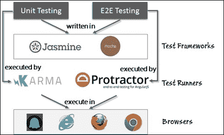
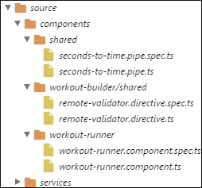
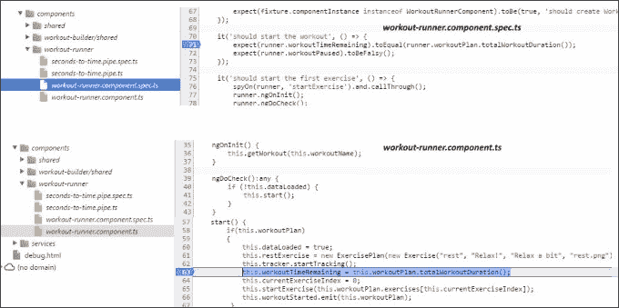

# 第七章。测试个人教练

除非您是一个完美编码的超级英雄，否则您需要测试您构建的内容。此外，除非您有大量的空闲时间来一遍又一遍地测试您的应用程序，否则您需要一些测试自动化。

当我们说 Angular 是考虑到可测试性而构建的，我们是真的。它有一个强大的**依赖注入**（**DI**）框架，一些很好的模拟构造，以及使在 Angular 应用程序中进行测试成为一项富有成效的工作的出色工具。

本章主要讨论测试，并致力于测试我们在本书中构建的内容。我们测试从组件到管道、服务和应用程序指令的所有内容。

本章涵盖的主题包括：

+   **理解全局视角**：我们将尝试理解测试如何适应 Angular 应用程序开发的整体背景。我们还将讨论 Angular 支持的测试类型，包括单元测试和**端到端**（**E2E**）测试。

+   **工具和框架概述**：我们涵盖了帮助在 Angular 中进行单元测试和端到端测试的工具和框架。这些包括**Karma**和**Protractor**。

+   **编写单元测试**：您将学习如何使用 Jasmine 和 Karma 在浏览器中进行单元测试。我们将对前几章中构建的内容进行单元测试。本节还教会我们如何对各种 Angular 构造进行单元测试，包括管道、组件、服务和指令。

+   **创建端到端测试**：自动化的端到端测试通过模拟浏览器自动化来模仿实际用户的行为。您将学习如何使用 Protractor 结合 WebDriver 执行端到端测试。

让测试开始吧！

### 注意

本章的代码可以在`checkpoint7.1`找到。它可以在 GitHub 上（[`github.com/chandermani/angular2byexample`](https://github.com/chandermani/angular2byexample)）下载。检查点在 GitHub 中作为分支实现。

如果您不使用 Git，请从此 GitHub 位置下载`checkpoint7.1`的快照（ZIP 文件）：[`github.com/chandermani/angular2byexample/archive/checkpoint7.1.zip`](https://github.com/chandermani/angular2byexample/archive/checkpoint7.1.zip)。首次设置快照时，请参考`trainer`文件夹中的`README.md`文件。

# 自动化的需求

随着每一天过去，为 Web 构建的应用程序的规模和复杂性正在增长。我们现在有太多的选项来构建 Web 应用程序，这简直令人难以置信。再加上产品/应用程序的发布周期已经从几个月缩短到几天，甚至一天内发布多个版本！这给软件测试带来了很大的负担。有太多需要测试的内容。多个浏览器，多个客户端和屏幕尺寸（桌面和移动），多种分辨率等等。

要在如此多样化的环境中发挥作用，自动化是关键。*应该自动化一切可以自动化*应该成为我们的口头禅。

# 在 Angular 中的测试

Angular 团队意识到了可测试性的重要性，因此创建了一个框架，允许在其上构建的应用程序进行轻松的（自动化）测试。使用 DI 构造进行依赖注入的设计选择有助于这一点。随着本章的进展，当我们为我们的应用程序构建大量测试时，这一点将变得清晰。然而，在此之前，让我们了解在构建此平台上的应用程序时，我们所针对的测试类型。

## 测试类型

对于典型的 Angular 应用程序，我们进行了两种广义上的测试：

+   **单元测试**：单元测试完全是关于在孤立环境中测试组件，以验证其行为的正确性。需要用模拟实现替换被测试组件的大多数依赖项，以确保单元测试不会因为依赖组件的失败而失败。

+   **端到端测试**：这种类型的测试完全是关于像真正的最终用户一样执行应用程序，并验证应用程序的行为。与单元测试不同，组件不是孤立测试的。测试是针对在真实浏览器中运行的系统进行的，并且基于用户界面的状态和显示的内容进行断言。

单元测试是防止错误的第一道防线，我们应该能够在单元测试期间解决大部分问题。但除非进行了 E2E 测试，否则我们无法确认软件是否正常工作。只有当系统中的所有组件以期望的方式进行交互时，我们才能确认软件正常工作；因此，E2E 测试成为必要。

谁编写单元测试和 E2E 测试，以及它们何时编写，这些都是重要的问题需要回答。

## 测试 - 谁进行测试以及何时进行测试？

传统上，E2E 测试是由质量保证（QA）团队进行的，开发人员负责在提交代码之前对其进行单元测试。开发人员也会进行一定量的 E2E 测试，但整个 E2E 测试过程是手动的。

随着技术环境的变化，现代测试工具，特别是在 Web 前端，已经允许开发人员自己编写自动化的 E2E 测试，并针对任何部署设置（如开发/阶段/生产）执行这些测试。像 Selenium 这样的工具，连同 WebDrivers，可以轻松进行浏览器自动化，从而便于编写和执行针对真实网络浏览器的 E2E 测试。

写 E2E 场景测试的好时机是在开发完成并准备部署时。

在单元测试方面，有不同的观点认为测试应该在何时编写。TDDer 在功能实现之前编写测试。其他人在实现完成后编写测试以确认行为。有些人在开发组件本身时编写测试。选择适合自己的风格，记住你写测试的越早，越好。

### 注意

我们不打算提出任何建议，也不打算就哪种更好进行争论。任何数量的单元测试都比没有好。

我们个人偏好使用“中间方法”。在 TDD 中，我们觉得测试创建的努力有时会因为规格/需求的变化而丧失。在开始时编写的测试容易因需求的变化而不断修复。

在最后编写单元测试的问题在于我们的目标是创建根据当前实现通过的测试。编写的测试是为了测试实现而不是规格。

在中间某个地方添加测试对我们来说效果最好。

现在让我们试着了解可用于 Angular 测试的工具和技术环境。

## Angular 测试生态系统

看下面的图表以了解支持 Angular 测试的工具和框架：



正如我们所看到的，我们使用 Jasmine 或 Mocha 等单元测试库编写我们的测试。

### 注意

目前，Angular 测试库默认使用 Jasmine。然而，Angular 团队表示他们已经将框架更加通用化，以便您可以使用其他测试库，比如 Mocha。Angular 文档尚未更新以包括如何做到这一点。

这些测试由 Karma 或 Protractor 执行，具体取决于我们是在编写单元测试还是集成测试。这些测试运行器又会在浏览器中运行我们的测试，比如 Chrome、Firefox 或 IE，或者无头浏览器，比如 PhantomJS。重要的是要强调的是，不仅 E2E 测试，单元测试也是在真实浏览器中执行的。

### 注意

除了浏览器，完整的 Angular 测试设置是由 **Node.js** 生态系统提供的出色库和框架支持的。一些库，比如 Jasmine，也有独立版本，但我们将坚持使用 Node.js 包。

本章中的所有测试都是使用 Jasmine 编写的（包括单元测试和集成测试）。Karma 将是我们的单元测试运行器，Protractor 将是我们的 E2E 测试运行器。

# 开始进行单元测试

单元测试的最终目的是测试特定的代码/组件，以确保组件按照规范工作。这减少了与软件其他部分集成时组件出现故障/错误的机会。在我们开始编写测试之前，有一些指导方针可以帮助我们编写良好且易于维护的测试：

+   一个单元应该测试一个行为。出于显而易见的原因，每个单元测试一个行为是有意义的。失败的单元测试应该清楚地突出问题区域。如果多个行为一起测试，失败的测试需要更多的探究来确定违反了哪个行为。

+   单元测试中的依赖项应该被模拟掉。单元测试应该测试单元本身，而不是它的依赖项。

+   单元测试不应该永久改变被测试组件的状态。如果发生这种情况，其他测试可能会受到影响。

+   单元测试的执行顺序应该是无关紧要的。一个单元测试不应该依赖于另一个单元测试在它之前执行。这是脆弱单元测试的迹象。这也可能意味着依赖项没有被模拟。

+   单元测试应该快速。如果它们不够快，开发人员就不会运行它们。这是模拟所有依赖项的一个很好的理由，比如数据库访问、远程网络服务调用等。

+   单元测试应该尝试覆盖所有代码路径。代码覆盖率是一个可以帮助我们评估单元测试效果的度量标准。如果在测试过程中覆盖了所有正面和负面情况，覆盖率确实会更高。这里需要注意：高代码覆盖率并不意味着代码是无错的，但低覆盖率明显突出了单元测试中未覆盖的区域。

+   单元测试应该测试正面和负面情况。不要只集中在正面测试用例上；所有软件都可能出现故障，因此单元测试失败场景与成功场景一样重要。

这些准则并不特定于框架，但为我们提供了撰写良好测试所需的足够支持。让我们通过设置所需的组件开始单元测试的过程。

## 为单元测试设置 Karma

由于完整的测试自动化基础设施是使用 Node 支持的，因此首先需要安装 Node。请按照 Node 网站（[`nodejs.org`](https://nodejs.org)）上的说明进行安装。

Node 自带一个名为**Node Package Manager**（**NPM**）的包管理器，用于安装测试所需的所有其他组件（Node 世界中的**包**）。

从命令行开始安装 Karma。导航到应用程序代码库的根目录（在`trainer`文件夹中），并使用以下命令安装 Karma：

```ts
npm install karma --save-dev 

```

要从命令行使用 Karma，我们需要安装其命令行界面：

```ts
npm install -g karma-cli 

```

### 注意

代码被测试的 Karma 版本是 0.13.22。**karma-cli**版本是 1.0.1。

要安装特定版本的包，需要在包名后面加上`@version`，例如，`npm install karma@0.13.22 --save-dev`。

这完成了 Karma 的安装，现在是时候配置测试运行器了。配置 Karma 就是设置其配置文件，以便其中包含足够的细节来运行我们的脚本并对其进行测试。在根目录（在`trainer`文件夹中）创建一个`tests`文件夹，导航到该文件夹，并使用以下命令开始 Karma 配置设置：

```ts
karma init 

```

这将启动一个命令行向导，指导我们选择可用的选项，包括测试框架、要监视的文件夹和其他设置。向导完成后，它会生成一个`karma.conf.js`文件。不要使用生成的配置文件，而是将伴随代码库中`checkpoint7.1/tests`的`karma.conf.js`文件复制到本地的`tests`文件夹中。

### 注意

`karma init`向导根据我们的选择安装了一些包。如果我们跳过向导，那么`karma-chromelauncher`和`karma-jasmine`包需要手动安装以进行单元测试。

接下来，我们将安装 Jasmine。因此执行以下命令：

```ts
npm install jasmine-core --save-dev --save-exact 

```

### Karma 配置文件

在`tests`目录中打开`karma.conf.js`。它包含影响我们运行的测试的设置。我们不会在这里涵盖 Karma 支持的每个配置，但会专注于对我们的测试设置是独特和/或必需的配置。请参考 Karma 文档（[`karma-runner.github.io/1.0/config/configuration-file.html`](http://karma-runner.github.io/1.0/config/configuration-file.html)）了解更多关于各种 Karma 配置选项的信息。

首先，我们需要设置解析文件位置的基本路径。在我们的情况下，因为我们将 Karma 放在了应用程序根目录下方的`tests`文件夹中，我们将使用一个相对 URL 来指向该位置：

```ts
basePath: '../', 

```

然后我们将框架设置为 Jasmine：

```ts
frameworks: ['jasmine'], 

```

下一个 Karma 配置是`files`数组。文件可以通过文件路径或使用模式引用。在我们的情况下，我们使用文件路径引用前十个文件。这些是用于 polyfills、SystemJS 和 zone.js 的文件。当 Karma 首次启动时，它将使用`<script>`标签在浏览器中加载所有这些文件。

对于其余部分，我们使用模式，因为这种方法允许我们设置`included`和`watched`属性。`included`属性确定 Karma 是否最初加载文件。如果设置为`true`，Karma 将在`<script>`标签中加载这些文件。如果不是，Karma 将不加载文件，因此必须找到其他机制来完成。`watched`属性指示文件是否将被监视以进行更改。

当您查看我们配置中的文件模式时，您会注意到一些您以前见过的用于构建我们的应用程序的文件，例如 RxJS 和 Angular 本身。我们已将`included`属性设置为`false`，除了其中一个文件。

`included`属性被设置为`true`的一个文件模式是我们以前没有见过的：`karma-test-shim.js`：

```ts
{pattern: 'tests/karma-test-shim.js', included: true, watched: true}, 

```

这个模式引用了一个我们添加到测试文件夹中的额外文件，用于处理在 Karma 中运行 Angular 测试的特殊要求，并且在 Karma 首次启动时将被加载。我们将很快讨论该文件。

我们所有文件中（除了 RxJS 和支持调试的文件）的`watched`属性都设置为 true，这意味着 Karma 将监视这些文件，如果它们中的任何一个发生变化，将重新运行我们的测试。

在`karma-test-shim.js`之后数组中的下一个文件模式与其他文件有些不同：

```ts
{pattern: 'dist/**/*.js', included: false, watched: true}, 

```

这个模式包含了我们应用程序文件的路径（我们在前几章中一直在构建的代码），以及我们将创建的测试文件的路径。

但请注意，它指向的是`dist`目录，该目录包含 TypeScript 转译器生成的 JavaScript 文件，而不是 TypeScript 文件本身。这是有道理的，因为 Karma 当然是一个 JavaScript 测试运行器（不会自己转译我们的 TypeScript 文件）。这反过来意味着我们需要一个初始的转译步骤来运行我们的测试。

回到我们将`included`属性设置为 false 的文件，如果我们不使用 Karma，我们如何加载它们？正如你所知，我们正在使用 SystemJS 来加载我们的模块，而 Karma 对 SystemJS 一无所知。如果 Karma 在相关模块加载之前运行我们的测试文件，我们的测试将失败。这意味着对于这些文件，我们需要在 Karma 运行之前运行 SystemJS 并加载我们的模块。将`included`属性设置为 false 意味着 Karma 不会自动运行这些文件。

但是，如果配置文件将这些文件的`included`属性设置为`false`，我们将如何运行这些文件中的测试？这个问题的答案将我们带到了 Karma 测试 shim 文件。

### Karma 测试 shim 文件

在`tests`目录中打开`karma-test-shim.js`。这个文件解决了使用 Karma 与 Angular 和 SystemJS 的挑战。

### 注意

Karma 测试 shim 文件目前使用 SystemJS 加载器，但根据 Angular 团队的说法，它可以适应其他东西，比如 Web Pack。

Karma 测试 shim 文件做了三件事，我们现在来讨论。

首先，它取消了 Karma 的同步启动。

```ts
__karma__.loaded = function() {}; 

```

然后它添加了 SystemJS 的配置：

```ts
System.config({ 
    baseURL: '/base' 
}); 

System.config( 
    { 
        paths: { 
            // paths serve as alias 
            'npm:': 'node_modules/' 
        }, 
        map: { 
            'app': 'dist', 
            '@angular/core': 'npm:@angular/core/bundles/core.umd.js', 
...[other Angular modules] ... 
            // angular testing umd bundles 
            '@angular/core/testing': 'npm:@angular/core/bundles/core-testing.umd.js', 
...[other Angular testing modules] ... 
            // other libraries 
            'rxjs': 'npm:rxjs', 
            'angular2-modal': 'npm:angular2-modal', 
        }, 
        packages: { 
            'app': { 
                defaultExtension: 'js' 
            }, 
            'rxjs': { 
                defaultExtension: 'js' 
            } 
        } 
    }); 

```

这应该已经很熟悉了。毕竟，我们已经在应用程序根目录的`system.js.config`文件中为 SystemJS 进行了这种配置。这个配置的作用是设置 Karma 将使用的模块的路径映射，包括 Angular 测试模块。我们已经修改了文件，使其指向我们应用程序中这个映射的正确位置。

### 注意

重要的是要理解，这个配置是用于在测试运行器中使用 SystemJS，而不是用于我们的基础应用程序。

最后，它使用 SystemJS 来导入我们的模块。如果承诺成功解析，它将启动 Karma，否则会抛出错误：

```ts
Promise.all([ 
    System.import('@angular/core/testing'), 
    System.import('@angular/platform-browser-dynamic/testing') 
]).then(function (providers) { 
    var testing = providers[0]; 
    var testingBrowser = providers[1]; 
    testing.TestBed.initTestEnvironment(testingBrowser.BrowserDynamicTestingModule, 
        testingBrowser.platformBrowserDynamicTesting()); 

}).then(function() { 
    // Finally, load all spec files. 
    // This will run the tests directly. 
    return Promise.all( 
        allSpecFiles.map(function (moduleName) { 
            return System.import(moduleName); 
        })); 
}).then(__karma__.start, __karma__.error); 

```

请注意，我们正在导入`@angular/platform-browser-dynamic/testing`并将特定于测试基于浏览器的应用程序的参数传递给`TestBed`的`initTestEnvironment`方法。我们将在本章后面详细讨论`TestBed`。

有了这个文件，我们现在准备开始使用 Karma 进行 Angular 测试。虽然这个配置有点繁琐，但好消息是一旦我们完成了 Karma 的配置，Angular 会很容易地创建和运行单元测试，我们很快就会看到。

## 我们测试文件的组织和命名

为了对我们的应用进行单元测试，计划为项目中的每个 TypeScript 文件创建一个测试文件（例如`workout-runner.spec.ts`）。

### 注意

使用 Jasmine 进行测试的开发人员通常将测试文件命名为被测试文件的名称加上`.spec`，这是一种惯例。这也用于在我们之前概述的配置步骤中方便地将文件映射到测试中。

这个测试文件将包含相应组件的单元测试规范，如下面的截图所示（在运行我们的单元测试时在 Karma 调试器中拍摄）：



## 单元测试 Angular 应用程序

在本书的过程中，我们已经构建了覆盖 Angular 中的每个构造的组件。我们已经构建了组件、管道、一些服务，最后还有一些指令。所有这些都可以在单元测试中进行测试。

为了熟悉使用 Jasmine 进行单元测试，让我们先测试最小和最简单的组件：管道。

### 单元测试管道

管道是最容易测试的，因为它们对其他构造的依赖最少或者没有依赖。我们为*Workout Runner*（*7 Minute Workout*应用程序）创建的`SecondsToTimePipe`没有依赖，可以很容易地进行单元测试。

### 注意

查看 Jasmine 框架文档，了解如何使用 Jasmine 编写单元测试。我们在单元测试中使用 Jasmine 2.0（[`jasmine.github.io/2.0/introduction.html`](http://jasmine.github.io/2.0/introduction.html)）。

Jasmine 有一些最好的文档，并且整体框架非常直观易用。我们强烈建议您前往 Jasmine 网站，并在继续之前熟悉该框架。

在`trainer`/`src/components/shared`文件夹中添加一个`seconds-to-time.pipe.spec.ts`文件，并将这个单元测试添加到其中：

```ts
import {SecondsToTimePipe} from "./seconds-to-time.pipe"; 
describe('SecondsToTime pipe', () => { 
    let pipe:SecondsToTimePipe; 
    beforeEach(() => { 
        pipe = new SecondsToTimePipe(); 
    }); 
    it('should convert integer to time format', () => { 
        expect(pipe.transform(5)).toEqual('00:00:05'); 
        expect(pipe.transform(65)).toEqual('00:01:05'); 
        expect(pipe.transform(3610)).toEqual('01:00:10'); 
    }); 
}); 

```

让我们来看看我们在测试文件中正在做什么。

毫不奇怪，我们导入了`SecondsToTimePipe`，这是我们将要测试的内容。这与我们在其他地方使用的 TypeScript 类中的导入方式一样。请注意，我们在文件中使用了相对路径来定位它的位置`'./seconds-to-time.pipe'`。在 Angular 中，这意味着在与测试本身相同的目录中查找要测试的组件。正如你记得的那样，这是我们设置文件结构的方式：将测试放在与要测试的文件相同的目录中。

在下一行，我们开始使用 Jasmine 语法。首先，我们在`describe`函数中包装测试，以标识测试。这个函数的第一个参数是测试的用户友好描述；在这种情况下，它是`SecondsToTime pipe`。对于第二个参数，我们传递一个 lambda（fat arrow）函数，它将包含我们的测试。在设置一个本地变量来保存管道之后，我们调用 Jasmine 的`beforeEach`函数，并使用它来注入我们的管道的一个实例。

### 注意

由于`beforeEach`函数在我们的`describe`函数中的每个测试之前运行，我们可以将其用于每个测试中运行的通用代码。在这种情况下，这并不是严格必要的，因为我们的`describe`函数中只有一个测试。但是，养成使用它进行常见设置场景的习惯是一个好主意，因为我们将会看到它在未来的使用中的好处。

接下来，我们调用 Jasmine 的`it`函数，并传递一个标题，以及对 Jasmine 的`expect`函数的三次调用（Jasmine 对断言的称呼）。这些都是不言自明的。

### 注意

在我们的测试中，不需要显式导入这些 Jasmine 函数。

### 运行我们的测试文件

现在是时候使用 Karma 运行我们的测试了。正如你记得的那样，为了做到这一点，我们首先必须将我们的文件从 TypeScript 转译成 JavaScript。为了做到这一点，我们将简单地在终端窗口中启动我们的应用程序本身，方法是调用：

```ts
gulp play 

```

应用程序的 gulp 文件将把我们的 TypeScript 文件转译成 JavaScript，然后监视这些文件的更改。

接下来，我们需要运行 Karma，我们通过在`trainer`文件夹中的一个单独的终端窗口中执行以下命令来实现：

```ts
karma start tests/karma.conf.js 

```

然后我们应该在终端窗口中看到这个输出：


最后一行显示我们的测试成功通过了。为了确保它报告了正确的通过/失败结果，让我们在测试中做出改变，导致其中一个期望失败。将第一个期望中的时间更改为 6 秒，而不是 5 秒，如下所示：

```ts
expect(pipe.transform(5, [])).toEqual('00:00:06'); 

```

我们得到以下错误消息：


这个错误消息的好处在于它将`describe`和`it`的描述结合成一个完整的句子，提供了对错误的清晰摘要。这显示了 Jasmine 如何允许我们编写可读的测试，以便对我们的代码不熟悉的人可以快速理解可能出现的任何问题。下一行显示了哪个期望没有被满足，期望是什么，以及未满足这个期望的实际结果是什么。

此消息下面还有一个冗长的堆栈跟踪，以及一个显示我们测试整体结果的最后一行：


你会注意到的一件事是，当我们对测试进行更改时，我们不需要重新运行 Karma。相反，它会监视我们文件和相关测试的任何更改，并在我们进行更改时立即报告成功或失败。

非常酷！让我们撤消我们所做的最后一次更改，并将测试恢复到通过状态。

总之，我们将采取以下多步骤方法来执行所有我们的测试。首先，我们使用我们的 gulp 脚本将 TypeScript 文件转换为 JavaScript。然后我们调用 Karma 来针对这些 JavaScript 文件运行我们的测试。以下图表阐明了这些步骤：


我们将不会在我们覆盖的测试中重复这些步骤的描述。因此，请确保在我们在本节中探索的每个测试中都遵循这些步骤。现在让我们继续进行单元测试组件。

## 单元测试组件

测试 Angular 组件比测试简单的管道或服务更复杂。这是因为 Angular 组件与视图相关联，通常比服务、过滤器或指令具有更多的依赖关系。

### Angular 测试工具

由于其复杂性，Angular 引入了一些工具，使我们能够更轻松地测试我们的组件。这些测试工具包括`TestBed`类（我们之前用来初始化测试）和`@angular/core/testing`中的几个辅助函数。

`TestBed`有一个`createComponent`方法，返回一个包含多个成员和方法的`ComponentFixture`。

+   `debugElement`：用于调试组件

+   `componentInstance`：用于访问组件的属性和方法

+   `nativeElement`：用于访问视图的标记和其他 DOM 元素

+   `detectChanges`：用于触发组件的变化检测周期

`ComnponentFixture`还包含用于覆盖组件的视图、指令、绑定和提供者的方法。在接下来的测试中，我们将在整个测试过程中使用`TestBed`。

`TestBed`有一个名为`configureTestingModule`的方法，我们可以使用它来设置我们的测试作为自己的模块。这意味着我们可以绕过初始的引导过程，并在我们的测试文件中编译我们要测试的组件。我们还可以使用`TestBed`来指定额外的依赖关系，并确定我们将需要的提供者。

### 注意

根据 Angular 文档，`TestBed`在每个规范文件运行之前都会重置基本状态。这个基本状态包括*可声明的内容（组件、指令和管道）和提供者（其中一些是模拟的）*，几乎每个组件都需要运行。参见[`angular.io/docs/ts/latest/guide/testing.html#!#atu-intro`](http://bit.ly/2eufBGN)。

### 在我们的测试中管理依赖关系

Angular 中的组件将视图与其他所有内容集成在一起。因此，与任何服务、过滤器或指令相比，组件通常具有更多的依赖关系。

尽管我们的单元测试侧重于组件本身的代码，但我们仍需要在测试中考虑这些依赖关系，否则测试将失败（我们跳过了管道测试的依赖设置，因为它没有外部依赖）。

处理这些依赖项存在两种方法：将它们注入到我们的组件中，或者为它们创建一个我们可以在测试中使用的模拟或伪造品。如果一个依赖项足够简单，我们可以将其实例直接注入到我们的测试类中。然而，如果依赖项非常复杂，特别是如果它有自己的依赖项和/或进行远程服务器调用，那么我们应该对其进行模拟。Angular 测试库为我们提供了这样做的工具。

我们计划在本节中测试的组件是`WorkoutRunner`组件。位于`trainer/src/components/workout-runner/`内，这是运行特定锻炼的组件。

## 单元测试 WorkoutRunnerComponent

有了这个背景，让我们开始单元测试`WorkoutRunnerComponent`。

首先，添加一个新文件`workout-runner-component.spec.ts`，其中包含以下导入：

```ts
import { inject, fakeAsync, async, tick, TestBed, ComponentFixture} from '@angular/core/testing'; 
import { NO_ERRORS_SCHEMA }          from '@angular/core'; 
import {Router} from '@angular/router'; 
import {Observable} from "rxjs/Rx"; 

import {WorkoutHistoryTracker} from '../../services/workout-history-tracker'; 
import {WorkoutRunnerComponent} from './workout-runner.component'; 
import {WorkoutService} from '../../services/workout-service'; 
import {Exercise, WorkoutPlan, ExercisePlan} from "../../services/model"; 
import {SecondsToTimePipe} from "../shared/seconds-to-time.pipe"; 

```

这些导入标识了我们在测试中将使用的测试工具（以及来自`RxJS`的`Router`和`Observable`等内容），以及我们组件所需的类型和依赖项。我们将在一会儿讨论这些依赖关系。一个与其他不同的导入是从`@angular/core`导入`NO_ERRORS_SCHEMA`的导入。我们将使用这个导入来忽略我们不会测试的组件中的元素。同样，我们将在一会儿进一步讨论这一点。

另一个需要注意的是，导入中的`@angular/core/testing`是核心模块的一部分，而不是单独的测试模块。这是 Angular 测试导入的常见模式。例如，当我们开始测试 HTTP 时，您将看到我们从`@angular/http/testing`导入。

### 设置组件依赖项

接下来，我们需要建立组件的依赖关系，并确定我们是否需要注入或模拟它们。如果我们查看`WorkoutRunner`组件的代码，我们会发现有三个依赖项被注入到我们的组件中：

+   `WorkoutHistoryTracker`：这是一个附有一些行为的组件。因此，我们肯定希望对其进行模拟。

+   `Router`：我们也必须模拟这个，以便将`WorkoutRunner`与应用程序的其余部分隔离开，并防止我们的测试尝试从`WorkoutRunner`视图中导航离开。

+   `WorkoutService：`这是一个我们将使用来进行 HTTP 调用以检索我们的锻炼的服务。我们也将模拟这个服务，因为我们不希望在我们的测试中对外部系统进行调用。

### 模拟依赖 - workout history tracker

Angular 允许我们使用简单的类以直接的方式模拟我们的依赖关系。让我们从模拟`WorkoutHistoryTracker`开始。为此，请在导入之后添加以下类：

```ts
class MockWorkoutHistoryTracker { 
    startTracking() {} 
    endTracking() {} 
    exerciseComplete() {} 
} 

```

我们不需要模拟整个`WorkoutHistoryTracker`类，而只需要模拟`WorkoutRunner`将要调用的方法。在这种情况下，这些方法是`startTracking()`，`endTracking()`和`exerciseComplete()`。我们将这些方法设置为空，因为我们不需要从中返回任何东西来测试`WorkoutRunner`。现在我们可以将这个虚拟实现注入到`WorkoutRunner`中，无论它在哪里寻找`WorkoutHistoryTracker`。

### 模拟依赖 - workout service

在第五章中，*支持服务器数据持久性*，我们扩展了 workout service 以进行远程调用以检索填充 workout 的数据。对于单元测试 workout runner，我们将希望用返回一些静态数据的模拟实现来替换该调用，以便我们可以用来运行测试。因此，我们将添加第三个模拟类，如下所示：

```ts
class MockWorkoutService { 
    sampleWorkout = new WorkoutPlan( 
         "testworkout", 
         "Test Workout", 
          40, 
          [ 
              new ExercisePlan(new Exercise( "exercise1", "Exercise 1", 
              "Exercise 1 description",  "/image1/path", 
             "audio1/path"), 50), 
              new ExercisePlan(new Exercise( "exercise1", "Exercise 2", 
             "Exercise 2 description",  "/image2/path", 
             "audio2/path"), 30), 
              new ExercisePlan(new Exercise( "exercise1", "Exercise 3", 
             "Exercise 3 description",  "/image3/path", 
             "audio3/path"), 20) 
          ], 
          "This is a test workout" 
    ); 
    getWorkout(name: string) { 
        return Observable.of(this.sampleWorkout); 
    } 
    totalWorkoutDuration(){ 
        return 180; 
    }; 
    export class MockRouter {
    navigate = jasmine.createSpy('navigate');
    }
} 

```

请注意，`getWorkout`方法返回一个`Observable`。否则，该类是不言自明的。

### 模拟依赖 - router

与`WorkoutHistoryTracker`和`WorkoutService`一样，我们也将使用模拟来处理我们对 Angular 路由器的依赖。但是在这里，我们将采取稍微不同的方法。我们将在我们的模拟上分配一个 jasmine spy 给一个 navigate 方法。这对我们来说已经足够了，因为我们只想确保路由器的 navigate 方法被调用时带有适当的路由（`finished`）作为参数。后面我们将看到，jasmine spy 将允许我们做到这一点。

### 使用 TestBed 配置我们的测试

现在我们已经处理了导入和依赖关系，让我们开始测试本身。我们首先添加一个 Jasmine `Describe`函数来包装我们的测试，然后使用`let`设置两个本地变量：一个用于`fixture`，另一个用于`runner`：

```ts
describe('Workout Runner', () =>{ 
    let fixture:any; 
    let runner:any; 

```

接下来，我们将添加一个`beforeEach`函数来设置我们的测试配置：

```ts
beforeEach( async(() =>{ 
    TestBed 
        .configureTestingModule({ 
            declarations: [ WorkoutRunnerComponent, SecondsToTimePipe ], 
            providers: [ 
                {provide: Router, useClass: MockRouter}, 
                {provide: WorkoutHistoryTracker ,useClass: 
                MockWorkoutHistoryTracker}, 
                {provide: WorkoutService ,useClass: MockWorkoutService} 
            ], 
            schemas: [ NO_ERRORS_SCHEMA ] 
        }) 
        .compileComponents() 
        .then(() => { 
            fixture = TestBed.createComponent(WorkoutRunnerComponent); 
            runner = fixture.componentInstance; 
        }); 
}));  

```

`beforeEach`方法在每个测试之前执行，这意味着我们只需要在测试文件中设置一次。在`beforeEach`中，我们添加一个`async`调用。这是必需的，因为我们正在调用异步的`compileComponents`方法。

### 注意

Angular 文档指出，`async`函数*安排测试者的代码在一个特殊的`async`测试区域中运行，隐藏了异步执行的机制，就像在传递给`it`测试时一样*。有关更多信息，请参阅[`angular.io/docs/ts/latest/guide/testing.html#!#async-in-before-each`](http://bit.ly/2etY1me)。我们很快会更详细地讨论这个问题。

让我们按照它们执行的顺序逐个讨论每个方法调用。第一个方法`configureTestingModule`允许我们在测试模块的基本配置上构建，并添加诸如导入、声明（我们将在测试中使用的组件、指令和管道）和提供者等内容。在我们的测试中，我们首先添加了 workout runner，我们的组件，和`SecondsToTimePipe`的声明。

```ts
declarations: [ WorkoutRunnerComponent, SecondsToTimePipe ], 

```

然后我们为我们的`Router`、`WorkoutHistoryTracker`和`WorkoutService`添加了三个提供者：

```ts
providers: [ 
{provide: Router, useClass: MockRouter}, 
{provide: WorkoutHistoryTracker ,useClass: MockWorkoutHistoryTracker}, 
{provide: WorkoutService ,useClass: MockWorkoutService} 
], 

```

对于这些提供者中的每一个，我们将`useClass`属性设置为我们的模拟，而不是实际的组件。现在，在我们的测试中的任何地方，当`WorkoutRunner`需要这些组件中的任何一个时，将使用模拟。

下一个配置可能看起来有点神秘：

```ts
schemas: [ NO_ERRORS_SCHEMA ] 

```

这个设置允许我们绕过我们在组件模板中使用的两个组件`ExerciseDescriptionComponent`和`VideoPlayerComponent`相关的自定义元素的错误。在这一点上，我们不想在`WorkoutRunnerComponent`的测试中测试这些组件。相反，我们应该分开测试它们。然而，当您使用这个设置时，需要注意的一点是，它将抑制与被测试组件模板中的元素和属性相关的所有模式错误；因此它可能会隐藏您想要看到的其他错误。

当您使用`NO_ERRORS_SCHEMA`设置测试时，您创建了所谓的浅层测试，即不深入到您正在测试的组件之外。浅层测试允许您减少在您正在测试的组件中的模板中的复杂性，并减少对模拟依赖的需求。

我们测试配置的最后一步是编译和实例化我们的组件：

```ts
.compileComponents() 
.then(() => { 
    fixture = TestBed.createComponent(WorkoutRunnerComponent); 
    runner = fixture.componentInstance; 
}); 

```

如前所述，我们在`beforeEach`方法中使用了`async`函数，因为当我们调用`compileComponents`方法时，这是必需的。这个方法调用是异步的，我们需要在这里使用它，因为我们的组件有一个在`templateUrl`中指定的外部模板。这个方法编译了外部模板，然后内联它，以便它可以被`createComponent`方法（同步的）使用来创建我们的组件 fixture。这个组件 fixture 反过来包含了一个`componentInstance`-`WorkoutRunner`。然后我们将`fixture`和`componentInstance`都分配给本地变量。

如前所述，我们正在使用的`async`函数创建了一个特殊的`async`测试区域，在这个区域中我们的测试将运行。您会注意到，这个函数与普通的`async`编程相比更简化，让我们可以做一些事情，比如使用`.then`操作符而不返回一个 promise。

### 注意

您也可以在单独的测试方法中编译和实例化测试组件。但是`beforeEach`方法允许我们为所有测试只做一次。

现在我们已经配置了我们的测试，让我们继续对`WorkoutRunner`进行单元测试。

## 开始单元测试

从加载锻炼数据到转换锻炼，暂停锻炼，运行锻炼视频，`WorkoutRunner`有许多方面可以测试。`workout.spec.ts`文件（位于`trainer/src`下的`components/workout-runner`文件夹中）包含了许多单元测试，涵盖了前述情景。我们将挑选其中一些测试并逐个进行。

首先，让我们添加一个测试用例，验证一旦组件加载，锻炼就开始运行。

```ts
it('should start the workout', () => { 
    expect(runner.workoutTimeRemaining).toEqual(runner.workoutPlan.totalWorkoutDuration()); 
    expect(runner.workoutPaused).toBeFalsy(); 
});  

```

这个测试断言了锻炼的总持续时间是正确的，并且锻炼处于运行状态（即未暂停）。

假设`karma.conf.js`文件中的`autoWatch`属性为 true，保存这个测试会自动触发测试执行。但是这个测试失败了（查看 Karma 控制台）。奇怪！所有依赖项都已正确设置，但`it`块的第二个 expect 函数失败了，因为它是未定义的。

我们需要调试这个测试。

## 在 Karma 中调试单元测试

在 Karma 中调试单元测试很容易，因为测试是在浏览器中运行的。我们调试测试就像调试标准的 JavaScript 代码一样。而且由于我们的 Karma 配置已经将 TypeScript 文件映射到 JavaScript 文件，我们可以直接在 TypeScript 中调试。

Karma 启动时，它会打开一个特定的浏览器窗口来运行测试。要在 Karma 中调试任何测试，我们只需要点击浏览器窗口顶部的**调试**按钮。

### 注意

Karma 打开了一个窗口，当我们点击**调试**时会打开另一个窗口；我们也可以使用原始窗口进行测试，但原始窗口连接到 Karma 并进行实时重新加载。此外，原始窗口中的脚本文件是有时间戳的，每当我们更新测试时时间戳都会改变，因此需要再次设置断点进行测试。

一旦我们点击**调试**，一个新的标签/窗口将打开，加载了所有测试和其他应用程序脚本进行测试。这些脚本是在`karma.conf.js`文件部分的 Karma 配置设置期间定义的。

要调试前面的失败，我们需要在两个位置添加断点。一个应该在测试本身内部添加，另一个应该在`Workoutcomponent`内部添加，在那里它加载了锻炼并将数据分配给适当的本地变量。

执行以下步骤在 Google Chrome 中添加断点：

1.  通过点击 Karma 启动时加载的窗口上的**调试**按钮打开 Karma 调试窗口/标签。

1.  按下**F12**键打开开发者控制台。

1.  转到**Sources**标签，您的应用程序的 TypeScript 文件将位于`source`文件夹中。

1.  现在我们可以通过点击行号在需要的位置设置断点。这是调试任何脚本的标准机制。在这里突出显示的位置添加断点：

1.  刷新**调试**页面（我们点击**调试**按钮时打开的页面）。`workout-runner.ts`中的断点从未被触发，导致测试失败。

我们忽视的是，我们试图到达的代码位于`workout-runner`的`start`方法中，并且`start`方法不是在构造函数中被调用的。相反，它是在`ngOnInit`中通过对`getWorkout`方法的调用加载锻炼数据后在`ngDoCheck`中被调用的。在测试中添加对`ngOnInit`和`ngDoCheck`的调用，如下所示：

```ts
        it('should start the workout', () => { 
 **runner.ngOnInit();**
 **runner.ngDoCheck();** 
            expect(runner.workoutTimeRemaining).toEqual(
                   runner.workoutPlan.totalWorkoutDuration()); 
            expect(runner.workoutPaused).toBeFalsy(); 
        }); 

```

1.  保存更改，Karma 将再次运行测试。这次测试将通过。

### 注意

随着测试数量的增加，单元测试可能需要我们集中精力进行特定的测试或一组特定的测试。Karma 允许我们通过在现有的`it`块前加上`f`来针对一个或多个测试；也就是说，`it`变成了`fit`。如果 Karma 找到带有`fit`的测试，它只会执行这些测试。同样，可以通过在现有的`describe`块前加上`f`来针对特定的测试套件：`fdescribe`。此外，如果你在`it`块前加上`x`，使其成为`xit`，那么该块将被跳过。

让我们继续对组件进行单元测试！

## 单元测试 WorkoutRunner 继续...

我们可以测试什么其他有趣的事情？我们可以测试第一个练习是否已经开始。我们将这个测试添加到`workout.spec.ts`中，放在我们刚刚添加的测试之后：

```ts
it('should start the first exercise', () => { 
    spyOn(runner, 'startExercise').and.callThrough(); 
    runner.ngOnInit(); 
    runner.ngDoCheck(); 
    expect(runner.currentExerciseIndex).toEqual(0); 
    expect(runner.startExercise).toHaveBeenCalledWith(
    runner.workoutPlan.exercises[runner.currentExerciseIndex]); 
    expect(runner.currentExercise).toEqual(
    runner.workoutPlan.exercises[0]); 
}); 

```

这个测试中的第二个`expect`函数很有趣。它使用了 Jasmine 的一个特性：间谍。间谍可以用来验证方法的调用和依赖关系。

### 使用 Jasmine 间谍来验证方法调用

间谍是一个拦截对其进行监听的函数的每次调用的对象。一旦调用被拦截，它可以返回固定的数据，或者将调用传递给实际被调用的函数。它还记录了调用的细节，可以在后面的`expect`中使用，就像我们在前面的测试中所做的那样。

### 注意

间谍非常强大，在单元测试期间可以以多种方式使用。查看关于间谍的文档以了解更多信息：[`jasmine.github.io/2.0/introduction.html#section-Spies`](http://jasmine.github.io/2.0/introduction.html#section-Spies)。

第二个`expect`函数验证了在锻炼开始时是否调用了`startExercise`方法（`toHaveBeenCalledWith`）。它还断言了传递给函数的参数的正确性。第二个`expect`语句使用了间谍来断言行为，但我们首先需要设置间谍才能使这个断言生效。

在这种情况下，我们使用间谍来模拟对`startExercise`方法的调用。我们可以使用间谍来确定方法是否已被调用，以及使用 Jasmine 的`toHaveBeenCalledWith`函数来确定使用了哪些参数。

### 注意

查看 Jasmine 文档中的`toHaveBeenCalled`和`toHaveBeenCalledWith`函数，以了解更多关于这些断言函数的信息。

在这里，该方法被调用时带有当前的`Exercise`作为参数。由于前面的`expect`确认了这是第一个练习，这个`expect`确认了对第一个练习的调用已经执行。

这里有几点需要注意。首先，您必须小心在调用`ngOnInit`之前设置`spyOn`的设置。否则，当调用`startExercise`方法时，间谍将不会*监听*，并且方法调用将不会被捕获。

其次，由于间谍是一个模拟，我们通常无法验证`startExercise`方法内部的任何内容。这是因为方法本身被模拟了。这意味着我们实际上无法验证`currentExercise`属性是否已经设置，因为这是在模拟方法内部完成的。然而，Jasmine 允许我们将间谍与`.and.callThrough`链接，这意味着除了跟踪方法的调用之外，它还将委托给实际的实现。这样我们就可以测试`startExercise`方法内部`currentExercise`是否也已经被正确设置。

### 使用 Jasmine 间谍来验证依赖项

虽然我们刚刚使用了一个间谍来验证类内部方法的调用，但 Jasmine 间谍在模拟对外部依赖项的调用时也很有用。但为什么要测试对外部依赖项的调用呢？毕竟，我们试图将我们的测试限制在组件本身！

答案是，我们模拟一个依赖项，以确保该依赖项不会对正在测试的组件产生不利影响。从单元测试的角度来看，我们仍然需要确保这些依赖项在正确的时间以及正确的输入下被被测试的组件调用。在 Jasmine 世界中，间谍帮助我们断言依赖项是否被正确调用。

如果我们看一下`WorkoutRunner`的实现，我们会在锻炼开始时发出包含锻炼详情的消息。一个外部依赖项`WorkoutHistoryTracker`订阅了这个消息/事件。所以让我们创建一个间谍并确认`WorkoutHistoryTracker`在锻炼开始时启动了。

在前面的`it`块之后添加这个`it`块：

```ts
it("should start history tracking", inject([WorkoutHistoryTracker], (tracker: WorkoutHistoryTracker) => { 
     spyOn(tracker, 'startTracking'); 
     runner.ngOnInit(); 
     runner.ngDoCheck(); 
     expect(tracker.startTracking).toHaveBeenCalled(); 
 })); 

```

在`it`块内，我们在`tracker`上添加了一个`WorkoutHistoryTracker`的本地实例的间谍。然后我们使用这个间谍来验证该依赖项的`startTracking`方法是否被调用。简单而富有表现力！

您可能还记得我们在这里使用`MockHistoryWorkoutTracker`；它包含一个空的`startTracking`方法，不返回任何内容。这没关系，因为我们不是在测试`WorkoutHistoryTracker`本身，而只是测试`WorkoutRunner`对其进行的方法调用。这个测试展示了能够将模拟与间谍结合起来，以完全测试`WorkoutRunner`内部工作的有用性，与其依赖项分开测试。

### 测试事件发射器

检查`WorkoutRunner`的代码，我们看到它设置了几个事件发射器，看起来像`workoutStarted`的以下一个：

```ts
@Output() workoutStarted: EventEmitter<WorkoutPlan> = new EventEmitter<WorkoutPlan>(); 

```

Angular 文档将事件发射器描述为*一个输出属性，触发我们可以使用事件绑定订阅的事件*。在第二章*构建我们的第一个应用程序-7 分钟锻炼*中，我们详细描述了事件发射器在 WorkoutRunner 中的使用。因此，我们对它们的作用有很好的理解。但是我们如何对我们的事件发射器进行单元测试，并确定它们是否按我们的预期触发事件呢？

实际上做起来相当容易。如果我们记得事件发射器是一个`Observable Subject`，我们可以订阅它，我们意识到我们可以在我们的单元测试中简单地订阅它。让我们重新审视一下我们的测试，验证锻炼是否开始，并向其中添加突出显示的代码：

```ts
it('should start the workout', () => { 
 **runner.workoutStarted.subscribe((w: any) => {
      expect(w).toEqual(runner.workoutPlan);**
 **});** 
    runner.ngOnInit(); 
    runner.ngDoCheck(); 
    expect(runner.workoutTimeRemaining).toEqual(
    runner.workoutPlan.totalWorkoutDuration()); 
    expect(runner.workoutPaused).toBeFalsy(); 
}); 

```

我们注入了`WorkoutService`并向`WorkoutStarted`事件发射器添加了一个订阅，并添加了一个期望，检查在触发事件时该属性是否发出`WorkoutPlan`。订阅放在`ngOnInit`之前，因为那是导致`workoutStarted`事件被触发的方法，我们需要在那之前放置我们的订阅。

### 测试间隔和超时的实现

对我们来说，一个有趣的挑战是验证锻炼随着时间的流逝而进行。`Workout`组件使用`setInterval`来随着时间推移推进事物。我们如何在不实际等待的情况下模拟时间呢？

答案是 Angular 测试库的`fakeAsync`函数，它允许我们将本来是异步的代码以同步的方式运行。它通过将要执行的函数包装在`fakeAsync`区域中来实现这一点。然后支持在该区域内使用同步定时器，并且还允许我们使用`tick()`来模拟时间的异步流逝。

### 注意

有关`fakeAsync`的更多信息，请参阅 Angular 文档[`angular.io/docs/ts/latest/guide/testing.html#!#async`](http://bit.ly/2eFYf7g)，标题为*fakeAsync 函数*。

让我们看看如何使用`fakeAsync`函数来测试代码中的超时和间隔实现。将以下测试添加到`workout-runner.spec.ts`中：

```ts
it('should increase current exercise duration with time', fakeAsync(() => { 
    runner.ngOnInit(); 
    runner.ngDoCheck(); 
    expect(runner.exerciseRunningDuration).toBe(0); 
    tick(1000); 
    expect(runner.exerciseRunningDuration).toBe(1); 
    tick(1000); 
    expect(runner.exerciseRunningDuration).toBe(2); 
    TestHelper.advanceWorkout(7); 
    expect(runner.exerciseRunningDuration).toBe(10); 
    runner.ngOnDestroy(); 
})); 

```

除了注入`WorkoutRunner`之外，我们首先在`fakeAsync`中包装测试。然后我们调用`WorkoutRunner`的`ngOnit()`方法。这会启动`WorkoutRunner`中的练习计时器。然后在测试中，我们使用`tick()`函数在不同的持续时间内测试计时器的运行情况，并确保它在我们预期的持续时间内继续运行。使用`tick()`允许我们*快进*代码，避免异步运行代码时需要等待几秒钟才能完成练习。

### 注意

你会注意到这里使用了一个辅助方法`advanceWorkout`。这个方法处理了一个异常，即如果传递给 tick 的参数不是`1000`，似乎会出现异常。

最后，我们调用`WorkoutRunner`的`ngOnDestroy()`方法来清除任何未决的计时器。

让我们尝试另一个类似的测试。我们要确保`WorkoutRunner`能够正确地从一个练习过渡到下一个。将以下测试添加到`workout-runner.ts`中：

```ts
it("should transition to next exercise on one exercise complete", fakeAsync(() => { 
    runner.ngOnInit(); 
    runner.ngDoCheck(); 
    let exerciseDuration = runner.workoutPlan.exercises[0].duration; 
    TestHelper.advanceWorkout(exerciseDuration); 
    expect(runner.currentExercise.exercise.name).toBe('rest'); 
    expect(runner.currentExercise.duration).toBe(
    runner.workoutPlan.restBetweenExercise); 
    runner.ngOnDestroy();
})); 

```

再次在`fakeAsync`中包装测试，并调用`runner.ngOnInit`来启动计时器。然后我们获取第一个练习的持续时间，并使用`tick()`函数将计时器提前 1 秒超过该练习的持续时间。接下来，我们测试我们现在处于休息练习中的期望，因此已经从第一个练习过渡过来。

### 测试练习暂停和恢复

当我们暂停练习时，它应该停止，时间计数器不应该流逝。为了检查这一点，添加以下时间测试：

```ts
it("should not update workoutTimeRemaining for paused workout on 
    interval lapse", fakeAsync(() => { 
    runner.ngOnInit(); 
    runner.ngDoCheck(); 
    expect(runner.workoutPaused).toBeFalsy(); 
    tick(1000); 
    expect(runner.workoutTimeRemaining).toBe(
    runner.workoutPlan.totalWorkoutDuration() - 1); 
    runner.pause(); 
    expect(runner.workoutPaused).toBe(true); 
    tick(1000); 
    expect(runner.workoutTimeRemaining).toBe(
    runner.workoutPlan.totalWorkoutDuration() - 1); 
    runner.ngOnDestroy(); 
})); 

```

测试从验证工作状态不是暂停开始，时间提前 1 秒，暂停，然后验证暂停后`workoutTimeRemaining`的时间没有改变。

## 单元测试服务

服务的单元测试与组件的单元测试并没有太大的不同。一旦我们掌握了如何设置组件及其依赖项（主要是使用模拟对象），将这种学习应用到测试服务就成了例行公事。往往，挑战在于设置服务的依赖项，以便有效地进行测试。

对于进行远程请求的服务（使用`http`或`jsonp`），情况有些不同。在我们可以单独测试这些服务之前，需要进行一些设置。

我们将针对`WorkoutService`编写一些单元测试。由于这个服务会进行远程请求来加载锻炼数据，我们将探讨如何使用模拟 HTTP 后端来测试这样的服务。Angular 为我们提供了`MockBackend`和`MockConnection`来实现这一点。

### 使用 MockBackend 模拟 HTTP 请求/响应

在测试服务（或者实际上是任何其他 Angular 构造）进行远程请求时，显然我们不希望实际向后端发出请求来检查行为。那甚至都不符合单元测试的资格。后端交互只需要被模拟掉。Angular 提供了一个专门用于此目的的服务：`MockBackend`！使用`MockBackend`，我们拦截 HTTP 请求，模拟来自服务器的实际响应，并断言端点的调用。

创建一个名为`workout-service.spec.ts`的新文件，并在文件顶部添加以下导入语句：

```ts
import {addProviders, fakeAsync, inject, tick} from '@angular/core/testing'; 
import {BaseRequestOptions, Http, Response, ResponseOptions} from '@angular/http'; 
import {MockBackend, MockConnection} from '@angular/http/testing'; 
import {WorkoutService} from './workout-service'; 
import {WorkoutPlan} from "./model"; 

```

除了从`testing`模块导入的内容，我们还从`http`模块和`http/testing`模块中导入了`MockBackend`和`MockConnection`。我们还导入了将要进行测试的`WorkoutService`和`WorkoutPlan`。

一旦我们导入就位，我们将开始使用 Jasmine 的`describe`语句创建测试，同时设置几个本地变量：

```ts
describe('Workout Service', () => { 
    let collectionUrl:string = "...[mongo connnection url]..."; 
    let apiKey:string = "...[mongo key]..."; 
    let params:string = '?apiKey=' + apiKey; 
    let workoutService:WorkoutService; 
    let mockBackend:MockBackend; 

```

除了为`WorkoutService`和`MockBackend`创建本地变量之外，您还会注意到我们为 Mongo 连接设置了本地变量。需要明确的是，我们设置这些变量不是为了对 Mongo 进行远程调用，而是为了测试连接属性是否被正确设置。

下一步是为我们的测试设置提供者和依赖注入。要处理提供者，请在测试文件中添加以下内容：

```ts
beforeEach(() => { 
    addProviders([ 
        MockBackend, 
        BaseRequestOptions, 
        { 
            provide: Http, 
            useFactory: (backend:MockBackend, 
            options:BaseRequestOptions) => { 
                return new Http(backend, options); 
            }, 
            deps: [MockBackend, BaseRequestOptions] 
        }, 
        WorkoutService 
    ]) 
}); 

```

毫不奇怪，我们正在添加`MockBackEnd`和`WorkoutService`作为提供者。与此同时，我们还从 http 模块中添加了`BaseRequestOptions`。然后我们添加了一个使用`MockEnd`和`BaseRequestOptions`的工厂的 HTTP 提供者。这个工厂将返回一个使用`MockBackend`的`Http`服务。因此，现在我们可以从我们的测试中发出一个 HTTP 调用，而不是远程调用，而是使用`MockBackEnd`来模拟这个调用。

为了完成我们测试的设置，我们添加以下内容来为每个测试注入依赖项：

```ts
beforeEach(inject([WorkoutService, MockBackend], (service:WorkoutService, backend:MockBackend) => { 
    workoutService = service; 
    mockBackend = backend 
})); 

```

有了这个设置，我们现在可以为 workout-service 创建测试，避免进行远程调用。我们将从一个简单的测试开始，确保`workoutService`加载：

```ts
it("should load Workout service", () => { 
    expect(workoutService).toBeDefined(); 
}); 

```

虽然这个测试看起来可能微不足道，但将其放在这里很重要，因为它作为一个检查，确保我们已经正确设置了配置。

接下来，我们将测试 workout-service 中的几种方法。首先，我们将确保在调用 get Workouts 方法时返回所有的锻炼。为此，添加以下测试：

```ts
it("should return all workout plans", fakeAsync(() => { 
    let result:any; 
    mockBackend.connections.subscribe((connection:MockConnection) => { 
      expect(connection.request.url).toBe(collectionUrl + "/workouts" + 
      params); 
      let response = new ResponseOptions({body: '[{ "name": "Workout1", 
      "title": "workout1" }, { "name": "Workout1", "title": "workout1" 
      }]'}); 
        connection.mockRespond(new Response(response)); 
    }); 
    workoutService.getWorkouts().subscribe((response:Response) => { 
        result = response; 
    }); 
    expect(result.length).toBe(2); 
    expect(result[0] instanceof WorkoutPlan).toBe(true); 
})); 

```

请注意，我们正在使用`fakeAsync`来同步运行本来应该是异步 HTTP 调用的代码。

### 注意

请注意，如果我们使用 XHR 进行真正的 HTTP 调用，这种方法可能会有问题。请参阅[`github.com/angular/angular/issues/8280`](https://github.com/angular/angular/issues/8280)。但在这里，我们并没有在我们的模拟中进行真正的 XHR 调用。

因为`Http`模块返回`RxJS`可观察对象，我们还使用了订阅这些可观察对象的模式。你应该已经习惯从我们对可观察对象的覆盖中看到这种模式了第五章，*支持服务器数据持久性*。具体来说，我们正在订阅`mockBackEnd`的`connections`属性，并将`MockConnection`作为我们的连接传入。在确认我们的连接已经正确设置之后，我们构造一个包含两个`workouts`的`response`。然后我们在我们的`connection`上调用`mockRespond`方法，并返回我们构造的`response`。最终结果是，我们已经能够为我们的服务构造一个可测试的响应，避免进行远程调用。

该过程的最后一步是将 workout 的`getWorkouts`方法设置为订阅该`response`，然后添加适当的`expect`语句来确认我们在`response`中获取到了正确数量的`workouts`，并且第一个`workout`的类型是`WorkoutPlan`。

我们将遵循相同的模式，使用`fakeAsync`和我们的`mockBackend`来构建额外的测试，以确认我们能够做到以下事情：

+   返回具有特定名称的`workout`计划

+   在`getWorkout`方法中正确映射`exercises`

您可以在检查点 7.1 的代码中查看这些测试。但需要注意的一点是，在这两个测试中，我们在`connections.subscribe`方法中有以下条件逻辑：

```ts
if (connection.request.url === collectionUrl + "/workouts/Workout1" + params) { 
    let response = new ResponseOptions({ 
        body: '{ "name" : "Workout1" , "title" : "Workout 1" , "exercises" : [ { "name" : "exercise1" , "duration" : 30}]}' 
    }); 
    connection.mockRespond(new Response(response)); 
} else { 
    connection.mockRespond(new Response( 
        new ResponseOptions({ 
            body: [{name: "exercise1", title: "exercise 1"}] 
        }))); 
} 

```

这一开始可能有点令人困惑，直到我们意识到，通过`getWorkout`方法，我们实际上进行了两次`Http`调用：一次是检索`workout`，一次是检索所有`exercises`。正如您从第五章中回忆的那样，我们这样做是为了创建包含在`workout`中的每个`exercise`的更完整描述。因此，我们在这里所做的是检查我们是否构建了一个由`workout`组成的`response`，用于检索`workout`的调用，以及由`exercise`组成的`response`，用于其他调用。

有了这些，我们已经完成了对服务的测试。

接下来，我们需要学习如何测试指令。下一节将专门讨论指令测试中的挑战以及如何克服这些挑战。

## 指令的单元测试

到目前为止，我们测试过的其他 Angular 构造都不涉及任何 UI 交互。但是，众所周知，指令是一种不同的东西。指令主要是增强组件的视图并扩展 HTML 元素的行为。在测试指令时，我们不能忽略 UI 连接，因此指令测试可能并不严格符合单元测试的标准。

指令测试的好处在于其设置过程不像服务或组件那样复杂。在单元测试指令时要遵循的模式如下：

1.  获取包含指令标记的 HTML 片段。

1.  编译并链接到一个模拟组件。

1.  验证生成的 HTML 是否具有所需的属性。

1.  验证指令创建的更改是否改变了状态。

### TestBed 类

如前所述，Angular 提供了`TestBed`类来方便这种 UI 测试。我们可以使用它来深入到组件视图中的标记，并检查由事件触发的 DOM 更改。有了这个工具，让我们开始测试我们的指令。在本节中，我们将测试`remoteValidator`。

### 注意

现在是重新审视我们在上一章中构建的指令的好时机。同时，保持代码方便，以便在接下来的章节中创建测试。

### 测试远程验证器

让我们开始对`remoteValidatorDirective`进行单元测试。为了刷新我们的记忆，`remoteValidatorDirective`用远程规则验证输入。它通过调用返回一个 promise 的组件方法来实现。如果 promise 解析为成功，验证通过；否则，验证失败。`[validateFunction]`属性提供了 DOM 和检查重复的组件方法之间的链接。

与我们其他的测试文件类似，我们在健身教练构建器文件夹中添加了一个`remote-validator.directive.spec.ts`文件。请参考第 7.1 检查点中的文件进行导入，这一点我们暂时不会涉及。

在导入语句的下面，添加以下组件定义：

```ts
@Component({ 
  template: ` 
  <form> 
  <input type="text" name="workoutName" id="workout-name" 
  [(ngModel)]="workoutName" a2beBusyIndicator 
  a2beRemoteValidator="workoutname" 
  [validateFunction]="validateWorkoutName"> 
  </form> 
  ` 
}) 
export class TestComponent { 
    workoutName: string; 

    constructor() { 
        this.workoutName = '7MinWorkout'; 
    } 
    validateWorkoutName = (name: string): Promise<boolean> => { 
        return Promise.resolve(false); 
    } 
} 

```

这个组件看起来很像我们在其他测试中设置的组件来模拟依赖关系。然而，在这里，它的作用略有不同；它充当了我们将要测试的指令的宿主容器。使用这个最小的组件，让我们避免加载这个指令的实际宿主，即`Workout`组件。

这里需要注意的一点是，我们已经为`validateWorkoutName`设置了一个方法，该方法将被我们的指令调用。它本质上是一个存根，只返回一个解析为`false`的`Promise`。请记住，我们不关心这个方法如何处理其验证，而是验证指令是否调用它并返回正确的结果，即`true`或`false`。

接下来，我们通过添加以下代码来设置我们测试套件的描述语句，将`RemoteValidatorDirective`注入到我们的测试中：

```ts
describe('RemoteValidator', () => { 
    let fixture: any; 
    let comp: any; 
    let debug: any; 
    let input: any; 

    beforeEach(async(() => { 
        TestBed.configureTestingModule({ 
            imports: [ FormsModule ], 
            declarations: [ TestComponent, RemoteValidatorDirective ] 
        }); 
        fixture = TestBed.createComponent(TestComponent); 
        comp = fixture.componentInstance; 
        debug = fixture.debugElement; 
        input = debug.query(By.css('[name=workoutName]')); 
    }));  

```

正如你所看到的，我们正在为`fixture`、它的`componentInstance`和`debugElement`设置本地变量。我们还使用了`by.css`（我们将在端到端测试中看到更多）以及`debugElement`上的查询方法来提取我们组件中的`workoutName`输入。我们将使用这些来深入研究我们指令中呈现的 HTML。

现在我们准备编写我们的单独测试。首先，我们将编写一个测试来确认我们已经能够加载`RemoteValidatorDirective`。因此添加以下代码：

```ts
it("should load the directive without error", fakeAsync(() => {
    expect(input.attributes.a2beRemoteValidator).toBe('workoutname',  'remote validator directive should be loaded.')
}));
```

这个测试的有趣之处在于，使用`debugElement`，我们已经能够深入到我们宿主组件的输入标签的属性中，并找到我们的验证器，确认它确实已被加载。还要注意到我们讨论过的`fakeAsync`的使用，它使我们能够以同步的方式编写我们的测试，并避免在尝试管理宿主组件的异步渲染时可能存在的复杂性。接下来，我们将编写两个测试来确认我们的验证器是否正常工作。第一个测试将确保如果远程验证失败（即找到与我们使用的相同名称的锻炼），则会创建错误。为此添加以下代码：

```ts
it('should create error if remote validation fails', fakeAsync(() => {
    spyOn(comp, 'validateWorkoutName').and.callThrough();
    fixture.detectChanges();
    input.nativeElement.value = '6MinWorkout';
    tick();
    let form: NgForm = debug.children[0].injector.get(NgForm);
    let control = form.control.get('workoutName');
    expect(comp.validateWorkoutName).toHaveBeenCalled();
    expect(control.hasError('workoutname')).toBe(true);
    expect(control.valid).toBe(false);
    expect(form.valid).toEqual(false);
    expect(form.control.valid).toEqual(false);
    expect(form.control.hasError('workoutname', 
    ['workoutName'])).toEqual(true);
}));
```

同样，我们使用`fakeAsync`来消除我们在渲染和执行`remoteValidatorDirective`时可能遇到的异步行为挑战。接下来，我们添加一个间谍来跟踪`validateWorkoutName`方法的调用。我们还设置间谍调用我们的方法，因为在这种情况下，我们期望它返回 false。该间谍用于验证我们的方法确实已被调用。接下来，我们设置`fixture.detectChanges`，触发变更检测周期。然后我们设置输入的值并调用 tick，希望这将触发我们从远程验证器中期望的响应。然后，我们使用从调试元素的子元素数组中可用的注入器来获取封装我们输入标签的表单。从那里，我们提取我们输入框的表单控件。然后我们运行几个期望，确认错误已经被添加到我们的控件和表单，并且两者现在都处于无效状态。下一个测试是这个测试的镜像相反，并检查是否为正：

```ts
it('should not create error if remote validation succeeds', fakeAsync(() => {
    spyOn(comp,' validateWorkoutName').and.returnValue(
    Promise.resolve(true));
    fixture.detectChanges();
    input.nativeElement.value = '6MinWorkout';
    tick();
    let form: NgForm = debug.children[0].injector.get(NgForm);
    let control = form.control.get('workoutName');
    expect(comp.validateWorkoutName).toHaveBeenCalled();
    expect(control.hasError('workoutname')).toBe(false);
    expect(control.valid).toBe(true);
    expect(form.control.valid).toEqual(true);
    expect(form.valid).toEqual(true);
    expect(form.control.hasError('workoutname',    ['workoutName'])).toEqual(false);
}));
```

除了更改期望值之外，我们从之前的测试中唯一做出的更改是设置我们的间谍返回一个 true 值。单元测试我们的`remoteValidatorDirective`展示了`TestBed`实用程序在测试我们的 UI 以及与之相关的元素和行为方面有多么强大。

# 开始进行 E2E 测试

如果底层框架支持，自动化**E2E**测试是一项非常宝贵的资产。随着应用程序规模的增长，自动化 E2E 测试可以节省大量手动工作。

没有自动化，确保应用程序功能正常就是一个永无止境的战斗。然而，请记住，在 E2E 设置中，并非所有事情都可以自动化；自动化可能需要大量的工作。通过尽职调查，我们可以减轻相当多的手动工作，但并非所有工作都可以。

Web 应用程序的 E2E 测试过程涉及在真实浏览器中运行应用程序，并根据用户界面状态断言应用程序的行为。这就是实际用户进行测试的方式。

浏览器自动化在这里起着关键作用，现代浏览器在支持自动化方面变得更加智能和更有能力。Selenium 工具是浏览器自动化的最流行选项。Selenium 具有 WebDriver ([`www.w3.org/TR/webdriver/`](https://www.w3.org/TR/webdriver/)) API，允许我们通过现代浏览器本地支持的自动化 API 来控制浏览器。

提到 Selenium WebDriver 的原因是 Angular E2E 测试框架/运行器**Protractor**也使用**WebDriverJS**，这是 Node 上 WebDriver 的 JavaScript 绑定。这些语言绑定（如前面的 JavaScript 绑定）允许我们使用我们选择的语言中的自动化 API。

在我们开始为应用程序编写一些集成测试之前，让我们讨论一下 Protractor。

## 介绍 Protractor

Protractor 是 Angular 中 E2E 测试的事实上的测试运行器。Protractor 使用 Selenium WebDriver 来控制浏览器并模拟用户操作。

### 注意

Protractor 取代了之前的 E2E 框架**AngularJS Scenario Runner**。Karma 有一个插件，允许 Karma 执行 E2E 测试。

典型的 Protractor 设置包括以下组件：

+   一个测试运行器（Protractor）

+   一个 Selenium 服务器

+   一个浏览器

我们使用 Jasmine 编写我们的测试，并使用 Protractors（它是 WebDriverJS 的包装器）暴露的一些对象来控制浏览器。

当这些测试运行时，Protractor 发送命令到 Selenium 服务器。这种交互主要是通过 HTTP 进行的。

Selenium 服务器反过来使用 *WebDriver Wire Protocol* 与浏览器通信，而浏览器在内部使用浏览器驱动程序（例如 Chrome 的 *ChromeDriver*）来解释操作命令。

了解这种通信的技术细节并不是那么重要，但我们应该意识到端到端测试的设置。查看 Protractor 文档中的文章 [`angular.github.io/protractor/#/infrastructure`](http://angular.github.io/protractor/#/infrastructure) 以了解更多关于这个流程的信息。

使用 Protractor 时另一个重要的事情要意识到的是，与浏览器的整体交互或浏览器控制流是异步的，并且基于 promise。任何 HTML 元素操作，无论是 `sendKeys`、`getText`、`click`、`submit` 还是其他任何操作，在调用时都不会立即执行；相反，该操作会排队在控制流队列中。因此，每个操作语句的返回值都是一个 promise，在操作完成时得到解析。

为了处理 Jasmine 测试中的这种 *异步性*，Protractor 对 Jasmine 进行了补丁，因此像这样的断言可以工作：

```ts
expect(element(by.id("start")).getText()).toBe("Select Workout"); 

```

尽管 `getText` 函数返回一个 promise 而不是元素内容，它们仍然可以工作。

### 注意

在编写本书时，Protractor 支持 Jasmine 版本 2.5.2。

对于 Protractor 的基本理解，让我们为端到端测试设置 Protractor。

## 设置 Protractor 进行端到端测试

要全局安装 Protractor，请在控制台中运行此命令：

```ts
npm install -g protractor 

```

这将安装两个命令行工具：Protractor 和 webdriver-manager。运行以下命令以确保 Protractor 设置正确：

```ts
protractor --version 

```

### 注意

所有端到端测试都已针对 Protractor 4.0.9.web 进行验证。

webdriver-manager 是一个辅助工具，可以轻松获取运行中的 Selenium 服务器实例。在启动 Selenium 服务器之前，我们需要使用以下调用更新驱动程序二进制文件。

```ts
webdriver-manager update 

```

最后，运行此命令启动 Selenium 服务器：

```ts
webdriver-manager start 

```

### 注意

Protractor 测试向该服务器发送请求以控制本地浏览器。可以通过检查 `http://localhost:4444/wd/hub`（默认位置）的服务器状态来验证端到端测试。

Protractor 也需要进行配置，就像 Karma 一样，并且有一个配置文件。我们将`protractor.config.js`文件从`chapter7/ checkpoint1/`文件夹下的`tests`文件夹复制到我们本地的`tests`文件夹中。

我们刚刚添加的 Protractor 配置文件包含四个设置，我们要确保这些设置根据我们本地的应用程序设置进行配置，其中包括以下内容：

| **关键** | **描述** |
| --- | --- |
| `Specs` | 规范文件的位置（E2E 测试文件）。当前分配的值`['e2e/*.js']`应该可以工作。 |
| `baseUrl` | 应用程序运行的基本 URL。更改服务器名称和端口以匹配您的本地设置。导航到 URL 以确保应用程序正在运行。 |
| `seleniumAddress` | Selenium 服务器正在运行的基本 URL。除非您重新配置了 Selenium 服务器设置，否则默认值应该可以工作。 |
| `useAllAngular2AppRoots` | 将其设置为`true`。这让 Protractor 知道我们不再使用早期版本的 Angular。 |

### 注意

Protractor 网站上的配置文件文档（[`github.com/angular/protractor/blob/master/lib/config.ts`](https://github.com/angular/protractor/blob/master/lib/config.ts)）包含其他支持的配置的详细信息。

这就足够开始使用 Protractor 进行测试了。

## TypeScript 配置

与本书中的所有其他示例一样，我们将使用 TypeScript 编写我们的测试。这需要进行一些额外的配置步骤。

首先，将`checkpoint 7.1`中的`tsconfig.json`文件复制到`trainer`文件夹中。您会注意到，这个文件现在具有一些额外的全局依赖项，用于 WebDriver 和 angular-protractor。

```ts
{ 
  "globalDependencies": { 
    "core-js": "registry:dt/core-js#0.0.0+20160602141332", 
    "jasmine": "registry:dt/jasmine#2.2.0+20160621224255", 
 **"angular-protractor": "registry:dt/angular-
     protractor#1.5.0+20160425143459",**
 **"selenium-webdriver":
     "registry:dt/selenium-webdriver#2.44.0+20160317120654"** 
  } 
} 

```

接下来，在`trainer`文件夹的命令行中运行以下命令：

```ts
typings install 

```

这将安装我们在测试中将要使用的 Protractor 和 web 驱动程序的类型定义。

现在让我们开始编写和执行一些测试。

## 为应用程序编写 E2E 测试

让我们以一种简单的方式开始测试我们的应用程序起始页面（**#/start**）。这个页面有一些静态内容，一个带有搜索功能的锻炼列表部分，以及通过点击任何锻炼瓷砖来开始锻炼的能力。

### 注意

我们所有的 E2E 测试将被添加到`tests`文件夹下的`e2e`文件夹中。

在`tests`文件夹下的`e2e`文件夹中添加一个名为`workout-runner.spec.ts`的新文件。

在文件顶部添加以下引用：

```ts
/// <reference path="../../typings/index.d.ts"/> 

```

这引入了我们刚刚安装的类型定义。接下来添加以下代码：

```ts
describe("Workout Runner", () => { 
describe("Start Page", () => { 
    beforeEach(() => {t 
        browser.get(""); 
    }); 
    it("should load the start page.", () => { 
        expect(browser.getTitle()).toBe("Personal Trainer"); 
        expect(element(by.id("start")).getText()).toBe("Select Workout"); 
    }); 
}); 
}); 

```

由于我们在 TypeScript 中编写这个测试，我们必须在这里引入一个转译步骤。因此，在一个新的命令窗口中，导航到`tests`下的`e2e`文件夹，并输入以下内容：

```ts
tsc workout-runner.e2e.ts -w 

```

你应该看到以下消息：

```ts
message TS6042: Compilation complete. Watching for file changes. 

```

`-w`开关意味着 TypeScript 会在我们更改它们时重新编译这个文件中的测试。因此，我们将不需要再次运行这个命令。

## 执行我们的 E2E 测试

在执行我们的第一个测试之前，我们必须确保 Selenium 服务器正在运行（`webdriver-manager start`），应用正在运行（在`trainer`文件夹的命令行中运行`gulp play`）。

现在在`trainer`文件夹的命令行中运行以下命令，并看到浏览器按照你的指示跳舞：

```ts
protractor tests/protractor.conf.js 

```

Protractor 将打开浏览器。然后它将导航到起始页面；等待页面、脚本和框架加载；然后执行测试。最后在控制台中记录测试的结果。这太棒了！

让我们走一遍这个简单的测试。

第一个有趣的部分在`beforeEach`块内。浏览器对象是 Protractor 公开的全局对象，用于控制浏览器级别的操作。在底层，它只是 WebDriver 的一个包装器。`browser.get(`""`)`方法在测试开始之前每次将浏览器导航到应用页面。

实际的测试验证了页面的标题是否正确。它还检查页面上是否存在一些随机内容。

前面的测试使用了两个新的全局变量`element`和`by`，这些变量是由 Protractor 提供的。

+   `element`：这个函数返回一个`ElementFinder`对象。`ElementFinder`的主要工作是与选定的元素进行交互。我们将在我们的测试中广泛使用`element`函数来选择`ElementFinder`。

### 注意

请参考[`www.protractortest.org/#/locators#actions`](http://bit.ly/2ekp2VQ)上的文档，了解更多关于元素操作 API 支持的信息。`getText()`等函数实际上是在`WebElement`上定义的，但总是使用`ElementFinder`访问。正如文档所建议的，`ElementFinder`在大多数情况下可以被视为`WebElement`。有关更多信息，您可以参考[`www.protractortest.org/#/locators#behind-the-scenes-elementfinders-versus-webelements`](http://bit.ly/2fnOzhC)。

+   `by`：这个对象用于定位元素。它有创建`定位器`的函数。在前面的测试中，创建了一个定位器来搜索具有`id=start`的元素。可以使用多种定位器来搜索特定元素。这些包括按类、按 ID 和按 css。 （目前尚不支持按模型和按绑定。）请参考 Protractor 定位器文档 [`angular.github.io/protractor/#/locators`](http://angular.github.io/protractor/#/locators) 了解支持的定位器。

### 注意

再次强调我们之前讨论的，前面测试中的`getTitle()`和`getText()`并不返回实际文本，而是一个 Promise；我们仍然可以对文本值进行断言。

这个简单的测试突出了 Protractor 的另一个显著特点。它会自动检测 Angular 应用程序何时加载以及何时可以进行测试。在标准的端到端测试场景中，通常需要使用丑陋的延迟测试（使用`timeouts`），而在 Protractor 中不需要。

请记住，这是一个*SPA*；全页浏览器刷新不会发生，因此确定页面何时加载以及渲染用于 AJAX 调用的数据何时可用并不那么简单。Protractor 使所有这些成为可能。

### 注意

Protractor 在尝试评估页面是否可用于测试时可能仍会超时。如果您在使用 Protractor 时遇到超时错误，Protractor 文档中的这篇文章可能会非常有帮助（[`www.protractortest.org/#/timeouts`](http://www.protractortest.org/#/timeouts)）来调试此类问题。

## 为端到端测试设置后端数据

为端到端测试设置后端数据是一个挑战，无论我们使用什么样的端到端框架进行测试。最终目标是对应用程序的行为进行断言，除非数据是固定的，否则我们无法验证涉及获取或设置数据的行为。

为端到端测试设置数据的一种方法是创建一个专门用于端到端测试的测试数据存储，并附带一些种子数据。一旦端到端测试结束，数据存储可以重置为其原始状态以供将来测试使用。对于*个人教练*，我们可以在 MongoLab 中创建一个专门用于端到端测试的新数据库。

这可能看起来很费力，但是这是必要的。谁说端到端测试很容易！事实上，即使我们进行手动测试，这个挑战也存在。对于一个真正的应用程序，我们总是需要为每个环境设置数据存储/数据库，无论是*dev*、*test*还是*production*。

在这种情况下，我们将继续使用我们现有的后端，但是继续添加另一个我们将用于测试的锻炼。将此锻炼命名为`1minworkout`，并将其标题设置为`1 Minute Workout`。为锻炼添加两个练习：开合跳和靠墙坐。将每个练习的持续时间设置为 15 秒，休息时间设置为 1 秒。

### 注意

我们故意将新的锻炼设置得很短，以便我们可以在 Protractor 提供的正常超时时间内完成对这个锻炼的端到端测试。

## 更多的端到端测试

让我们回到测试起始页面上的锻炼搜索功能。通过添加 1 分钟锻炼，我们现在有两个锻炼，我们可以对这些进行搜索行为断言。

### 注意

如果您已经向后端添加了其他锻炼，请相应地调整此测试中的数字。

在`workout-runner.spec.ts`中的现有测试之后添加此测试：

```ts
it("should search workout with specific name.", () => { 
    var filteredWorkouts = element.all(by.css(".workout.tile")); 
    expect(filteredWorkouts.count()).toEqual(2); 
    var searchInput = element(by.css(".form-control")); 
    searchInput.sendKeys("1 Minute Workout"); 
    expect(filteredWorkouts.count()).toEqual(1); 
    expect(filteredWorkouts.first().element(by.css(".title")).getText()).toBe("1 Minute Workout"); 
}); 

```

该测试使用`ElementFinder`和`Locator API`来查找页面上的元素。检查测试的第二行。我们使用`element.all`函数与`by.css`定位器一起对屏幕上使用`.workout.tile` CSS 类的所有元素进行多元素匹配。这给我们提供了一个锻炼列表，下一行对其进行断言，断言元素计数为 3。

然后，测试使用`element`函数和`by.css`定位器获取搜索输入，以便使用`.form-contol` CSS 类进行单个元素匹配。然后我们使用`sendKeys`函数模拟在搜索输入中输入数据。

最后两个 expect 操作检查了我们列表中元素的数量，在搜索之后应该是 1。此外，它们检查了基于`title` CSS 类的 div 标签过滤出的正确锻炼是否是包含我们锻炼的元素的子元素。这最后一个 expect 语句突出了我们如何链接元素过滤并获取 HTML 中的子元素。

与起始页面相关的另一个测试应该添加。它测试了从起始页面到锻炼运行器屏幕的导航。为此测试添加以下代码：

```ts
it("should navigate to workout runner.", () => { 
    var filteredWorkouts = element.all(by.css(".workout.tile")); 
    filteredWorkouts.first().click(); 
    expect(browser.getCurrentUrl()).toContain("/workout/1minworkout"); 
}); 

```

这个测试使用`click`函数来模拟点击一个锻炼块，然后我们使用`browser.getCurrentUrl`函数来确认导航是否正确。

再次运行测试（`protractor tests/protractor.conf.js`），并再次观察浏览器自动化的魔力，测试一个接一个地运行。

我们能否自动化*Workout Runner*的 E2E 测试？好吧，我们可以尝试。

### 测试 WorkoutRunner

测试 WorkoutRunner 的一个主要挑战是一切都取决于时间。在单元测试中，至少我们能够模拟间隔，但现在不行了。测试锻炼转换和锻炼完成肯定是困难的。

然而，在我们解决这个问题或尝试找到可接受的解决方法之前，让我们偏离一下，学习一个重要的管理 E2E 测试的技术：页面对象！

### 使用页面对象管理 E2E 测试

页面对象的概念很简单。我们将页面元素的表示封装到一个对象中，这样我们就不必在 E2E 测试代码中使用`ElementFinder`和`locators`。如果任何页面元素移动，我们只需要修复页面对象。

这是我们如何表示我们的 Workout Runner 页面：

```ts
class WorkoutRunnerPage{ 
    pauseResume: any; 
    playButton: any; 
    pauseButton: any; 
    exerciseTitle: any; 
    exerciseDescription: any; 
    exerciseTimeRemaining; any; 

    constructor(){ 
        this.pauseResume =  element.all(by.id('pause-overlay')); 
        this.playButton = element.all(by.css('.glyphicon-play')); 
        this.pauseButton = element.all(by.css('.glyphicon-pause')); 
        this.exerciseTitle = element.all(by.css(
        '.workout-display-div h1')).getAttribute('value'); 
        this.exerciseDescription = element.all(by.id(
        'description-panel')).getAttribute('value'); 
        this.exerciseTimeRemaining = element.all(by.css(
        '.workout-display-div h4')).getAttribute('value'); 
    } 
}; 

```

这个页面对象现在封装了我们想要测试的许多元素。通过将元素选择代码组织在一个地方，我们增加了 E2E 测试的可读性和可维护性。

现在将 Workout Runner 页面对象添加到测试文件的顶部。我们将在锻炼运行器的测试中使用它。添加以下包含我们的第一个锻炼运行器测试的新描述块：

```ts
describe("Workout Runner page", () => { 
    beforeEach(() => { 
        browser.get("#/workout/1minworkout"); 
    }); 
    it("should load workout data", () => { 
        var page = new WorkoutRunnerPage(); 
        page.pauseResume.click(); 
        expect(page.exerciseTitle).toBe['Jumping Jacks']; 
        expect(page.exerciseDescription).toBe["A jumping jack or 
        star jump, also called side-straddle hop is a physical 
        jumping exercise."]; 
    }); 
}); 

```

测试验证了锻炼是否加载，并显示了正确的数据。我们充分利用了之前定义的页面对象。运行测试并验证其是否通过。

让我们回到基于`interval`或`timeout`的代码测试的挑战。首先，我们将添加一个测试，确认在屏幕上点击事件时，暂停按钮被按下：

```ts
it("should pause workout when paused button clicked", () => { 
    let page = new WorkoutRunnerPage(), 
        timeRemaining; 
    page.pauseResume.click(); 
    expect(page.playButton.count()).toBe(1); 
    expect(page.pauseButton.count()).toBe(0); 
    page.exerciseTimeRemaining.then((time)=> { 
        timeRemaining = time; 
        browser.sleep(3000); 
    }); 
    page.exerciseTimeRemaining.then((time)=> { 
        expect(page.exerciseTimeRemaining).toBe(timeRemaining); 
    }); 
}); 

```

有趣的是，我们在一个 promise 中使用`browser.sleep`函数来验证在按钮点击之前和之后，锻炼剩余时间是否相同。我们再次使用我们的`WorkoutRunner`页面对象来使测试更易读和易懂。

接下来，将以下测试添加到当前测试套件中：

```ts
it("should transition exercise when time lapses.", () => { 
    var page = new WorkoutRunnerPage(); 
    browser.sleep(15000); 
    page.pauseResume.click(); 
    expect(page.exerciseTitle).toBe["Relax!"]; 
    expect(page.exerciseDescription).toBe["Relax a bit!"]; 
    //expect(page.videos.count()).toBe(0); 
 }); 

```

这个测试检查了运动过渡是否发生。它通过添加一个`browser.sleep`函数来进行 15 秒的等待，然后从 UI 状态检查`Rest`的运动相关内容是否可见。这个测试的问题在于它并不是非常准确。它可以确认过渡正在发生，但无法确认它是否发生在正确的时间。

这种行为的一个合理解释在于 Protractor 的工作方式。在 Protractor 开始测试之前，它首先等待页面加载。如果测试涉及任何操作（如`getText`），它会再次等待直到 Angular 同步页面。在页面同步期间，Angular 会等待任何未决的 HTTP 请求或任何基于超时的操作完成，然后才开始测试。因此，当调用`browser.sleep`函数并且浏览器实际上进入睡眠状态的时间无法准确预测。

### 注意

我们可以通过将`browser.ignoreSynchronization`设置为`true`来禁用这种同步行为，但我们应尽量避免这样做。如果我们将其设置为`true`，那么我们就需要确定页面内容何时可以用于进行断言。

最重要的是*Workout Runner*应用程序的工作流确实很难测试。与*Workflow Runner*相比，其他事情要容易得多，就像我们在开始页面测试中看到的那样。

现在是时候结束本章并总结我们的学习了。

# 总结

我们不需要重申单元测试和端到端测试对于任何应用程序有多么重要。Angular 框架的设计方式使得测试 Angular 应用程序变得容易。在本章中，我们介绍了如何使用针对 Angular 的库和框架编写单元测试和端到端测试。

对于单元测试，我们使用 Jasmine 编写测试，并使用 Karma 执行它们。我们测试了*Personal Trainer*中的许多过滤器、组件、服务和指令。在这个过程中，您了解了有效测试这些类型所使用的挑战和技术。

对于端到端测试，我们选择的框架是 Protractor。我们仍然使用 Jasmine 编写测试，但这次的测试运行器是 Protractor。您学习了 Protractor 如何使用 Selenium WebDriver 自动化端到端测试，因为我们对*Start*和*Workout Runner*页面进行了一些场景测试。

如果你已经到达这一点，你离成为一个熟练的 Angular 开发者更近了。下一章将通过更多实际场景和使用 Angular 构建的实现来加强这一点。在本书的最后一章中，我们将涉及一些重要概念；这些包括多语言支持、认证和授权、通信模式、性能优化等等。你肯定不想错过它们！
