# 第六章：响应式表单和组件交互

到目前为止，您一直在努力组合构成 Angular 应用程序的基本元素，比如模块、组件、管道、服务、RxJS、单元测试、环境变量，甚至更进一步地学习如何使用 Docker 交付您的 Web 应用程序，并使用 Angular Material 使其看起来更加精致。

为了构建真正动态的应用程序，我们需要构建能够实现丰富用户交互并利用现代网络功能的功能，比如`LocalStorage`和`GeoLocation`。您还需要熟练掌握新的 Angular 语法，以有效地利用绑定、条件布局和重复元素。

您需要能够使用 Angular 表单来创建带有验证消息的输入字段，使用搜索即时输入功能创建引人入胜的搜索体验，为用户提供自定义其偏好的方式，并能够在本地和服务器上持久保存这些信息。您的应用程序可能会有多个共享数据的组件。

随着您的应用程序不断发展，并且有更多的人参与其中或者与同事交流您的想法，仅仅用手绘草图就变得越来越困难。这意味着我们需要一个更专业的模拟，最好是一个交互式的模拟，以最好地展示应用程序的计划用户体验。

在本章中，您将做以下事情：

1.  了解这些：

+   双向绑定

+   模板驱动表单

1.  熟练掌握组件之间的交互

1.  能够创建这些：

+   交互式原型

+   使用 Angular 响应式表单进行输入字段和验证

# 交互式原型

外观确实很重要。无论您是在开发团队工作还是作为自由职业者，您的同事、老板或客户总是会更认真地对待一个精心准备的演示。在第二章中，*创建本地天气 Web 应用程序*，我提到了成为全栈开发人员的时间和信息管理挑战。我们必须选择一个可以在最少的工作量下取得最佳结果的工具。这通常意味着选择付费工具，但 UI/UX 设计工具很少是免费或便宜的。

原型工具将帮助您创建一个更好、更专业的应用程序模拟。无论您选择哪种工具，都应该支持您选择使用的 UI 框架，在这种情况下是 Material。

如果一张图片价值千言万语，那么你的应用的交互式原型价值千行代码。应用的交互式模型将帮助你在编写一行代码之前审查想法，并节省大量的代码编写。

# MockFlow WireFramePro

我选择了 MockFlow WireFramePro，[`mockflow.com`](https://mockflow.com)，作为一个易于使用、功能强大且在线支持 Material design UI 元素的工具，它允许你创建多个页面，然后将它们链接在一起，以创建一个工作应用程序的幻觉。

最重要的是，在发布时，MockFlow 允许永远免费使用一个完整功能集和功能。这将给你一个机会真正审查工具的有用性，而不受人为限制或者试用期的影响，试用期总是比你预期的要快得多。

Balsamiq 是更知名的线框工具。然而，[`balsamiq.com`](https://balsamiq.com)没有提供免费使用，但如果你正在寻找一个没有月费的工具，我强烈推荐 Balsamiq 的桌面应用 Mockups，它只需要一次购买费用。

# 构建模型

我们首先添加一个新任务来创建一个交互式原型，在任务结束时，我会将所有工件附加到这个任务上，这样它们就存储在 GitHub 上，所有团队成员都可以访问，也可以从 Wiki 页面链接进行持久性文档化。让我们将这个新任务拉到进行中的列，并查看来自 Waffle.io 的看板板的状态：

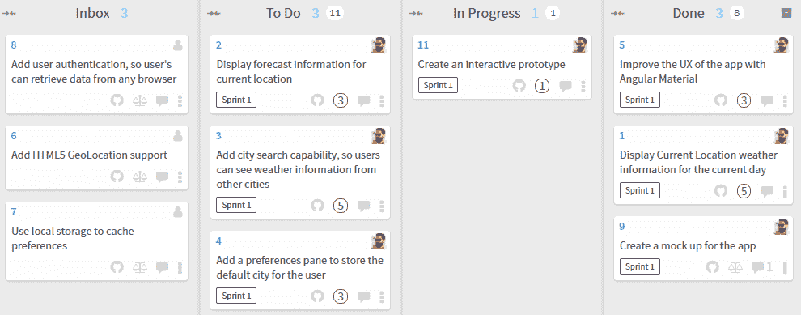

WireframePro 作为一个拖放设计界面非常直观，所以我不会详细介绍工具的工作原理，但我会强调一些技巧：

1.  创建你的项目

1.  选择一个组件包，可以是手绘 UI 或者 Material design

1.  将每个屏幕作为一个新页面添加，如下所示：

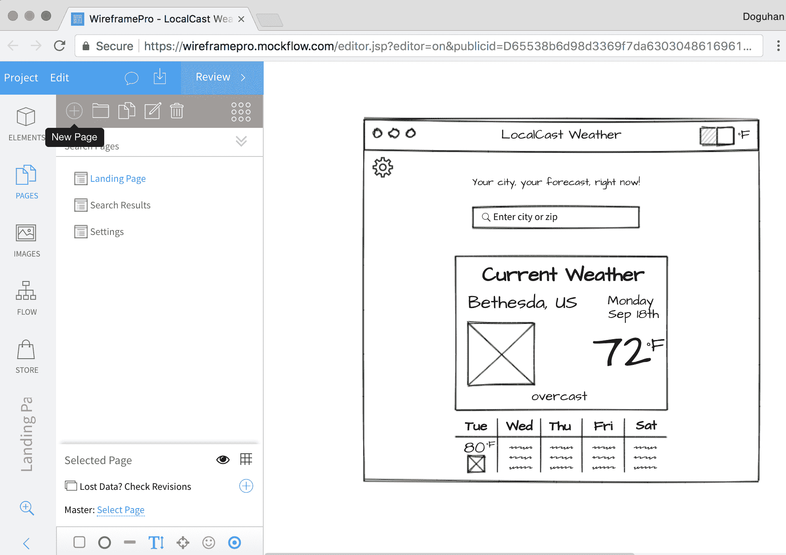MockFlow.com WireFrame Pro

我建议坚持手绘 UI 的外观和感觉，因为它能够为你的观众设定正确的期望。如果你在与客户的第一次会议上展示了一个非常高质量的模型，你的第一个演示将是一个低调的陈述。你最多只能满足期望，最坏的情况下，会让你的观众感到失望。

# 主屏幕

这是主屏幕的新模型：

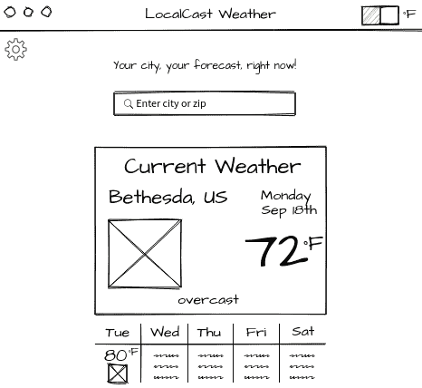LocalCast Weather Wireframe

您会注意到一些不同之处，比如应用工具栏与浏览器栏的混合以及重复元素的故意模糊。我做出这些选择是为了减少我需要在每个屏幕上花费的设计时间。我只是使用水平和垂直线对象来创建网格。

# 搜索结果

搜索屏幕同样故意保持模糊，以避免必须维护任何详细信息。令人惊讶的是，您的观众更有可能关注您的测试数据，而不是关注设计元素。

通过含糊不清，我们故意让观众的注意力集中在重要的事情上。以下是搜索屏幕的模拟：

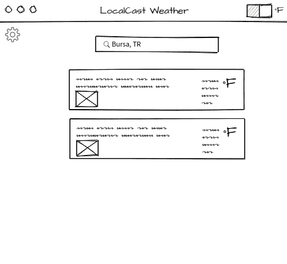LocalCast 天气搜索线框图

# 设置窗格

设置窗格是一个单独的屏幕，其中包含从主屏幕复制并应用了 85%不透明度的元素，以创建类似模型的体验。设置窗格本身只是一个带有黑色边框和纯白背景的矩形。

看一下以下的模拟：

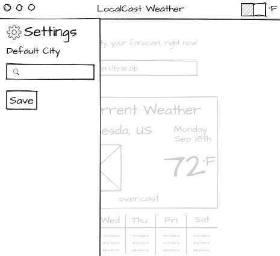LocalCast 天气设置线框图

# 添加交互性

能够点击模拟并了解导航工作流程的感觉是一个无法或缺的工具，可以获得早期用户反馈。这将为您和您的客户节省大量的沮丧、时间和金钱。

要将元素链接在一起，请按照以下步骤操作：

1.  选择主屏幕上的可点击元素，如*齿轮*图标

1.  在链接子标题下，点击选择页面

1.  在弹出窗口中，选择设置

1.  点击创建链接，如此截图所示：

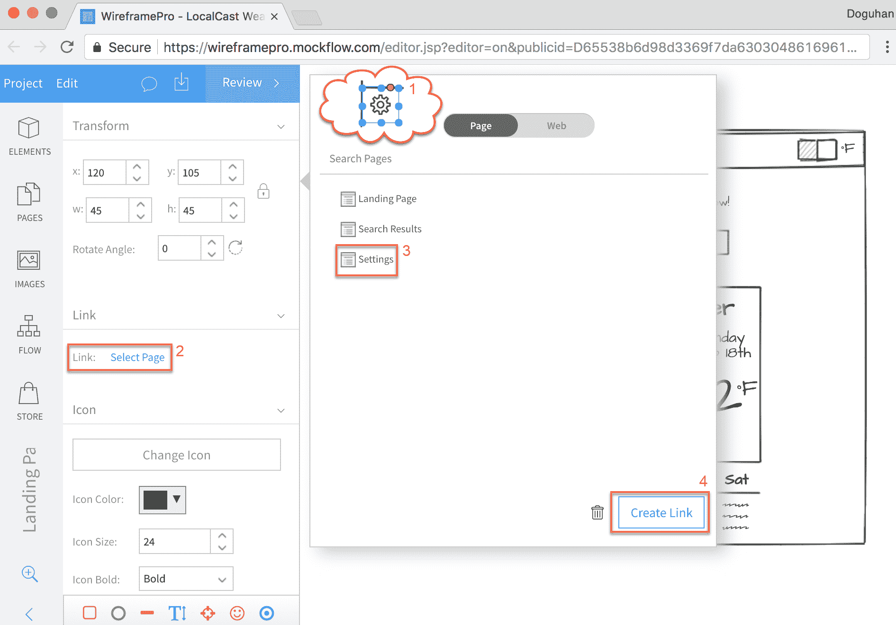WireFrame Pro - 添加链接

现在，当您点击*齿轮*图标时，工具将显示设置页面，这将在同一页面上创建侧边栏实际显示的效果。要返回主屏幕，您可以将齿轮图标和侧边栏外部的部分链接回该页面，以便用户可以来回导航。

# 导出功能原型

一旦您的原型完成，您可以将其导出为各种格式：

1.  选择导出线框图按钮，如下所示：

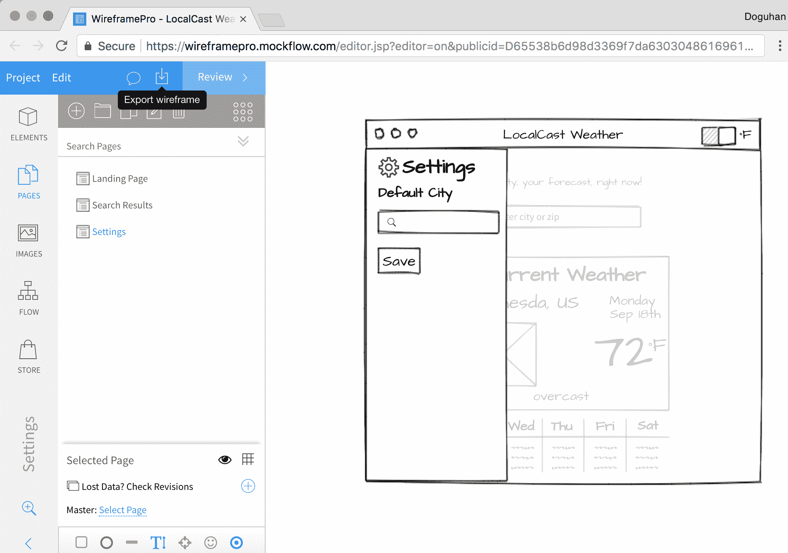WireFrame Pro - 导出线框图

1.  现在选择您的文件格式，如下所示：

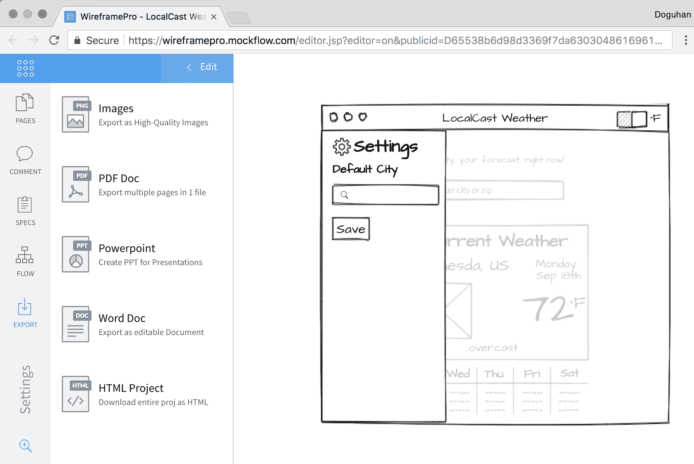WireFrame Pro - 文件格式

我更喜欢 HTML 格式，因为它更灵活；然而，您的工作流程和需求会有所不同。

1.  如果您选择了 HTML，您将获得一个 ZIP 捆绑包的所有资产。

1.  解压捆绑包并使用浏览器导航到它；您应该会得到您线框的交互版本，如图所示：

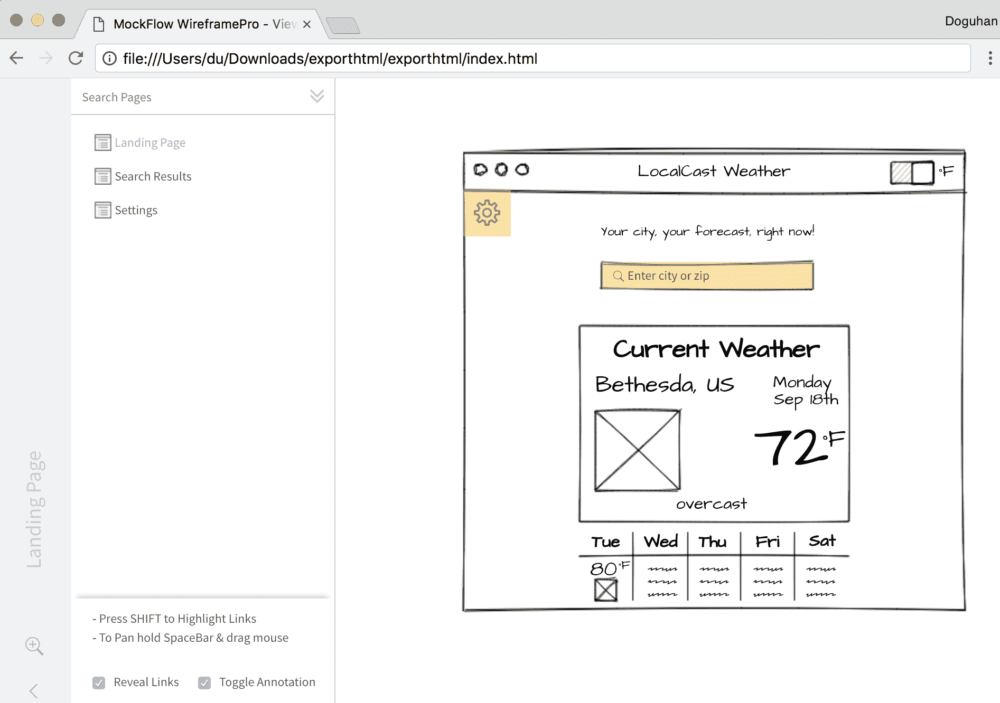WireFrame Pro - 交互式线框交互元素在以下截图中以黄色突出显示。您可以使用屏幕左下角的“显示链接”选项启用或禁用此行为。

您甚至可以使用`minimal-nginx-server`或`minimal-node-server`对原型 HTML 项目进行容器化，并使用相同的技术在 Zeit Now 上进行托管，这与第三章中讨论的准备 Angular 应用程序进行生产发布的技术完全相同。

现在将所有资产添加到 GitHub 问题的评论中，包括 ZIP 捆绑包，我们准备继续下一个任务。让我们将“添加城市搜索卡…”移动到“进行中”，如我们看板中所示：

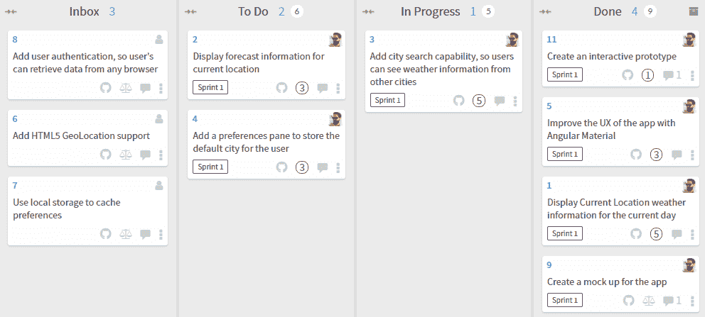Waffle.io 看板

# 使用用户输入进行搜索

现在，我们将在应用程序的主屏幕上实现搜索栏。用户故事中指出显示当前位置的天气预报信息，这可能意味着具有地理位置功能。然而，正如您可能注意到的，地理位置被列为一个单独的任务。挑战在于，使用原生平台功能如地理位置，您永远无法保证获得实际的位置信息。这可能是由于移动设备的信号丢失问题，或者用户可能拒绝分享他们的位置信息。

首先，我们必须提供良好的基线用户体验，并实现增值功能，如地理位置功能。我们将实现搜索即时输入功能，同时向用户提供反馈，如果服务无法检索到预期的数据。

最初，实现类型搜索机制可能是直观的；然而，`OpenWeatherMap`API 并没有提供这样的端点。相反，它们提供昂贵且在兆字节范围内的大量数据下载。

我们需要实现自己的应用服务器来公开这样一个端点，以便我们的应用可以有效地查询，同时使用最少量的数据。

OpenWeatherMap 的免费端点确实带来了一个有趣的挑战，其中两位数的国家代码可能会伴随城市名称或邮政编码以获得最准确的结果。这是一个很好的机会，可以为用户实现反馈机制，如果对于给定的查询返回了多个结果。

我们希望应用程序的每次迭代都是一个潜在的可发布的增量，并且避免在任何给定时间做太多事情。

我们将执行以下操作：

1.  添加 Angular 表单控件

1.  使用 Angular Material Input，如在[`material.angular.io/components/input`](https://material.angular.io/components/input)中记录的那样。

1.  将搜索栏创建为其自己的组件

1.  扩展现有的端点以接受邮政编码，并使国家代码在`weather.service`中变为可选项

1.  节流请求

# 添加 Angular 响应式表单

您可能会想为什么我们要添加 Angular 表单，因为我们只添加了一个单个输入字段，而不是具有多个输入的表单。作为一个一般的经验法则，任何时候您添加任何输入字段，它都应该包装在`<form>`标签中。`Forms`模块包含`FormControl`，它使您能够编写支持输入字段背后的后备代码，以响应用户输入，并根据需要提供适当的数据、验证或响应消息。

Angular 中有两种类型的表单：

+   **模板驱动：** 这些表单类似于您可能熟悉的 AngularJS 中的表单，其中表单逻辑主要在 HTML 模板中。我个人不喜欢这种方法，因为很难测试这些行为，而且庞大的 HTML 模板很快就难以维护。

+   **响应式：** 响应式表单的行为由控制器中编写的 TypeScript 代码驱动。这意味着您的验证逻辑可以进行单元测试，并且更好的是可以在整个应用程序中重复使用。在[`angular.io/guide/reactive-forms`](https://angular.io/guide/reactive-forms)中了解更多关于响应式表单的信息。

让我们首先将`ReactiveFormsModule`导入到我们的应用程序中：

[PRE0]

响应式表单是使 Angular Material 团队能够编写更丰富的工具的核心技术，例如可以根据将来的 TypeScript 接口自动生成输入表单的工具。

# 添加和验证组件

我们将使用 Material 表单和输入模块创建一个`citySearch`组件：

1.  将`MatFormFieldModule`和`MatInputModule`添加到`material.module`中，以便在应用程序中可用：

[PRE1]

我们正在添加`MatFormFieldModule`，因为每个输入字段都应该包装在`<mat-form-field>`标签中，以充分利用 Angular Material 的功能。在高层次上，`<form>`封装了键盘、屏幕阅读器和浏览器扩展用户的许多默认行为；`<mat-form-field>`实现了简单的双向数据绑定，这种技术应该适度使用，并且还允许优雅的标签、验证和错误消息显示。

1.  创建新的`citySearch`组件：

[PRE2]

由于我们添加了`material.module.ts`文件，`ng`无法猜测应将城市搜索功能模块添加到哪里，导致出现错误，例如*More than one module matches*。因此，我们需要使用`--module`选项提供要将`citySearch`添加到的模块。使用`--skip-import`选项跳过将组件导入到任何模块中。

1.  创建一个基本模板：

[PRE3]

1.  导入并实例化`FormControl`的实例：

[PRE4]

响应式表单有三个级别的控件：

+   `FormControl`是与输入字段具有一对一关系的最基本元素

+   `FormArray`表示重复的输入字段，表示对象的集合

+   `FormGroup`用于将单独的`FormControl`或`FormArray`对象注册为您向表单添加更多输入字段时

最后，`FormBuilder`对象用于更轻松地编排和维护`FormGroup`的操作，这将在第十章中进行介绍，*Angular 应用设计和示例*。

1.  在包含`app-current-weather`的外部行的标题之间，在`app.component`中添加`app-city-search`：

[PRE5]

1.  通过在浏览器中查看应用程序来测试组件的集成，如下所示：

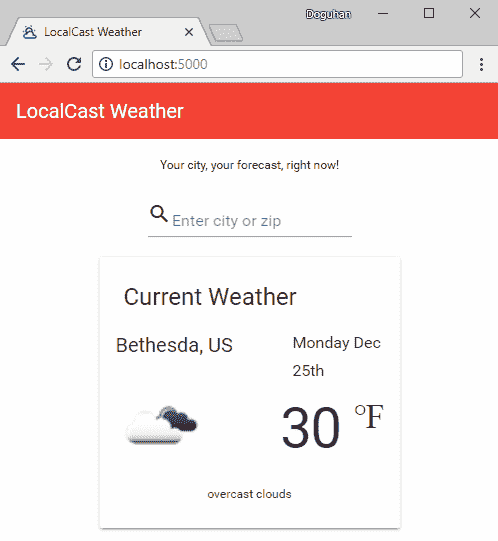带有搜索字段的 LocalWeather 应用

如果没有错误，现在我们可以开始添加`FormControl`元素并将它们连接到搜索端点。

# 向天气服务添加搜索

到目前为止，我们一直在通过名称和国家代码传递参数来获取城市的天气。通过允许用户输入邮政编码，我们必须使我们的服务更灵活，以接受两种类型的输入。

OpenWeatherMap 的 API 接受 URI 参数，因此我们可以使用 TypeScript 联合类型重构现有的`getCurrentWeather`函数，并使用类型守卫，我们可以提供不同的参数，同时保持类型检查：

1.  重构`weather.service`中的`getCurrentWeather`函数以处理邮政编码和城市输入：

[PRE6]

我们将城市参数重命名为`search`，因为它可以是城市名称或邮政编码。然后，我们允许其类型为`string`或`number`，并根据运行时的类型，我们将使用`q`或`zip`。如果存在，我们还将`country`设置为可选，并仅在查询中追加它。

`getCurrentWeather`现在嵌入了业务逻辑，因此是单元测试的良好目标。遵循单一职责原则，从 SOLID 原则中，我们将 HTTP 调用重构为自己的函数，称为`getCurrentWeatherHelper`。

1.  将 HTTP 调用重构为`getCurrentWeatherHelper`。

在下一个示例中，请注意使用反引号字符`` ` ``而不是单引号字符`'`，它利用了允许在JavaScript中嵌入表达式的模板文字功能：

[PRE7]

As a positive side effect, `getCurrentWeatherHelper` adheres to the Open/Closed principle, because it is open to extension by our ability to change the function's behavior by supplying different `uriParams` and is closed to modification, because it won't have to be changed frequently.

To demonstrate the latter point, let's implement a new function to get the current weather by latitude and longitude.

3.  Implement `getCurrentWeatherByCoords`:

[PRE8]

As you can see, `getCurrentWeatherHelper` can easily be extended without any modification.

4.  Ensure that you update `IWeatherService` with the changes made earlier.

As a result of adhering to SOLID design principles, we make it easier to robustly unit test flow-control logic and ultimately end up writing code that is more resilient to bugs and is cheaper to maintain.

# Implementing search

Now, let's connect the new service method to the input field:

1.  Update `citySearch` to inject the `weatherService` and subscribe to input changes:

[PRE9]

We are treating all input as `string` at this point. The user input can be a city, zip code or a city and country code, or zip code and country code separated by a comma. While city or zip code is required, country code is optional. We can use the `String.split` function to parse any potential comma separated input and then trim any whitespace out from the beginning and the end of the string with `String.trim`. We then ensure that we trim all parts of the string by iterating over them with `Array.map`.

We then deal with the optional parameter with ternary operator `?:`, only passing in a value if it exists, otherwise leaving it undefined.

2.  Implement the search handler:

[PRE10]

3.  Add a hint for the user about the optional country functionality:

[PRE11]

At this point, the subscribe handler will make calls to the server and log its output to the console.

Observe how this works with Chrome Dev Tools. Note how often the `search` function is run and also that we are not handling service errors.

# Limiting user inputs with throttle/debounce

As is, we submit a request to the server with every keystroke. This is not a desirable behavior, because it can lead to a bad user experience, drain battery life, result in wasted network requests, and create performance issues both on the client and server side. Users make typos; they can change their mind about what they are inputting and rarely ever, the first few characters of information input result in useful results.

We can still listen to every keystroke, but we don't have to react to every keystroke. By leveraging throttle/debounce, we can limit the number of events generated to a predetermined interval and still maintain the type-as-you-search functionality.

Note that `throttle` and `debounce` are not functional equivalents, and their behavior will differ from framework to framework. In addition to throttling, we expect to capture the last input that the user has typed. In the `lodash` framework, the throttle function fulfills this requirement, whereas in `RxJS`, debounce fulfills it. Beware that this discrepancy may be fixed in future framework updates.

It is very easy to inject throttling into the observable stream using `RxJS/debounceTime`.

Implement `debounceTime` with `pipe`:

[PRE12]

`debounceTime` will, at a maximum, run a search every second, but also run a last search after the user has stopped typing. In comparison, `RxJS/throttleTime` will only run a search every second, on the second, and will not necessarily capture the last few characters the user may have input.

RxJS also has the `throttle` and `debounce` functions, which you can use to implement custom logic to limit input that is not necessarily time-based.

Since this is a time- and event-driven functionality, break point debugging is not feasible. You may monitor the network calls within the Chrome Dev Tools | Network tab, but to get a more real-time feeling of how often your search handler is actually being invoked, add a `console.log` statement.

It is not a good practice to check in code with active `console.log` statements. As covered in Chapter 3, *Prepare Angular App for Production Release*, `console.log` is a poor-man's debugging method. The statements make it difficult to read the actual code, which itself bears a high cost of maintainability. So, whether they are commented out or not, do not check in code with `console.log` statements.

# Implementing input validation and error messaging

`FormControl` is highly customizable. It allows you to set a default initial value, add validators, or listen to changes on blur, change, and submit events, as follows:

[PRE13]

We won't be initializing the `FormControl` with a value, but we need to implement a validator to disallow one character inputs:

1.  Import `Validators` from `@angular/forms`:

[PRE14]

2.  Modify `FormControl` to add a minimum length validator:

[PRE15]

3.  Modify the template to show a validation error message:

[PRE16]

Note the addition of some extra margin to make room for lengthy error messages.

If you are handling different kinds of errors, the `hasError` syntax in the template can get repetitive. You may want to implement a more scalable solution that can be customized through code, as shown:

[PRE17]

4.  Modify the `search` function to not execute a search with invalid input:

[PRE18]

Instead of doing a simple check to see whether `searchValue` is defined and not an empty string, we can tap in to the validation engine for a more robust check by calling `this.search.invalid`.

# Template driven forms with two-way binding

The alternative to Reactive forms are Template driven forms. If you're familiar with `ng-model` from AngularJS, you'll find that the new `ngModel` directive is an API compatible replacement for it.

Behind the scenes, `ngModel` implements a `FormControl` that can automatically attach itself to a `FormGroup`. `ngModel` can be used at the `<form>` level or individual `<input>` level. You can read more about `ngModel` at [`angular.io/api/forms/NgModel`](https://angular.io/api/forms/NgModel).

In the Local Weather app, I have included a commented-out component in `app.component.ts` named `app-city-search-tpldriven`. You can uncomment this component in `app.component` to experiment with it. Let's see how the alternate template implementation looks like:

[PRE19]

Note the `[()]` "box of bananas" two-way binding syntax being used with `ngModel`.

The differences in the component are implemented as follows:

[PRE20]

As you can see, most of the logic is implemented in the template, and the programmer is required to maintain an active mental model of what's in the template and the controller and switch back and forth between the two files to make changes to event handlers and validation logic.

Furthermore, we have lost the input limiting and the ability to prevent service calls when the input is in an invalid state. It is, of course, possible to still implement these features, but they require convoluted solutions and do not neatly fit into the new Angular syntax and concepts.

# Enabling component interaction

In order to update current weather information, we need the `city-search` component to interact with the `current-weather` component. There are four main techniques to enable component interaction in Angular:

*   Global events
*   Parent components listening for information bubbling up from children  components
*   Sibling, parent, or children components within a module that work off of similar data streams
*   Parent components passing information to children components

# Global events

This a technique that's been leveraged since the early days of programming in general. In JavaScript, you may have achieved this with global function delegates or jQuery's event system. In AngularJS, you may have created a service and stored values in it.

In Angular, you can still create a root level service, store values in it, use Angular's `EventEmitter` class, which is really meant for directives, or use an `rxjs/Subscription` to create a fancy messaging bus for yourself.

As a pattern, global events are open to rampant abuse and rather than helping maintain a decoupled application architecture, it leads to global state over time. Global state or even localized state at the controller level, where functions read and write to variables in any given class, is enemy number one of writing maintainable and unit testable software.

Ultimately, if you're storing all your application data or routing all events in one service to enable component interaction, you're merely inventing a better mouse trap. This is an anti-pattern that should be avoided at all costs. In a later section, you will find that essentially we will still be using services to enable component interaction; however, I want to point out that there's a fine line that exists between a flexible architecture that enables decoupling and the global or centralized decoupling approach that does not scale well.

# Child-parent relationships with event emitters

Your child component should be completely unaware of its parent. This is key to creating reusable components.

We can implement the communication between the city search component and the current weather component leveraging app component as a parent element and let the `app` module controller orchestrate the data.

Let's see how this implementation will look:

1.  The `city-search` component exposes an `EventEmitter` through an `@Output` property:

[PRE21]

2.  The `app` component consumes that and calls the `weatherService`, setting the `currentWeather` variable:

[PRE22]

We have been able to successfully bubble up the information, but now we must be able to pass it down to the `current-weather` component.

# Parent-child relationships with input binding

By definition, your parent component will be aware of what child components it is working with. Since the `currentWeather` property is bound to the `current` property on the `current-weather` component, the results pass down to be displayed. This is achieved by creating an `@Input` property:

[PRE23]

You can then update `app` component to bind the data to `current` weather:

[PRE24]

This approach may be appropriate in cases where you are creating well-coupled components or user controls and no outside data is being consumed. A good example might be adding forecast information to the `current-weather` component, as shown:

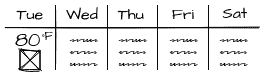Weather Forecast Wireframe

Each day of the week can be implemented as a component that is repeated using `*ngFor`, and it will be perfectly reasonable for `current-weather` to retrieve and bind this information to its children component:

[PRE25]

In general, if you're working with data-driven components, the parent-child or child-parent communication pattern results in an inflexible architecture, making it very difficult to reuse or rearrange your components. Given the ever-changing business requirements and design, this is an important lesson to keep in mind.

# Sibling interactions with subjects

The main reason for components to interact is to send or receive updates to data either provided by the user or received from the server. In Angular, your services expose `RxJS.Observable` endpoints, which are data-streams that your components can subscribe to. `RxJS.Observer` compliments `RxJS.Observable` as a consumer of events emitted by `Observable`. `RxJS.Subject` brings the two sets of functionalities together, in an easy to work with object. You can essentially describe a stream that belongs to a particular set of data, such as the current weather data that is being displayed, with subjects:

[PRE26]

`currentWeather` is still a data stream and does not simply represent one data point. You can subscribe to changes to `currentWeather` data with subscribe, or you can publish changes to it as follows:

[PRE27]

The default behavior of `Subject` is very much like generic pub/sub mechanisms, such as jQuery events. However, in an asynchronous world where components are loaded or unloaded in ways that are unpredictable, using the default `Subject` is not very useful.

There are three different types of Subjects:

*   `ReplaySubject`: It will remember and cache all data points occurred within the data stream so that a subscriber can replay all events at any given time
*   `BehaviorSubject`: It remembers only the last data point, while continuing to listen for new data points
*   `AsyncSubject`: This is for one-time only events that are not expected to reoccur

`ReplaySubject` can have severe memory and performance implications on your application, so it should be used with care. In the case of `current-weather`, we are only interested in displaying the latest weather data received, but through user input or other events we are open to receiving new data, so we can keep the `current-weather` component up to date. The `BehaviorSubject` would be the appropriate mechanism to meet these needs:

1.  Define `BehaviorSubject` in `weatherService` and set a default value:

[PRE28]

2.  Update the `current-weather` component to subscribe to the new `BehaviorSubject`:

[PRE29]

3.  Update the `city-search` component to publish the data it receives to `BehaviorSubject`:

[PRE30]

1.  在浏览器中测试您的应用程序；它应该如下所示：

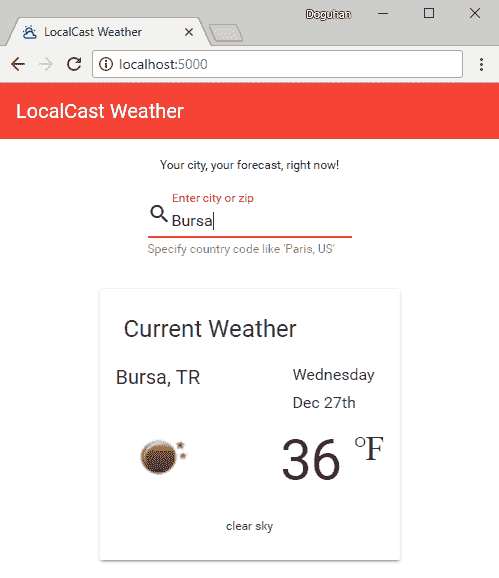土耳其布尔萨的天气信息

当您输入一个新的城市时，组件应该更新为该城市的当前天气信息。

在应用程序首次加载时，默认体验看起来有些问题。至少有两种不同的处理方式。首先是在`app`组件级别隐藏整个组件，如果没有数据显示。为了使其工作，我们将不得不将`weatherService`注入到`app`组件中，最终导致不太灵活的解决方案。另一种方法是能够更好地处理`current-weather`组件中缺少的数据。

为了使应用程序更好，您可以在应用程序启动时实现地理位置功能，以获取用户当前位置的天气。您还可以利用`window.localStorage`来存储上次显示的城市或从`window.geolocation`在初始启动时检索的上次位置。

在继续之前，不要忘记执行`npm test`和`npm run e2e`。读者可以自行修复单元测试和端到端测试。

# 摘要

这一章完成了我们对本地天气应用程序的工作。我们可以将`城市搜索`功能任务移动到`完成`列，如我们看板中所示：

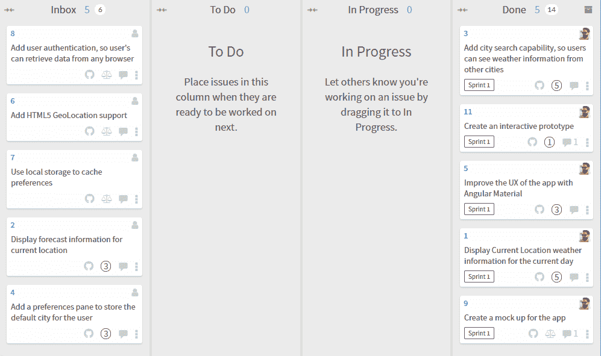Waffle.io 看板状态

在本章中，您学会了如何创建一个交互式原型，而不需要编写一行代码。然后，您使用`MatInput`、验证器、响应式表单和数据流驱动处理程序创建了一个搜索即时响应的功能。您还了解了不同的策略来实现组件间的交互和数据共享。最后，您了解了双向绑定和基于模板的表单。

LocalCast Weather 是一个简单的应用程序，我们用它来介绍 Angular 的基本概念。正如您所见，Angular 非常适合构建这样的小型和动态应用程序，同时向最终用户提供最少量的框架代码。您应该考虑利用 Angular 甚至用于快速而简单的项目，这在构建更大型的应用程序时也是一个很好的实践。在下一章中，您将使用路由器优先的方法来创建一个更复杂的**业务线**（**LOB**）应用程序，设计和构建可扩展的 Angular 应用程序，其中包括一流的身份验证和授权、用户体验以及涵盖大多数 LOB 应用程序需求的众多技巧。
