# 第二章。使用 Bootstrap 组件

在网页设计和开发领域，我们听说过很多关于**Twitter Bootstrap 3**。我们今天的英雄是**Bootstrap 4**，这是一个 CSS 框架，最终帮助设计网页应用更容易更快。

在本章中，我将解释如何通过展示演示布局页面来开始使用 Bootstrap 4，以及如何探索框架并根据您的要求进行自定义。在本章结束时，您将对以下内容有扎实的理解：

+   如何使用**Sass**（**Syntactically Awesome Style Sheets**）

+   如何将 Bootstrap 4 添加到您的项目中

+   如何使用网格和容器设计布局

+   如何添加导航元素

+   如何自定义选定的组件

# Bootstrap 4

在第一章中，我们简要谈到了 Twitter Bootstrap 4，但现在是时候更仔细地看看这个 CSS 框架了。然而，在深入了解 Bootstrap 4 之前，让我们先谈谈所有新引入的功能：

+   Bootstrap 4 的源 CSS 文件是基于 Sass 的

+   `rem`是主要的 CSS 单位，而不是`px`

+   全局字体大小从`14px`增加到`16px`

+   新的网格层级已经为小型设备（从`~480px`及以下）添加了

+   Bootstrap 4 可选择支持**Flex Box Grid**

+   添加了改进的**媒体查询**

+   新的**Card**组件取代了**Panel**，**Well**和**Thumbnail**

+   有一个名为`Reboot.css`的新的重置组件

+   使用 Sass 变量可以自定义一切

+   不再支持 IE 8 和 iOS 6

+   它不再支持非响应式使用

# Sass 简介

如果您不熟悉 Sass，我认为现在是介绍这个梦幻般的 CSS 预处理框架的合适时机。毫无疑问，对 CSS 文件进行预处理可以让您编写更简洁、更简洁的样式表。Sass 的第一个版本的语法使用缩进，不需要分号，有简写操作符，并使用`.sass`文件扩展名。它与 CSS 有很大不同，以至于 Sass 第 3 版开始支持带有大括号、分号和`.scss`文件扩展名的新格式。让我们将各种形式进行比较。

这是一个原始的 CSS 样式：

```ts
#container { 
        width:100px; 
        padding:0; 
} 
#container p { 
        color: red; 
} 

```

在扩展名为`.sass`的文件中，我们应该只使用缩进，并且它严重依赖于空格：

```ts
$red: #ff0000 
#container 
        width:100px 
        padding: 0 
                p 
                        color:$red 

```

在扩展名为`.scss`的文件中，我们使用大括号和分号：

```ts
$red: #ff0000; 
#container { 
        width:100px; 
        padding:0; 
        p { 
                color :$red; 
        } 
} 

```

最终由您决定使用哪种样式，但我将在本书中使用基于`.scss`文件的最新样式。

## 设置 Ruby

在开始使用 Sass 之前，你需要安装 Ruby，但首先检查一下你是否已经有了。打开终端，输入 `ruby -v` 。

如果你没有收到错误，请跳过安装 Ruby 的步骤。否则，你将从官方 Ruby 网站[`www.ruby-lang.org/en/documentation/installation`](https://www.ruby-lang.org/en/documentation/installation)安装一个新的 Ruby。

## Sass 的设置

完成 Ruby 的安装后，打开终端并输入以下命令。

+   对于 Windows：

```ts
 **gem install sass** 

```

+   对于 Linux 和 Mac：

```ts
 **sudo gem install sass** 

```

这个命令将为你安装 Sass 和必要的依赖项。运行以下命令检查你的 PC 上是否安装了 Sass：

```ts
 **sass -v** 

```

Sass 必须以版本号做出响应：

```ts
 **Sass 3.4.22 (Selective Steve)** 

```

请记住，我电脑上安装的 Sass 版本可能与你的不同。如果这些命令给你一个版本号，你就可以开始使用 Sass 进行开发了。

现在我们已经安装了 Sass，我们可以探索它的文件并将它们输出为 CSS。你可以使用 CLI 或 GUI 来开始使用 Sass。如果你喜欢 GUI 风格的开发，请从以下列表中选择一个：

+   CodeKit（Mac，付费）：[`incident57.com/codekit`](http://incident57.com/codekit)

+   Compass.app（Windows，Mac，Linux，付费，开源）：[`compass.kkbox.com/`](http://compass.kkbox.com/)

+   Ghostlab（基于 Web，付费）：[`www.vanamco.com/ghostlab`](http://www.vanamco.com/ghostlab)

+   Hammer（Mac，付费）：[`hammerformac.com`](http://hammerformac.com)

+   Koala（Windows，Mac，Linux，开源）：[`koala-app.com`](http://koala-app.com)

+   LiveReload（Mac，付费，开源）：[`livereload.com`](http://livereload.com)

+   Prepros（Windows，Mac，Linux，付费）：[`prepros.io`](https://prepros.io)

+   Scout（Windows，Mac，开源）：[`github.com/scout-app/scout-app`](https://github.com/scout-app/scout-app)

我个人更喜欢 Scout GUI，它在一个独立的 Ruby 环境中运行 Sass 和 Compass；它会处理所有繁重的工作，所以我们永远不必担心设置 Ruby 之类的技术问题。

我推荐的另一个有趣的选择是基于 Web 的 Sass 游乐场**SassMeister**，你可以在[`www.sassmeister.com`](http://www.sassmeister.com)找到。我们将在 Sass 速成课程中稍微使用一下它。

## Sass 速成课程

Sass 的主要理念是我们创建可重用、不冗长的易于阅读和理解的代码。让我们看看是哪些特性实现了这一点。请打开 SassMeister 网站，准备进行练习。

### 变量

我们可以在 Sass 中创建变量，特别是为了在整个文档中重用它们。变量的可接受值包括：

+   数字

+   字符串

+   颜色

+   空值

+   列表

+   映射

我们使用`$`符号来定义一个变量。切换到 SassMeister 并创建我们的第一个变量：

```ts
$my-pad: 2em; 
$color-primary: red; 
$color-secondary: #ff00ed; 

```

SassMeister 对它们进行编译，但没有输出任何 CSS。我们只是在作用域中定义变量，就是这样。我们需要在 CSS 声明中使用它们才能看到编译的结果：

```ts
body { 
  background-color: $color-primary; 
} 

.container { 
  padding: $my-pad; 
  color: $color-secondary; 
} 

```

这是从 Sass 到 CSS 的编译结果：

```ts
body { 
  background-color: red; 
} 

.container { 
  padding: 2em; 
  color: #ff00ed; 
} 

```

### 数学表达式

Sass 允许我们在算术表达式中使用以下数学运算符：

+   加法（+）

+   减法（-）

+   除法（/）

+   乘法（*）

+   模数（%）

+   相等（==）

+   不相等（！=）

转到 SassMeister 并尝试一些引入的数学运算：

```ts
$container-width: 100%; 
$font-size: 16px; 

.container { 
  width: $container-width; 
} 

.col-4 { 
  width: $container-width / 4; 
  font-size: $font-size - 2; 
} 

```

这是一些 CSS 编译器代码：

```ts
.container { 
  width: 100%; 
} 

.col-4 { 
  width: 25%; 
  font-size: 14px; 
} 

```

我想警告您不要在数学运算中使用不兼容的单位。在您的游乐场中尝试以下 Sass 代码：

```ts
 h2 { 
    // Error: Incompatible units: 'em' and 'px'. 
    width: 100px + 2em; 
    // Result: 52px 
    height: 50px + 2; 
} 

```

然而，将两个相同单位的数字相乘会产生无效的 CSS 值：

```ts
h2 { 
    // Error: 100px*px isn't a valid CSS value. 
    width: 50px * 2px; 
} 

```

斜杠符号（/）是 CSS 简写属性的一部分。例如，这里是字体声明：

```ts
font-style: italic; 
font-weight: bold; 
font-size: .8em; 
line-height: 1.2; 
font-family: Arial, sans-serif; 

```

它可以缩短为以下内容：

```ts
font: italic bold .8em/1.2 Arial, sans-serif; 

```

为了避免任何可能的问题，您应该始终将包含非变量值的除法运算符的表达式用括号括起来，例如：

```ts
h2 { 
    // Result: Outputs as CSS 
    font-size: 16px / 24px; 
    // Result: Does division because uses parentheses 
    width: (16px / 24px); 
} 

```

### 注意

应避免在数学运算中使用不同的单位。

### 函数

Sass 有一套丰富的内置函数，您可以在以下地址找到它们：

[`sass-lang.com/documentation/Sass/Script/Functions.html`](http://sass-lang.com/documentation/Sass/Script/Functions.html)

这是使用`rgb($red, $green, $blue)`函数的最简单的例子。它从红色、绿色和蓝色值创建一个`color`：

```ts
$color-secondary: rgb(ff,00,ed); 

```

### 嵌套

Sass 允许我们在另一个声明中有一个声明。在以下原始 CSS 代码中，我们定义了两个语句：

```ts
.container { 
    width: 100px; 
} 

.container h1 { 
    color: green; 
} 

```

我们有一个容器类和容器内的标题样式声明。在 Sass 中，我们可以创建紧凑的代码：

```ts
.container { 
  width: 100px; 
  h1 { 
    color: green; 
  } 
} 

```

嵌套使代码更易读，更简洁。

### 导入

Sass 允许您将样式分成单独的文件并将其导入到另一个文件中。我们可以使用`@import`指令，带有或不带有文件扩展名。有两行代码产生相同的结果：

```ts
@import "components.scss"; 
@import "components"; 

```

### 扩展

如果您需要从现有样式中继承样式，Sass 有`@extend`指令可以帮助您：

```ts
.input { 
  color: #555; 
  font-size: 17px; 
} 

.error-input { 
  @extend .input; 
  color: red; 
} 

```

这是 Sass 编译器正确处理编译代码的结果：

```ts
.input, .error-input { 
  color: #555; 
  font-size: 17px; 
} 

.error-input { 
  color: red; 
} 

```

### 占位符

在您想要扩展不存在的一组样式声明时，Sass 可以帮助使用占位符选择器：

```ts
%input-style { 
  font-size: 14px; 
} 

.input { 
  @extend %input-style; 
  color: #555; 
} 

```

我们使用`%`符号来给类名加前缀，并借助`@extend`，魔法就发生了。Sass 不会渲染占位符，它只会渲染其扩展元素的结果。以下是编译后的代码：

```ts
.input { 
  font-size: 14px; 
} 

.input { 
  color: #555; 
} 

```

### 混合

我们可以使用 mixin 创建可重用的 CSS 样式块。Mixin 始终返回标记代码。我们使用`@mixin`指令来定义 mixin，并使用`@include`在文档中使用它们。您可能以前经常看到以下代码：

```ts
a:link { color: white; } 
a:visited { color: blue; } 
a:hover { color: green; } 
a:active { color: red; } 

```

实际上，更改元素的颜色取决于状态。通常我们一遍又一遍地写这段代码，但是使用 Sass，我们可以这样做：

```ts
@mixin link ($link, $visit, $hover, $active) { 
  a { 
    color: $link; 
    &:visited { 
      color: $visit; 
    } 
    &:hover { 
      color: $hover;    
    } 
    &:active { 
      color: $active; 
    } 
  } 
} 

```

这里的`&`符号指向父元素，即锚元素。让我们在下面的示例中使用这个 mixin：

```ts
.component { 
  @include link(white, blue, green, red); 
} 

```

这是编译为 CSS 代码的 mixin：

```ts
.component a { 
  color: white; 
} 
.component a:visited { 
  color: blue; 
} 
.component a:hover { 
  color: green; 
} 
.component a:active { 
  color: red; 
} 

```

### 函数指令

函数指令是 Sass 的另一个特性，它通过`@return`指令帮助创建可重用的 CSS 样式返回值块。我们使用`@function`指令来定义它：

```ts
@function getTableWidth($columnWidth,$numColumns,$margin){ 
    @return $columnWidth * $numColumns + $margin * 2; 
}  

```

在这个函数中，我们计算表的宽度取决于单独的列宽、列数和边距值：

```ts
$column-width: 50px; 
$column-count: 4; 
$margin: 2px; 

.column { 
  width: $column-width; 
} 

.table { 
  background: #1abc9c; 
  height: 200px; 
  width: getTableWidth($column-width,$column-count,$margin); 
  margin: 0 $margin; 
} 

```

生成的 CSS 代码如下：

```ts
.column { 
  width: 50px; 
} 

.table { 
  background: #1abc9c; 
  height: 200px; 
  width: 204px; 
  margin: 0 2px; 
} 

```

我认为是时候结束我们的 Sass 速成课程了，但请不要认为你对它了解一切。Sass 非常强大，所以如果你决定继续我们在这里开始的旅程，请在这里获取更多信息：[`sass-lang.com/documentation/file.SASS_REFERENCE.html`](http://sass-lang.com/documentation/file.SASS_REFERENCE.html)。

# 示例项目

让我们在阅读本书的同时谈谈我们将开发什么样的 Web 应用程序。我已经决定电子商务应用程序是展示不同 Bootstrap 4 组件完整风格的最佳候选人。

电子商务这个词，如今我们所理解的，指的是通过互联网购买和销售商品或服务，因此我们基于真实场景设计网络应用程序。在介绍之后，我们将整理出一个高层次的客户需求清单。然后，我们将准备一系列模型，这将帮助您更清楚地了解最终应用程序对最终用户的外观。最后，我们将把客户需求分解成一系列实施任务，并构建应用程序，以便清晰定义功能组件之间的责任和交互。

## 情景

Dream Bean 是一家小型杂货店，与几家当地农场合作，供应有机食品和农产品。该店拥有长期的客户群，并为该地区带来不断增长的利润。由于最近的一项调查显示，其常客中有 9%持续拥有互联网访问权限，83%有兴趣使用此服务，因此该店决定调查提供在线送货服务的可能性。

杂货店经理要求您创建一个网站，使他们的客户能够从各种设备上在线购物，包括手机、平板电脑和台式电脑。

## 收集客户需求

在做出任何设计或实施决策之前，您需要从客户那里收集信息；因此，在与客户直接沟通后，我们有以下条件：

+   客户可以购买实体店中的产品。有以下产品类别：

+   肉类

+   海鲜

+   面包店

+   乳制品

+   水果和蔬菜

+   带走

+   客户可以浏览所有商品或按类别筛选商品

+   客户有一个虚拟购物车

+   客户可以在购物车中添加、删除或更新商品数量

+   客户可以查看所有内容的摘要

+   客户可以下订单并通过安全的结账流程付款

## 准备用例

现在，当需求确定后，是时候与 Dream Bean 的经理合作，了解网站应该如何展现和运作。我们创建一组用例，描述客户如何使用网络应用程序：

+   客户访问欢迎页面，并按类别选择产品

+   客户在所选类别页面浏览产品，然后将产品添加到购物车中

+   客户点击**信息**按钮打开包含产品完整信息的单独页面，然后将产品添加到购物车

+   客户继续购物并选择不同的类别

+   客户从这个类别中添加了几种产品到购物车

+   客户选择**查看购物车**选项并更新购物车中产品的数量

+   客户验证购物车内容并进行结账

+   在结账页面，客户查看订单成本和其他信息，填写个人数据，然后提交详细信息

我们继续与 Dream Bean 的工作人员合作，需要以以下一种方式创建模型：

+   使用故事板软件

+   创建一组线框

+   使用纸质原型

我使用**Balsamiq Mockups**来帮助我快速创建线框。Balsamiq Mockups 的完全功能试用版本可用 30 天，并可从官方网站[`balsamiq.com`](https://balsamiq.com)下载。

## 欢迎页面

欢迎页面是应用程序的入口点。它向客户介绍业务和服务，并使他/她能够导航到任何产品类别。我们在欢迎页面中间添加了一个幻灯片，如下所示：

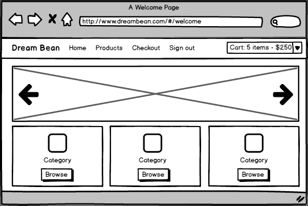

欢迎页面的线框

## 产品页面

产品页面提供了所选类别中所有商品的列表。从这个页面，客户可以查看所有产品信息，并将列出的任何产品添加到他或她的购物车中。用户还可以导航到任何提供的类别，或者使用**快速购物**功能按名称搜索产品，如下所示：

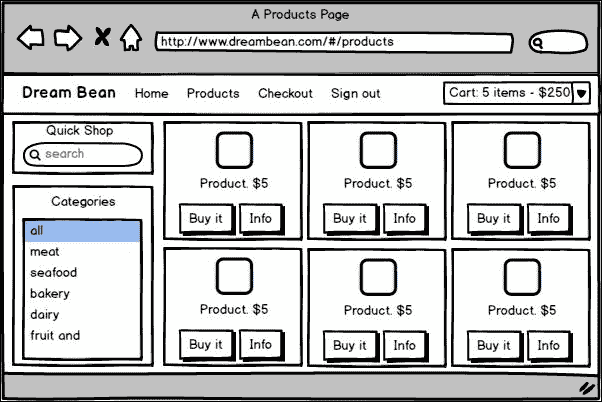

产品页面的线框

## 产品页面

产品页面显示有关产品的信息。在此页面上，客户可以执行以下操作：

+   检查产品的可用性

+   更新产品的数量

+   通过点击“购买”将产品添加到购物车

+   通过点击“继续购物”返回产品列表

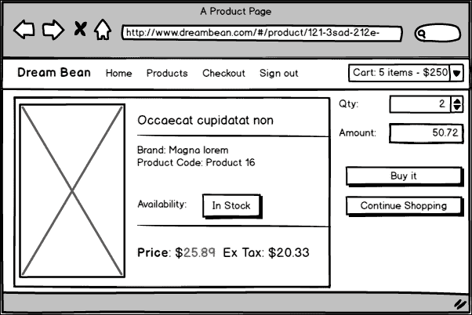

产品页面的线框

## 购物车页面

购物车页面列出了用户购物车中的所有物品。它显示了每件物品的产品详细信息，用户可以从这个页面执行以下操作：

+   通过点击**清空购物车**来从购物车中删除所有商品

+   更新任何列出的物品的数量

+   点击“继续购物”返回产品列表

+   点击**结账**继续结账

以下是购物车页面可能的样子：

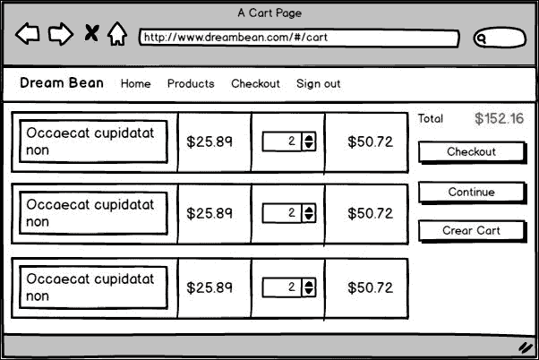

购物车页面的线框

## 结账页面

结账页面显示客户详细信息表单、购买条件和订单信息。客户应填写表单，确认付款，并点击**提交**按钮开始付款流程，如下所示：

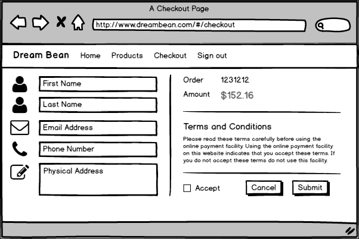

结账页面的线框

我们已经准备好使用 Angular 2 和 Bootstrap 4 开始项目。我们已经将业务需求投影到模型上，现在需要做以下事情：

1.  打开终端，创建名为`ecommerce`的文件夹并进入其中

1.  将项目的内容从`ecommerce-seed`文件夹复制到新项目中

1.  运行以下脚本以安装 npm 模块：

```ts
 **npm install** 

```

1.  使用以下命令启动**TypeScript**监视器和 lite 服务器：

```ts
 **npm run start** 

```

这个脚本会打开网页浏览器并导航到项目的欢迎页面。我们已经准备好开始开发了。

### 注意

您可以在`chapter_2/1.ecommerce-seed`文件夹中找到源代码。

# 使用网格和容器设计布局

Bootstrap 包括一个强大的面向移动设备的网格系统，用于构建各种形状和大小的设计，这听起来非常有前途，因为我们需要为项目创建多个页面。我们将使用网格系统通过一系列行和列来创建页面布局。由于 Bootstrap 是为移动设备优先开发的，我们使用了一些[媒体查询](https://developer.mozilla.org/en-US/docs/Web/Guide/CSS/Media_queries)来为我们的布局和界面创建合理的断点。这些断点主要基于最小视口宽度，并允许我们随着视口的变化而扩展元素。网格系统有三个主要组件，它们是：

+   容器

+   行

+   列

容器是 Bootstrap 中的核心和必需的布局元素。有两个类可以创建所有其他项目的容器：

+   您可以使用`container`类创建一个响应式的固定宽度容器。这个容器在托管元素的两侧没有额外的空间，并且它的`max-width`属性在每个断点处都会改变。

+   您可以使用`container-fluid`类创建全宽度的容器。这个容器始终占据视口的 100%宽度。

要为我们的项目创建一个简单的布局，请打开`app.component.html`文件，并在其中插入一个带有`container`类的`div`元素：

```ts
<div class="container"> 
</div> 

```

我们可以嵌套容器，但大多数布局不需要。容器只是行的占位符，所以让我们在其中添加行：

```ts
<div class="container"> 
  <div class="row"> 
  </div> 
</div> 

```

行具有`row`类，容器可以包含所需的行数。

### 注意

我建议使用一个或多个容器，所有行都在其中，以包裹页面内容并在屏幕上居中元素。

行是列的水平组。它只存在一个目的：保持列正确对齐。我们必须将页面内容仅放在列内，并指示要使用的列数。每行最多可以包含 12 列。

我们可以将列添加到行中，作为`col`类的组合，并且它有前缀大小：

```ts
<div class="col-md-12"> 

```

Bootstrap 4 支持五种不同大小的显示屏，并且列类名称取决于它们：

+   `col-xs`：用于超小显示屏（屏幕宽度小于 34em 或 544px）

+   `col-sm`：用于较小的显示屏（屏幕宽度 34em 或 544ps 及以上）

+   `col-md`：用于中等显示屏（屏幕宽度 48em 或 768px 及以上）

+   `col-lg`：用于更大的显示屏（屏幕宽度 62em 或 992px 及以上）

+   `col-xl`：用于超大显示屏（屏幕宽度 75em 或 1200px 及以上）

列类名称始终适用于屏幕宽度大于或等于断点大小的设备。

列的宽度设置为百分比，因此它始终是流动的，并且大小约等于父元素。每列都有水平填充，以在各列之间创建空间。第一列和最后一列有负边距，这就是为什么网格内的内容与网格外的内容对齐。这是一个针对超小设备的网格示例：

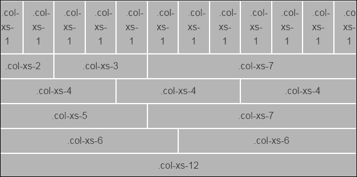

看看我们项目欢迎页面的示意图，并想象将其分成行和列：

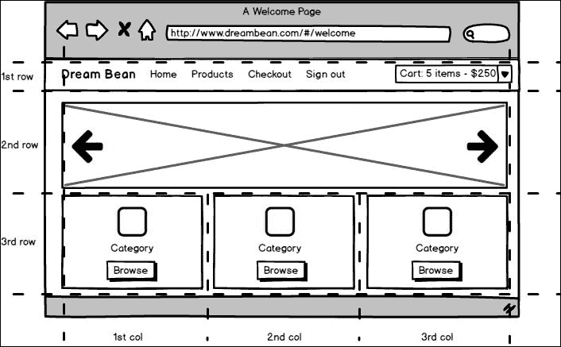

欢迎页面的线框图

我们的标记至少有三行。第一行有一个带有公司标志和菜单的标题。它跨越 12 个中等大小的列，标记为`col-md-12`。我现在使用网格，但以后我会将其更改为更合适的组件：

```ts
<div class="container"> 
  <div class="row"> 
    <div class="col-md-12 table-bordered"> 
      <div class="product-menu">Logo and Menu</div> 
    </div> 
  </div> 
  <!-- /.row --> 
</div> 

```

第二个有一个单独的列，包含一个 1110x480px 的图像，并跨越所有 12 个中等大小的列，标记为`col-md-12`，就像前一个一样：

```ts
<div class="container"> 
  <div class="row"> 
    <div class="col-md-12 table-bordered"> 
       
    </div> 
  </div> 
  <!-- /.row --> 

```

最后一个包括六个产品类别的位置，每个类别占据的列数取决于布局的大小：

+   四个中等大小的列标记为`col-md-4`

+   六个标记为`col-sm-6`的小列

+   用`col-xs-12`标记的十二个额外小的列

每个图像的尺寸为 270x171px。屏幕底部的标记相当长，所以我把它截断了：

```ts
<div class="row"> 
    <div class="col-xs-12 col-sm-6 col-md-4 table-bordered"> 
      <a href="#"> 
         
      </a> 
    </div> 
    <!-- /.col --> 
    <div class="col-xs-12 col-sm-6 col-md-4 table-bordered"> 
      <a href="#"> 
         
      </a> 
    </div> 
    <!-- /.col --> 
... 
    <div class="col-xs-12 col-sm-6 col-md-4 table-bordered"> 
      <a href="#"> 
         
      </a> 
    </div> 
    <!-- /.col --> 
  </div> 
  <!-- /.row --> 
</div> 
<!-- /.container --> 

```

我故意添加了 Bootstrap 类`table-bordered`来显示列的边界。稍后我会将其移除。这是网站的外观结果：

如果我将视口更改为较小的尺寸，Bootstrap 立即将列转换为行，就像您在前面的图表中看到的那样。我在页面上没有使用真实图像，而是指向了[`placehold.it`](http://placehold.it)。这是一个在网上动态生成指定尺寸占位图像的服务。像这样的链接[`placehold.it/270x171`](http://placehold.it/270x171)返回尺寸为 270x171px 的占位图像。

# 使用图像

在我们的标记中，我使用了图像，所以请注意`img-fluid`类，它使图像具有响应式行为：

```ts
 

```

该类的逻辑永远不会使图像变大于父元素。同时，它通过类轻量级地管理样式。您可以轻松地设计图片的形状如下：

+   用`img-rounded`类使其变成圆角。边框半径为 0.3rem

+   用`img-circle`来使其成为圆形，所以边框半径变成了 50%

+   用`img-thumbnail`来转换它

在我们的示例中，`center-block`使图像居中，但您也可以使用辅助浮动或文本对齐类来对齐它：

+   `pull-sm-left`类在小尺寸或更宽的设备上向左浮动

+   `pull-lg-right`类在大尺寸和更大的设备上向右浮动

+   `pull-xs-none`类防止在所有视口尺寸上浮动

### 注意

您可以在`chapter_2/2.ecommerce-grid`文件夹中找到源代码。

现在，我想创建板块，并在页面底部用图像替换它们。我们可以用于此目的的最佳组件是**Card**。

# 使用 Cards

Card 组件是一个非常灵活和可扩展的内容容器，只需要少量的标记和类就可以做出很棒的东西。Cards 替换了 Bootstrap 3 中存在的以下元素：

+   面板

+   Wells

+   缩略图

创建它的最简单方法是向元素添加`card`和`card-block`类：

```ts
<div class="col-xs-12 col-sm-6 col-md-4"> 
  <div class=" **card** 

"> 
     
    <div class="card-block"> 
      <h4 class="card-title">Bakery</h4> 
      <p class="card-text">The best cupcakes, cookies, cakes,  
                           pies, cheesecakes, fresh bread,  
                           biscotti, muffins, bagels, fresh coffee  
                           and more.</p> 
      <a href="#" class="btn btn-primary">Browse</a> 
    </div> 
  </div> 
</div> 

```

`card-block`类在内容和卡片边框之间添加了填充空间。在我的示例中，我将其移动到内部，以使卡片标题与卡片边缘对齐。如果需要，您可以使用`card-header`创建标题和`card-footer`类创建页脚。正如您所看到的，它在卡片中包括了各种组件，如图像、文本、列表组等。这是我们的卡片组件的外观：

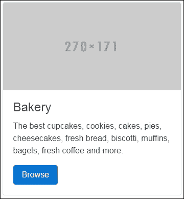

但这不是唯一使用卡片组件的地方。我们将在接下来的章节中经常使用它们。

### 注意

您可以在`chapter_2/3.ecommerce-cards`文件夹中找到源代码。

# 使用按钮

我已经向卡片组件添加了一个按钮，并且我想谈谈它。您可以将按钮样式应用于以下元素：

+   标准的`button`在所有浏览器中都能正常工作。

+   具有`type="button"`的`input`元素。

+   锚元素，只有在使用`role="button"`时才像按钮一样。仅用于触发页面功能，而不是链接到当前页面或部分内的新页面。

+   在处理复选框和单选按钮时的标签。

## 常规按钮样式

在 Bootstrap 4 中，我们可以找到七种按钮样式，每种都有不同的语义目的。`btn`类为独立放置、在表单中或对话框中的按钮添加了样式的上下文变化、大小和状态：


主要行动样式提供了额外的视觉重量：

```ts
<button type="button" class=" **btn btn-primary** 

">Primary</button> 

```

次要的，比主要行动不太重要的样式提供了减少背景颜色的选项：

```ts
<button type="button" class=" **btn btn-secondary** 

">Secondary</button> 

```

成功指示任何成功的操作或位置行动：

```ts
<button type="button" class=" **btn btn-success** 

">Success</button> 

```

信息是为了指导用户进行信息性行动或警报：

```ts
<button type="button" class=" **btn btn-info** 

">Info</button> 

```

警告提供了警告和警告行动：

```ts
<button type="button" class=" **btn btn-warning** 

">Warning</button> 

```

危险指示危险或潜在的负面行动：

```ts
<button type="button" class=" **btn btn-danger** 

">Danger</button> 

```

链接按钮呈现为链接的按钮：

```ts
<button type="button" class=" **btn btn-link** 

">Link</button> 

```

## 轮廓按钮样式

您可以通过用`.btn-outline-*`样式替换默认修改的类来删除任何预定义样式的按钮上的沉重背景图像和颜色。


```ts
<button type="button"  
        class=" **btn btn-outline-primary** 

">Primary</button> 
<button type="button"  
        class=" **btn btn-outline-secondary** 

">Secondary</button> 
<button type="button"  
        class=" **btn btn-outline-success** 

">Success</button> 
<button type="button"  
        class=" **btn btn-outline-info** 

">Info</button> 
<button type="button"  
        class=" **btn btn-outline-warning** 

">Warning</button> 
<button type="button"  
        class=" **btn btn-outline-danger** 

">Danger</button> 

```

### 注意

链接按钮没有轮廓（即没有`btn-outline-link`类）。

## 按钮尺寸

按钮可以有小号和大号：


使用`btn-sm`和`btn-lg`类来实现这一点：

```ts
<button type="button"  
        class="btn btn-primary btn-lg">Large button</button> 
<button type="button"  
        class="btn btn-primary btn-sm">Small button</button> 

```

## 块级按钮样式

如果您计划创建占满父元素整个宽度的块级按钮，只需添加`btn-block`类：

```ts
<button type="button"  
        class="btn btn-primary btn-lg btn-block">Block</button> 

```


## 具有活动样式的按钮

按钮样式中的伪类根据用户操作更新元素的视觉状态，但如果您需要手动更改状态，请使用`active`类：

```ts
<a href="#" class="btn btn-primary btn-lg active"    
   role="button">Primary link</a> 

```


## 具有非活动状态的按钮

我们可以使用`disabled`属性使按钮看起来不活动：

```ts
<button type="button" disabled 
        class="btn btn-lg btn-primary">Primary button</button> 

```


## 单选按钮和复选框

Bootstrap 4 为`input`元素提供了具有切换功能的按钮样式，类似于单选按钮和复选框。为了实现这一点，您需要创建包括组元素、标签和输入元素本身的大量构造：

```ts
 **<div class="btn-group" data-toggle="buttons">** 

 **<label class="btn btn-primary active">** 

    <input type="checkbox" checked autocomplete="off"> 
      Checkbox 1 (active) 
  </label> 
  **<label class="btn btn-primary">** 

    <input type="checkbox" autocomplete="off"> Checkbox 2 
  </label> 
 **<label class="btn btn-primary">** 

    <input type="checkbox" autocomplete="off"> Checkbox 3 
  </label> 
</div>  

```


```ts
 **<div class="btn-group" data-toggle="buttons">** 

 **<label class="btn btn-primary active">** 

    <input type="radio" name="options" id="option1"  
           autocomplete="off" checked> Radio 1 (preselected) 
  </label> 
 **<label class="btn btn-primary">** 

    <input type="radio" name="options" id="option2"  
           autocomplete="off"> Radio 2 
  </label> 
 **<label class="btn btn-primary">** 

    <input type="radio" name="options" id="option3"  
           autocomplete="off"> Radio 3 
  </label> 
</div> 

```


# 导航

Bootstrap 4 为导航元素提供了基本样式。它公开了基本的`nav`类，通过扩展它来共享一般的标记和样式。所有导航组件都是基于此构建的，通过指定额外的样式。它没有活动状态的样式。顺便说一句，您可以使用这些方法来禁用按钮。

## 基本导航

任何**Nav**组件必须具有基于`ul`或`nav`元素的外部导航元素。这是一种基于列表的方法，垂直显示导航元素：

```ts
<ul class="nav"> 
  <li class="nav-item"> 
    <a class="nav-link" href="#">Link</a> 
  </li> 
  <li class="nav-item"> 
    <a class="nav-link" href="#">Link</a> 
  </li> 
  <li class="nav-item"> 
    <a class="nav-link" href="#">Another link</a> 
  </li> 
  <li class="nav-item"> 
    <a class="nav-link disabled" href="#">Disabled</a> 
  </li> 
</ul> 

```

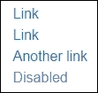

我们的标记可以非常灵活，因为所有组件都基于类。我们可以使用`nav`与常规锚元素水平布局导航：

```ts
<nav class="nav"> 
  <a class="nav-link active" href="#">Active</a> 
  <a class="nav-link" href="#">Link</a> 
  <a class="nav-link" href="#">Another link</a> 
  <a class="nav-link disabled" href="#">Disabled</a> 
</nav> 

```


我喜欢这种方法，因为它比基于列表的方法更简洁。

## 内联导航

您可以使用`nav-inline`类轻松添加水平间距的内联导航元素，就像前面的示例一样：

```ts
<ul class="nav nav-inline"> 
  <li class="nav-item"> 
    <a class="nav-link" href="#">Link</a> 
  </li> 
  <li class="nav-item"> 
    <a class="nav-link" href="#">Link</a> 
  </li> 
  <li class="nav-item"> 
    <a class="nav-link" href="#">Another link</a> 
  </li> 
  <li class="nav-item"> 
    <a class="nav-link disabled" href="#">Disabled</a> 
  </li> 
</ul> 

```

## 选项卡

我们可以快速将前述的 Nav 组件转换为具有`nav-tabs`类的选项卡界面：

```ts
<ul class="nav **nav-tabs** 

"> 
  <li class="nav-item"> 
    <a class="nav-link active" href="#">Active</a> 
  </li> 
  <li class="nav-item"> 
    <a class="nav-link" href="#">Link</a> 
  </li> 
  <li class="nav-item"> 
    <a class="nav-link" href="#">Another link</a> 
  </li> 
  <li class="nav-item"> 
    <a class="nav-link disabled" href="#">Disabled</a> 
  </li> 
</ul> 

```


## 药丸

只需将`nav-tabs`更改为`nav-pills`以显示**药丸**：

```ts
<ul class="nav **nav-pills** 

"> 
  <li class="nav-item"> 
    <a class="nav-link active" href="#">Active</a> 
  </li> 
  <li class="nav-item"> 
    <a class="nav-link" href="#">Link</a> 
  </li> 
  <li class="nav-item"> 
    <a class="nav-link" href="#">Another link</a> 
  </li> 
  <li class="nav-item"> 
    <a class="nav-link disabled" href="#">Disabled</a> 
  </li> 
</ul> 

```


## 堆叠的药丸

如果您需要垂直布局药丸，请使用`nav-stacked`类：

```ts
<ul class="nav **nav-pills nav-stacked** 

"> 
  <li class="nav-item"> 
    <a class="nav-link active" href="#">Active</a> 
  </li> 
  <li class="nav-item"> 
    <a class="nav-link" href="#">Link</a> 
  </li> 
  <li class="nav-item"> 
    <a class="nav-link" href="#">Another link</a> 
  </li> 
  <li class="nav-item"> 
    <a class="nav-link disabled" href="#">Disabled</a> 
  </li> 
</ul> 

```


## 带下拉菜单的导航

您可以通过将`dropdown`类应用于列表项，并使用一些额外的 HTML 和下拉 JavaScript 插件，将下拉菜单添加到内联导航、选项卡或药丸中：

```ts
<ul class="nav nav-tabs"> 
  <li class="nav-item"> 
    <a class="nav-link active" href="#">Active</a> 
  </li> 
  <li class="nav-item dropdown"> 
    <a class="nav-link dropdown-toggle" data-toggle="dropdown"  
       href="#" role="button" aria-haspopup="true"  
       aria-expanded="false">Dropdown</a> 
    <div class="dropdown-menu"> 
      <a class="dropdown-item" href="#">Action</a> 
      <a class="dropdown-item" href="#">Another action</a> 
      <a class="dropdown-item" href="#">Something else here</a> 
      <div class="dropdown-divider"></div> 
      <a class="dropdown-item" href="#">Separated link</a> 
    </div> 
  </li> 
  <li class="nav-item"> 
    <a class="nav-link" href="#">Another link</a> 
  </li> 
  <li class="nav-item"> 
    <a class="nav-link disabled" href="#">Disabled</a> 
  </li> 
</ul> 

```

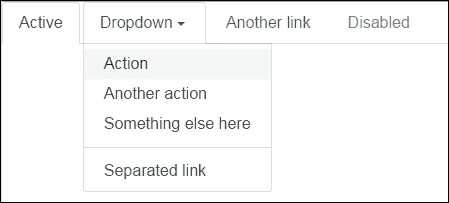

# 导航栏

我之前提到了带有公司标志和菜单的标题，暂时实现为网格。现在我们将这个构造更改为合适的组件。请欢迎**Navbars**。

Navbar 只是一个简单的包装器，有助于定位包含元素。通常，它显示为水平条，但您可以将其配置为在较小的布局上折叠。

与 Bootstrap 的许多其他组件一样，Navbar 容器需要少量的标记和类来使其工作：

+   要创建一个，您必须同时使用`navbar`类和颜色方案

+   最顶部必须是带有`role="navigation"`的`nav`或`div`元素

## 内容

我们可以在必要时包含内置的子组件来添加占位符：

+   使用`navbar-brand`类为您的公司、产品或项目名称。

+   使用`navbar-nav`类来实现全高度和轻量级导航。它包括对下拉菜单的支持。

+   使用`navbar-toggler`类来组织可折叠的行为。

让我们利用我们对 Navbar 的了解来构建我们的标题。首先，我使用`nav`来创建最顶层的元素：

```ts
 **<nav class="navbar navbar-light bg-faded">** 

```

然后，我需要为公司名称使用`navbar-brand`类。我们可以将此类应用于大多数元素，但锚点效果最佳：

```ts
  <a class=" **navbar-brand** 

" href="#">Dream Bean</a> 

```

最后，我添加了一组导航链接，首先是`active`：

```ts
  <ul **class="nav navbar-nav"** 

> 
    <lii **class="nav-tem active"** 

> 
      <a **class="nav-link"** 

 href="#"> 
        Home **<span class="sr-only">(current)</span>** 

      </a> 
    </li> 
    <li **class="nav-item"** 

> 
      <a **class="nav-link"** 

 href="#">Products</a> 
    </li> 
    <li **class="nav-item"** 

> 
      <a **class="nav-link"** 

 href="#">Checkout</a> 
    </li> 
    <li **class="nav-item"** 

> 
      <a **class="nav-link"** 

 href="#">Sign out</a> 
    </li> 
  </ul> 
</nav> 
<!-- /.navbar --> 

```

这是我们带有品牌和一组链接的标题：


借助`nav`类，我们可以通过完全避免基于列表的方法来简化导航：

```ts
<nav class="navbar navbar-light bg-faded"> 
  <a class="navbar-brand" href="#">Dream Bean</a> 
  <div class="nav navbar-nav"> 
    <a class="nav-item nav-link active" href="#"> 
      Home <span class="sr-only">(current)</span> 
    </a> 
    <a class="nav-item nav-link" href="#">Products</a> 
    <a class="nav-item nav-link" href="#">Checkout</a> 
    <a class="nav-item nav-link" href="#">Sign out</a> 
  </div> 
</nav> 

```

## 颜色

您可以非常优雅地管理 Navbar 的颜色：

+   使用`navbar-light`或`navbar-dark`类来指定方案

+   通过 Bootstrap 颜色类之一添加颜色值，或者使用 CSS 创建自己的颜色。

在我的示例中，我使用了浅色方案和 Bootstrap 淡色背景颜色。让我们将其更改为深色方案和自定义颜色：

```ts
<nav class="navbar **navbar-dark** 

" style=" **background-color: #666** 

"> 
  <a class="navbar-brand" href="#">Dream Bean</a> 
  <div class="nav navbar-nav"> 
    <a class="nav-item nav-link active" href="#"> 
      Home <span class="sr-only">(current)</span> 
    </a> 
    <a class="nav-item nav-link" href="#">Products</a> 
    <a class="nav-item nav-link" href="#">Checkout</a> 
    <a class="nav-item nav-link" href="#">Sign out</a> 
  </div> 
</nav> 

```


看起来不错，但 Navbar 横跨整个视口的宽度。这不是 Dream Bean 的经理们想要的。标题必须居中并具有特定的大小。

## 容器

我们将在`container`类中包装我们的 Navbar，以使其居中在页面上：

```ts
 **<div class="container">** 

  <nav class="navbar navbar-dark" style="background-color: #666"> 
    <a class="navbar-brand" href="#">Dream Bean</a> 
    <div class="nav navbar-nav"> 
      <a class="nav-item nav-link active" href="#"> 
        Home <span class="sr-only">(current)</span> 
      </a> 
      <a class="nav-item nav-link" href="#">Products</a> 
      <a class="nav-item nav-link" href="#">Checkout</a> 
      <a class="nav-item nav-link" href="#">Sign out</a> 
    </div> 
  </nav> 
 **</div>** 

```


另一个他们想要的更正是标题必须静态放置在页面顶部。我使用了`navbar-fixed-top`类将其放置在视口顶部：

```ts
<div class="container"> 
  <nav class="navbar navbar-fixed-top navbar-dark"  
       style="background-color: #666"> 
    <a class="navbar-brand" href="#">Dream Bean</a> 
    <div class="nav navbar-nav"> 
      <a class="nav-item nav-link active" href="#"> 
        Home <span class="sr-only">(current)</span> 
      </a> 
      <a class="nav-item nav-link" href="#">Products</a> 
      <a class="nav-item nav-link" href="#">Checkout</a> 
      <a class="nav-item nav-link" href="#">Sign out</a> 
    </div> 
  </nav> 
</div> 

```

您可以使用`navbar-fixed-bottom`类来在页面底部达到相同的效果。

通过最后这些更改，页眉再次跨越整个视口的宽度。为了解决这个问题，我们需要将`container`移到`navbar`内部以包装其内容：

```ts
<nav class=" **navbar** 

 navbar-fixed-top navbar-dark"  
     style="background-color: #666"> 
  **<div class="container">** 

    <a class="navbar-brand" href="#">Dream Bean</a> 
    <div class="nav navbar-nav"> 
      <a class="nav-item nav-link active" href="#"> 
        Home <span class="sr-only">(current)</span> 
      </a> 
      <a class="nav-item nav-link" href="#">Products</a> 
      <a class="nav-item nav-link" href="#">Checkout</a> 
      <a class="nav-item nav-link" href="#">Sign out</a> 
    </div> 
  **</div>** 

</nav> 

```

我们的导航栏隐藏了视口下方的部分，因此我们需要添加填充来补偿这个问题：

```ts
body {  
  padding-top: 51px;  
} 

```

如果您的导航栏固定在底部，请为其添加填充：

```ts
body {  
  padding-bottom: 51px;  
} 

```

## 响应式导航栏

Dream Bean 的员工想要解决的另一个问题是内容必须在给定的视口宽度下折叠。让我们使用`navbar-toggler`类以及`navbar-toggleable`类和它们的前缀大小来做到这一点：

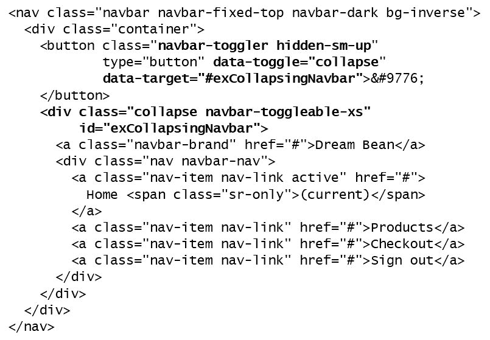

如我之前提到的，`navbar-toggler`类有助于组织可折叠的行为。可折叠插件使用`data-toggle`属性中的信息来触发操作，并使用`data-target`中定义的一个元素。`data-target`保留了包含在`navbar-toggleable`类中的元素的 ID，并且它会加上前缀大小。

可折叠的页眉只能通过它们的组合响应地工作：

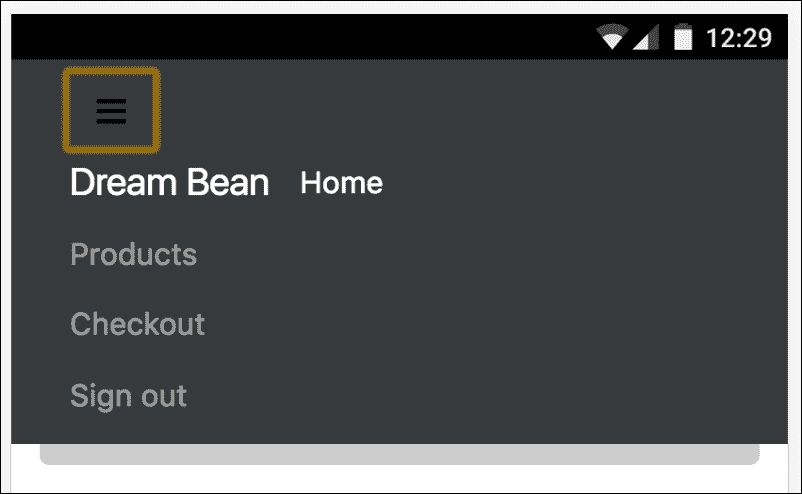

## 响应式实用程序

为了让开发者的生活更轻松，Bootstrap 提供了用于更快速移动友好开发的实用程序类。它们可以帮助：

+   通过媒体查询来显示和隐藏内容

+   打印时切换内容

我不想为不同的移动设备创建完全不同的 Web 应用程序版本。相反，我将使用以下实用程序类来补充每个设备的呈现：

+   实用程序类`hidden-*-up`在视口位于给定断点或更宽时隐藏元素

+   实用程序类`hidden-*-down`在视口位于给定断点或更小时隐藏元素

+   通过组合`hidden-*-up`和`hidden-*-down`实用程序类，我们可以仅在给定的屏幕尺寸间隔上显示元素

请记住，没有退出响应式实用程序类来显式显示元素。事实上，我们不会在特定的断点大小隐藏它。

在我们的项目中，我们只为屏幕尺寸小于 544px 的设备显示我们喜欢称为汉堡按钮的 UI 元素：


这是一个快速提示表，可以帮助您选择正确的实用程序类来在屏幕上显示元素：

+   `hidden-xs-down`在小型设备（横向手机）及以上（>= 544px）显示元素

+   `hidden-sm-down`在中等设备（平板电脑）及以上（>= 768px）显示元素

+   `hidden-md-down`显示来自大型设备（台式电脑）及以上（>= 992px）的元素

+   `hidden-lg-down`显示来自小型设备（台式电脑）及以上（>= 1200px）的元素

+   `hidden-sm-up`显示超小型设备（竖屏手机）的元素（< 544px）

+   `hidden-md-up`显示小型设备（竖屏手机）及以下的元素（< 768px）

+   `hidden-lg-up`显示中等设备（平板电脑）及以下的元素（< 992px）

+   `hidden-xl-up`显示大型设备（台式电脑）及以下的元素（< 1200px）

## 导航栏内容对齐

我们需要修复的最后一件事是菜单在导航栏中的位置。我们可以使用`pull-*left`或`pull-*right`类中的任何一个来对齐菜单和导航栏中的所有其他组件。Dream Bean 的管理人员希望将购物车项目添加为菜单的最后一项，并将其与右侧对齐：

```ts
<ul class="nav navbar-nav **pull-xs-right** 

"> 
  <li class="nav-item dropdown"> 
    <a class="nav-link dropdown-toggle"  
       data-toggle="dropdown" href="#" role="button"  
       aria-haspopup="true" aria-expanded="false">Cart</a> 
    <div class="dropdown-menu"> 
      <span>The Cart Placeholder</span> 
    </div> 
  </li> 
</ul> 

```

我创建了一个单独的菜单组，并在所有布局大小上使用`pull-xs-right`将其对齐到右侧：

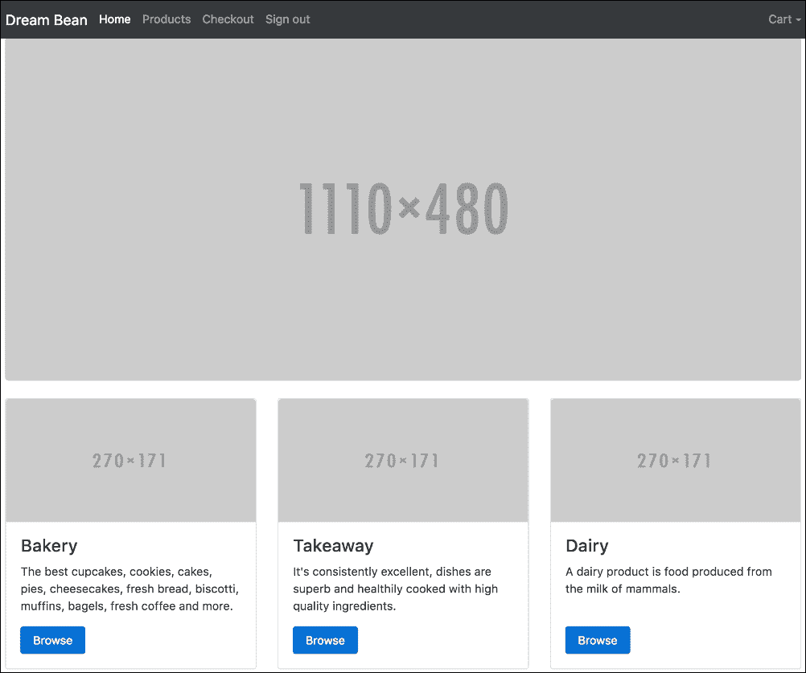

### 注意

您可以在`chapter_2/4.ecommerce-responsive`文件夹中找到源代码。

# 摘要

在本章中，我们发现了 Sass 的世界；这个 CSS 预处理框架允许您编写更简洁的样式表。Sass 文件格式良好，需要较少的重复技术，通常在编写 CSS 代码时会发现。因此，我们拥有了更具动态风格的样式，并节省了开发高质量网站和应用程序的时间。在接下来的章节中，我们将使用 Sass 来定制我们的项目。

我们介绍了我们将在本书中构建的项目。这些信息包括如何从头开始开发项目的重要方面。

我们探索了最基本的网格组件，帮助我们在页面上布局所有其他元素。

我们介绍了灵活的卡片组件，并构建了包含建筑项目产品类别的板块。

现在我们知道如何使用 Nav 和 Navbar 组件来组织响应式可折叠的标题菜单，并对其进行定制。

在第三章中，*高级 Bootstrap 组件和定制*，我们将探索更多 Bootstrap 基础知识，并继续构建我们在本章开始开发的项目。

# 读累了记得休息一会哦~

**公众号：古德猫宁李**

+   电子书搜索下载

+   书单分享

+   书友学习交流

**网站：**[沉金书屋 https://www.chenjin5.com](https://www.chenjin5.com)

+   电子书搜索下载

+   电子书打包资源分享

+   学习资源分享
